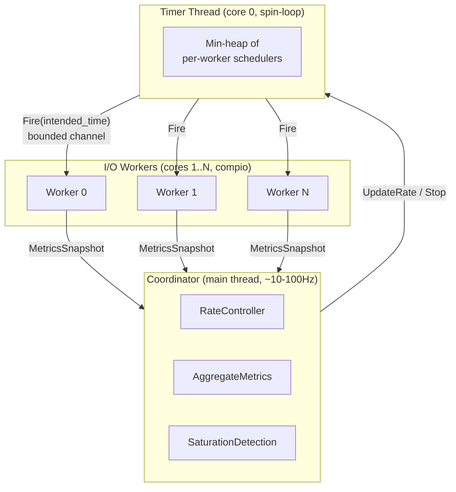
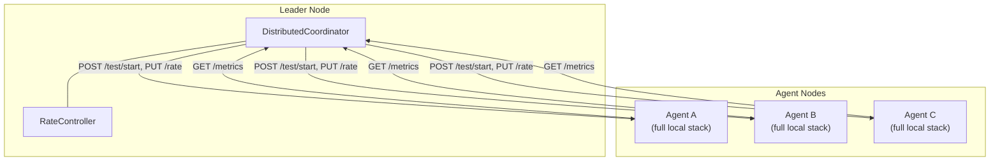

# Architecture

This document describes the design of netanvil-rs for contributors and people
integrating with it. It covers the runtime model, how threads communicate, and
where to find things in the source. It does not reproduce type definitions or
function signatures — read the source or run `cargo doc --open` for that.

## Design principles

**Shared-nothing, thread-per-core.** Each CPU core runs an independent I/O
worker with its own connection pool, metrics collector, and request generator.
No state is shared between cores during a test. The only cross-core
communication is periodic metrics snapshots sent to a coordinator via channels.

**Separated timing and I/O.** A dedicated timer thread owns all per-worker
request schedulers and dispatches fire events through bounded channels. The
timer runs a synchronous spin-loop for microsecond-precision scheduling. I/O
workers receive fire events and execute requests — they have no scheduling
logic. This separation means an I/O worker stalling on a slow response does
not affect the timing accuracy of other workers.

**Coordinated omission prevention.** Every request carries an `intended_time`
(when it should have been sent) and an `actual_time` (when it was dispatched).
Latency is measured from the intended time, so queuing delays are always
visible in the percentile distribution.

**Traits for extensibility.** The hot-path pipeline (generate, transform,
execute, record) and the control plane (rate control, node discovery) are
defined as traits in `netanvil-types`. Advanced features are trait
implementations or decorators — PID control, plugin generators, connection
policies, distributed coordination, and profiling all extend the system
without modifying core types.

## Runtime

NetAnvil uses [compio](https://github.com/compio-rs/compio), a
completion-based async runtime. On Linux it uses io_uring for all network I/O.
On macOS and Windows it falls back to kqueue and IOCP respectively (adequate
for development, but production performance requires Linux).

compio is thread-per-core: each I/O worker runs its own event loop on a pinned
core. Tasks are `!Send`, so per-core state uses `Rc<RefCell<...>>` instead of
`Arc<Mutex<...>>`. Cross-core communication goes through `flume` channels.

For HTTP, the executor uses cyper (a compio-to-hyper bridge) for HTTP/1.1 and
HTTP/2 support. A local fork of compio adds linked SQE support for io_uring
(see the `[patch.crates-io]` section in the workspace `Cargo.toml`).

## Thread model

A running test has three kinds of threads:



The **coordinator** runs on the main thread as a synchronous `sleep`-loop at
10–100 Hz. Each tick it drains metrics snapshots from workers, feeds a
`MetricsSummary` to the rate controller, and sends the resulting target RPS to
the timer thread. It also handles external commands (from the control API or
distributed leader) and computes saturation assessments. The coordinator holds
a `Box<dyn RateController>`, selected at startup based on CLI flags or config.

The **timer thread** is pinned to core 0 and runs a synchronous spin-loop with
no async runtime. It owns one `RequestScheduler` per I/O worker and maintains
a min-heap of the next fire time for each. When a fire time arrives, it sends
a `ScheduledRequest::Fire(intended_time)` through a bounded channel (capacity
1024, roughly 10 ms of buffering at 100K RPS). If the channel is full, the
event is dropped and an atomic counter is incremented — the coordinator reads
this counter each tick for backpressure detection.

Each **I/O worker** is pinned to a core and runs a compio event loop. On
receiving a fire event, it calls the request generator, applies the
transformer, then spawns a compio task to execute the request and record
metrics. Generation and transformation are synchronous (run on the event
loop); execution and recording are async (run as `!Send` tasks on the same
core). Hundreds of requests can be in-flight concurrently on a single core
without blocking the event loop.

## Request pipeline

Each I/O worker runs the same pipeline per request:

1. **Generate** — `RequestGenerator::generate()` produces a protocol-specific
   request spec (HTTP, TCP, UDP, DNS, or Redis). Generators may be native Rust
   or a plugin runtime (Lua, WASM, V8, Rhai).

2. **Transform** — `RequestTransformer::transform()` modifies the spec. Used
   for injecting headers, applying connection policies, or bandwidth
   throttling.

3. **Execute** — `RequestExecutor::execute()` sends the request and awaits the
   response. Returns an `ExecutionResult` with timing breakdown, status, and
   any error.

4. **Record** — `MetricsCollector::record()` logs the result into an HDR
   histogram and increments counters.

All four traits are defined in `netanvil-types`. They are `!Send` (except
`RequestScheduler`, which must be `Send` because schedulers are created on the
main thread and moved to the timer thread). The traits use `&self` with
interior mutability where shared across spawned tasks (executor, metrics) and
`&mut self` where owned exclusively (generator).

## Rate control

The coordinator selects a rate controller at startup. The controller receives a
`MetricsSummary` each tick and returns a `RateDecision` (target RPS and next
update interval). Implementations in `netanvil-core/src/controller/`:

- **Static** — constant RPS, supports external `set_rate()` from the API.
- **Step** — time-based rate changes from a predefined schedule.
- **PID** — single-metric feedback loop (e.g. hold p99 latency at 200 ms).
- **Autotuning PID** — runs a Cohen-Coon step-response exploration phase to
  compute gains automatically.
- **Composite PID** — multiple constraints (latency, error rate, external
  signals), each running an independent PID loop. The minimum rate wins.
  Non-binding constraints decay their integral to prevent windup.
- **Adaptive (ramp)** — warmup phase to learn baseline latency, then ramps up
  until a threshold or error limit is hit.

External signals can feed into the rate controller via two paths: a pull-based
HTTP poller (`--response-signal`) or push-based delivery through `PUT /signal`
on the control API. Both inject named values into `MetricsSummary` for
controllers targeting `TargetMetric::External`.

## Saturation detection

Each coordinator tick, the system classifies the test state as `Healthy`,
`ClientSaturated`, `ServerSaturated`, or `BothSaturated`. Client saturation is
detected from backpressure drops (fire channel full), scheduling delay
(intended vs actual time divergence), and rate achievement ratio. Server
saturation is detected from error rate and latency spikes.

## Protocols

NetAnvil supports multiple protocols, each implemented as a set of trait
implementations (generator, transformer, executor) in its own crate:

| Protocol | Crate | Executor |
|----------|-------|----------|
| HTTP/1.1, HTTP/2 | `netanvil-http` | cyper + hyper |
| TCP | `netanvil-tcp` | compio-net, with framing (raw, length-prefix, delimiter, fixed) |
| UDP | `netanvil-udp` | compio-net, with loss tracking |
| DNS | `netanvil-dns` | UDP-based, wire-format encoding/decoding |
| Redis | `netanvil-redis` | TCP-based RESP protocol |

The protocol is selected by the URL scheme (`http://`, `tcp://`, `udp://`,
`dns://`, `redis://`). The CLI and harness crate handle protocol detection and
wiring the correct generator/transformer/executor factories.

## Plugin system

Plugins implement `RequestGenerator` and replace the default native generator.
The I/O worker does not know whether generation is native or scripted — it
calls `generator.generate(context)` either way. Plugins are instantiated
per-core (one instance per I/O worker) to maintain the shared-nothing model.

| Runtime | Crate | Notes |
|---------|-------|-------|
| Hybrid Lua | `netanvil-plugin` | Lua `configure()` runs once, native Rust hot path |
| LuaJIT | `netanvil-plugin-luajit` | Per-request scripting via `generate(ctx)` |
| Lua 5.4 | `netanvil-plugin-lua54` | Same API, excluded from default build (link conflict with LuaJIT) |
| WASM | `netanvil-plugin` | Compiled module via wasmtime |
| Rhai | `netanvil-plugin` | Embedded Rust-native scripting |
| V8 JavaScript | `netanvil-plugin-v8` | Feature-gated (`--features v8`) due to binary size |

See [plugins.md](plugins.md) for the user-facing plugin guide.

## Control API

The `netanvil-api` crate provides an axum-based HTTP server in two modes:

**Standalone control server** — started with `--api-port` during a local test.
Exposes live metrics, mid-test rate changes, target/header updates, and signal
injection.

**Agent server** — started with `netanvil-cli agent`. A long-lived process
that accepts test commands from a distributed leader or manual operator. Same
endpoints, plus `POST /test/start` and `POST /stop` for lifecycle management.

Key endpoints: `GET /metrics`, `GET /metrics/prometheus`, `PUT /rate`,
`PUT /targets`, `PUT /headers`, `PUT /signal`, `GET /info`, `GET /status`.
TLS with client certificate verification is supported for distributed
deployments.

The API and test engine communicate through `Arc<Mutex<SharedState>>`. The
coordinator writes metrics and status each tick via its progress callback; API
handlers read from it. Push signals flow the other direction.

## Distributed testing

Multiple nodes can coordinate as a test cluster without modifying any core
types. The pattern is recursive: a `DistributedCoordinator` wraps remote agent
nodes the same way the local `Coordinator` wraps I/O workers.



Each tick the leader discovers nodes, fetches metrics from each agent,
aggregates them (conservative: max of percentiles across nodes), runs its rate
controller on the aggregate, and distributes the resulting RPS to agents
weighted by core count. The distributed layer is defined by three traits
(`NodeDiscovery`, `MetricsFetcher`, `NodeCommander`) in `netanvil-types`, with
HTTP implementations in `netanvil-distributed`. mTLS variants exist for
secured clusters.

## Crate structure

```
netanvil-types          Traits and data types. Zero runtime dependencies.
netanvil-sampling       Distribution sampling and lifecycle counters.
netanvil-metrics        HDR histogram metrics collector and aggregation.
netanvil-core           Engine, coordinator, timer thread, I/O workers, rate controllers.
netanvil-http           HTTP executor (compio + cyper + hyper).
netanvil-tcp            TCP executor with framing strategies.
netanvil-udp            UDP executor with loss tracking.
netanvil-dns            DNS executor with wire-format codec.
netanvil-redis          Redis executor (RESP protocol).
netanvil-events         Per-request Arrow IPC event logging.
netanvil-api            Control API server (axum, standalone + agent mode).
netanvil-distributed    Distributed coordinator (HTTP-based multi-node).
netanvil-plugin         Plugin system core (WASM, Rhai, Hybrid Lua).
netanvil-plugin-luajit  LuaJIT per-request generator.
netanvil-plugin-lua54   Lua 5.4 per-request generator (excluded from default build).
netanvil-plugin-v8      V8 JavaScript generator (feature-gated).
netanvil-test-servers   Embeddable TCP/UDP/DNS echo servers for testing.
netanvil-harness        Test orchestration, config building, protocol detection.
netanvil-cli            CLI entry point.
```

Dependencies flow downward: `cli` depends on everything, `core` depends on
`types` and `metrics`, protocol crates depend on `types`, plugin crates depend
on `types` and `plugin`. The dependency graph is in the workspace `Cargo.toml`.

## Extension points

Every feature is a trait implementation, a decorator, or a new coordinator
layer:

- New rate control strategy → `impl RateController`
- New protocol → generator + transformer + executor in a new crate
- New plugin runtime → `impl RequestGenerator` in a new crate
- New scheduling discipline → `impl RequestScheduler`
- Connection behavior → `impl RequestTransformer`
- Profiling / tracing → decorator wrapping `RequestExecutor`
- New node discovery → `impl NodeDiscovery`

## Design decisions

| Decision | Choice | Why |
|----------|--------|-----|
| Async runtime | compio | Thread-per-core, io_uring, hyper bridge via cyper |
| Timer thread model | Dedicated spin-loop thread | Timing precision independent of I/O load |
| Hot-path trait bounds | `!Send` (except scheduler) | Matches thread-per-core; `Rc`, not `Arc` |
| Control plane | Synchronous main-thread loop | 10–100 Hz loop does not need async |
| Rate controller dispatch | `Box<dyn RateController>` | Runtime-selected; virtual dispatch at 10 Hz is irrelevant |
| Metrics pipeline | Snapshot → Aggregate → Summary | Decouples histogram dependency from rate controller trait |
| Metrics merge | Associative + commutative | Same merge works for per-core and per-node aggregation |
| Type erasure boundary | Channel between coordinator and workers | Coordinator does not know worker generic types |
| Backpressure | Bounded channels + atomic drop counters | Detects saturation without adding overhead to the fire path |
| Plugin model | Per-core instances via factory closure | Preserves shared-nothing; plugins are just `RequestGenerator` |
| Distributed communication | HTTP + optional mTLS | Trait-abstracted; can be replaced with gRPC or gossip later |

## Open questions

1. **cyper maturity.** The compio-to-hyper bridge is pre-1.0. Connection
   pooling, HTTP/2 multiplexing, and TLS session resumption under high
   concurrency need ongoing validation.

2. **io_uring completion latency.** Under extreme load, io_uring completion
   processing in I/O workers may delay `recv_async()`, increasing the gap
   between fire event receipt and actual request dispatch.

3. **Histogram merge cost.** At high core counts (32+), periodic histogram
   merges in the coordinator could become a bottleneck. Pre-aggregated counters
   for the rate controller (full histogram merge only for final reporting) may
   be needed.

4. **LuaJIT/Lua 5.4 link conflict.** The two Lua runtimes cannot coexist in
   the same binary due to symbol conflicts. Handled via workspace
   `default-members` exclusion.
