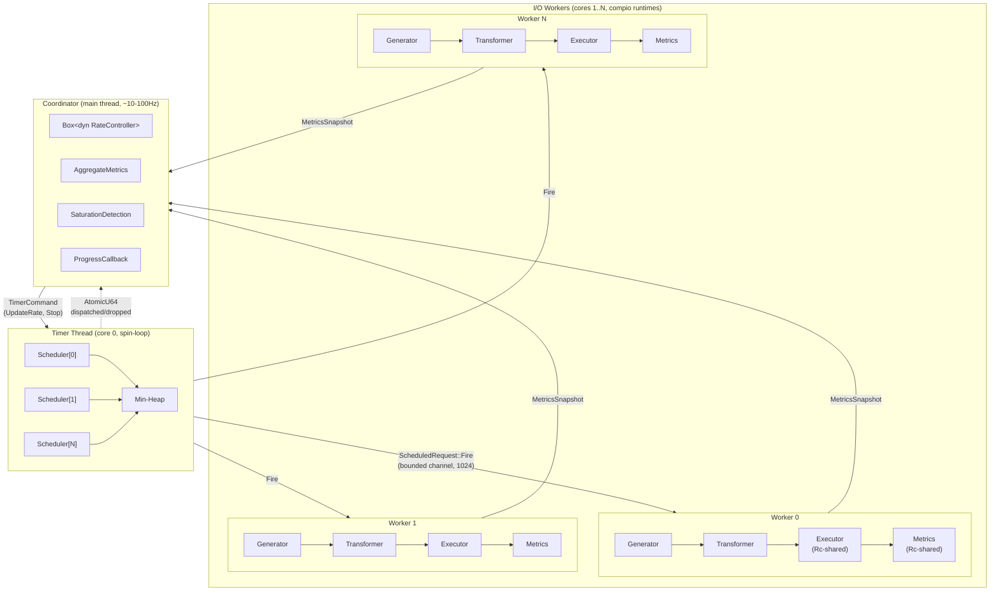
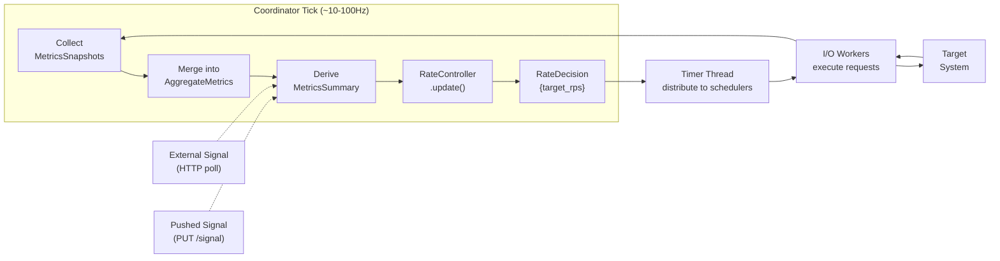
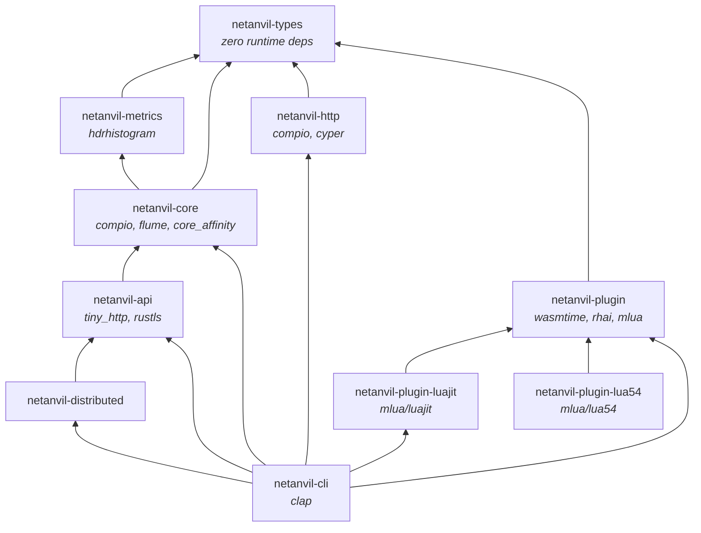
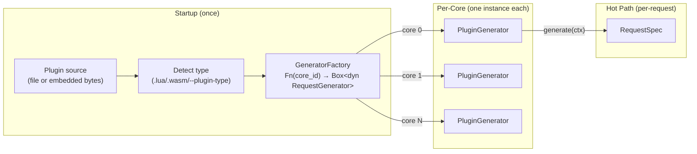
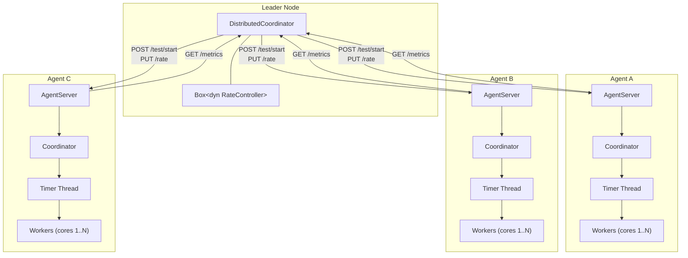

# NetAnvil-RS Architecture

This is the authoritative design document for netanvil-rs. It supersedes all prior
design documents (archived in `docs/archive/`).

## 1. Design Principles

1. **Shared-nothing, thread-per-core.** Each CPU core runs an independent I/O
   worker with its own connection pool and metrics. No locks, no atomics on
   the hot path. Linear scaling with core count.

2. **N:M timer thread model.** A dedicated timer thread owns all per-worker
   schedulers and dispatches fire events via bounded channels. I/O workers
   are pure executors — no scheduling logic. This separates timing precision
   (~1us spin-loop) from I/O throughput (io_uring completion processing).

3. **Coordinator pattern.** A single coordinator thread distributes rate targets
   and collects metrics. The same pattern scales from cores to nodes — replace a
   channel with an HTTP call and you have distributed load testing.

4. **Coordinated omission prevention.** Every request records its *intended* send
   time and *actual* send time. Latency is measured from the intended time, not
   the actual time. This prevents the system from hiding queuing delays.

5. **Traits for extensibility, not abstraction.** Core traits are minimal
   interfaces that advanced features implement. PID control, session simulation,
   plugin generators, and distributed coordination are all just trait
   implementations or decorators — not new abstraction layers.

6. **Plugin-based extensibility.** Request generation is extensible via a plugin
   system supporting Lua (hybrid/per-request), WASM, and Rhai runtimes. Plugins
   implement `RequestGenerator` and are indistinguishable from native generators
   on the hot path.

## 2. Runtime: compio

**Choice:** [compio](https://github.com/compio-rs/compio) — a completion-based
async runtime with thread-per-core architecture.

**Rationale:**
- **io_uring on Linux** for optimal connection throughput (async connect, send,
  recv — no readiness notification overhead)
- **Thread-per-core** with `!Send` tasks, `Rc`-based sharing — no atomic ops
- **Built-in Dispatcher** for multi-core work distribution with CPU pinning
- **hyper bridge** via cyper — uses the battle-tested hyper HTTP engine
  (HTTP/1.1, HTTP/2) without reimplementing protocol logic
- **Cross-platform** — io_uring on Linux, IOCP on Windows, kqueue on macOS
  (fallback for development; production perf requires Linux)

**Rejected alternatives:**
- *Glommio*: Effectively abandoned (seeking maintainers as of March 2026). No
  hyper bridge. Linux-only with no fallback.
- *Monoio*: Viable but declining commit rate. HTTP stack is a custom h2 fork
  (less proven than hyper). No built-in dispatcher pattern.
- *Tokio*: Not thread-per-core. Would require `Send + Sync` bounds everywhere,
  which is the wrong model for maximum per-core throughput.

**Implications for code:**
- Hot-path types are `!Send`. Use `Rc<RefCell<...>>` for per-core shared state.
- Cross-core communication via `flume` channels.
- `async fn` in traits is used without `Send` bounds on the returned future.
- compio's buffer ownership model (`IoBuf`/`IoBufMut` with `BufResult`) flows
  through the HTTP executor. This is handled inside `netanvil-http`; the rest of
  the system works with `HttpRequestSpec` and `ExecutionResult` value types.

## 3. System Architecture

### 3.1 Overview



### 3.2 Thread Roles

| Thread | Pinned to | Runtime | Responsibility |
|--------|-----------|---------|---------------|
| Coordinator | — | `std::thread::sleep` loop | Rate control, metrics aggregation, progress reporting |
| Timer | core 0 | Synchronous spin-loop | Owns schedulers, dispatches fire events at ~1us precision |
| I/O Worker *i* | core *i+1* | compio (io_uring) | Request generation, transformation, execution, metrics recording |

The timer thread is separated from I/O workers because:
- **Timing precision**: A synchronous spin-loop achieves ~1us precision. An async
  runtime processing io_uring completions cannot guarantee this.
- **Backpressure isolation**: If an I/O worker falls behind, its fire channel fills
  up. The timer thread detects this (atomic drop counter) but continues scheduling
  other workers without blocking.
- **Scheduling fairness**: A min-heap across all workers ensures globally fair
  scheduling order, impossible if each worker has its own scheduler.

### 3.3 Shared-Nothing Per-Core State

Each I/O worker owns (not shares) all its state:

| State | Per-core? | Rationale |
|-------|-----------|-----------|
| Connection pool | Yes | Each core manages its own TCP connections |
| HDR histogram | Yes | Record locally, merge periodically |
| Session state | Yes | Sessions never cross core boundaries |
| Request generator | Yes | Stateful generators partition the ID/URL space |
| Request transformer | Yes | Interior mutability for header updates |
| Test config | Yes (cloned) | Read-only after startup, clone to each core |

**Nothing is shared between cores during the hot path.** The only cross-core
communication is via channels to the coordinator, at low frequency.

### 3.4 Communication Model

```
Coordinator → Timer Thread:  TimerCommand via flume::Sender
  - UpdateRate(f64)              ~10-100Hz
  - UpdateTargets(Vec<String>)   rare (API-driven)
  - UpdateHeaders(Vec<...>)      rare (API-driven)
  - Stop                         once

Timer Thread → I/O Workers:  ScheduledRequest via bounded flume channels
  - Fire(Instant)                per-request (hot path)
  - UpdateTargets(Vec<String>)   forwarded from coordinator
  - UpdateHeaders(Vec<...>)      forwarded from coordinator
  - Stop                         once

I/O Workers → Coordinator:  MetricsSnapshot via flume::Sender
  - Histogram + counters         ~1-10Hz (configurable metrics_interval)
```

The timer thread acts as a **command multiplexer**: rate commands are processed
locally (distributed to per-worker schedulers), while target/header/stop commands
are forwarded to I/O workers via fire channels.

The channel boundary is where **type erasure** happens. The coordinator holds
`IoWorkerHandle`s and a `TimerThreadHandle`, and knows nothing about the worker's
generic types (`<G, T, E, M>`).

### 3.5 Concurrency Within a Core

The I/O worker's event loop spawns each request as a separate compio task:

```mermaid
sequenceDiagram
    participant Timer as Timer Thread
    participant Loop as I/O Worker Loop
    participant Gen as Generator
    participant Trans as Transformer
    participant Task as Spawned Task
    participant Exec as Executor (Rc)
    participant Met as Metrics (Rc)
    participant Ring as io_uring

    Timer->>Loop: ScheduledRequest::Fire(intended_time)
    activate Loop
    Loop->>Gen: generate(&context)
    Gen-->>Loop: HttpRequestSpec
    Loop->>Trans: transform(spec, &context)
    Trans-->>Loop: HttpRequestSpec
    Loop->>Task: compio::spawn(async move { ... })
    deactivate Loop
    Note over Loop: Loop returns to recv_async()<br/>yields to compio runtime

    activate Task
    Task->>Exec: execute(&spec, &context)
    Exec->>Ring: TCP connect + TLS + HTTP send
    Ring-->>Exec: HTTP response
    Exec-->>Task: ExecutionResult
    Task->>Met: record(&result)
    deactivate Task
```

The event loop is never blocked by network I/O. Hundreds or thousands of requests
can be in-flight simultaneously on a single core. `compio::runtime::spawn`
creates `!Send` tasks on the same core — no cross-core scheduling.

Hundreds or thousands of requests can be in-flight simultaneously on a single
core. The event loop is never blocked by network I/O. `compio::runtime::spawn`
creates `!Send` tasks on the same core — no cross-core scheduling.

### 3.6 Backpressure and Saturation Detection

The system detects when the client or server is the bottleneck:

**Client saturation signals** (tracked per tick):
- Backpressure drops: fire channel full, timer thread drops events (atomic counter)
- Scheduling delay: gap between `intended_time` and `actual_time` > 1ms
- Rate achievement: `achieved_rps / target_rps < 90%`

**Server saturation signals:**
- Error rate > 5%
- Latency p99 > 5 seconds

These are combined into a `SaturationAssessment`: `Healthy`, `ClientSaturated`,
`ServerSaturated`, or `BothSaturated`, reported in every progress callback.

## 4. Core Traits

All traits live in `netanvil-types`. No runtime dependency. No `Send + Sync`
bounds on hot-path traits (except `RequestScheduler` — see below). No supertrait
requirements (profiling is a decorator).

### 4.1 Hot-Path Traits (per-core, `!Send`)

```rust
/// Computes when to fire the next request.
///
/// NOTE: Send bound required because the timer thread owns all schedulers
/// and they are created on the main thread then moved to the timer thread.
///
/// Implementations: ConstantRateScheduler, PoissonScheduler
pub trait RequestScheduler: Send {
    fn next_request_time(&mut self) -> Option<Instant>;
    fn update_rate(&mut self, rps: f64);
}

/// Creates request specifications from context.
///
/// Implementations: SimpleGenerator (netanvil-core),
///   HybridGenerator, WasmGenerator, LuaJitGenerator, Lua54Generator (plugins)
pub trait RequestGenerator {
    fn generate(&mut self, context: &RequestContext) -> HttpRequestSpec;
    /// Replace the target URLs mid-test. Default: no-op.
    fn update_targets(&mut self, _targets: Vec<String>) {}
}

/// Modifies requests before execution.
///
/// Uses &self because it is Rc-shared. Interior mutability (RefCell) for
/// mutable state like headers.
///
/// Implementations: NoopTransformer, HeaderTransformer, ConnectionPolicyTransformer
pub trait RequestTransformer {
    fn transform(&self, spec: HttpRequestSpec, context: &RequestContext) -> HttpRequestSpec;
    /// Replace the header list mid-test. Default: no-op.
    fn update_headers(&self, _headers: Vec<(String, String)>) {}
}

/// Executes requests against the target system.
///
/// Takes &self because it is Rc-shared across concurrent spawned tasks.
/// Uses interior mutability for connection pool state.
///
/// Implementations: HttpExecutor (netanvil-http)
pub trait RequestExecutor {
    fn execute(
        &self,
        spec: &HttpRequestSpec,
        context: &RequestContext,
    ) -> impl Future<Output = ExecutionResult>;
}

/// Records per-request metrics. Rc-shared across spawned tasks.
/// Uses interior mutability (RefCell<Histogram>, Cell<u64> counters).
///
/// Implementations: HdrMetricsCollector (netanvil-metrics)
pub trait MetricsCollector {
    fn record(&self, result: &ExecutionResult);
    fn snapshot(&self) -> MetricsSnapshot;
}
```

All traits except `RequestScheduler` have blanket impls for `Box<dyn Trait>`,
enabling runtime construction while preserving the generic worker signature.

### 4.2 Control-Plane Trait

```rust
/// Pure computation: metrics summary in, rate decision out.
///
/// The coordinator owns the controller exclusively — no sharing needed.
/// Takes &MetricsSummary (not AggregateMetrics) so the trait has no
/// dependency on hdrhistogram.
///
/// Implementations:
///   StaticRateController    — constant rate, supports external set_rate()
///   StepRateController      — time-based rate changes
///   PidRateController       — PID feedback loop on a single metric
///   AutotuningPidController — auto-tuned PID (Cohen-Coon step response)
///   CompositePidController  — multi-constraint PID (min-rate selector)
pub trait RateController {
    fn update(&mut self, summary: &MetricsSummary) -> RateDecision;
    fn current_rate(&self) -> f64;
    /// Override the target rate externally (e.g. from the control API).
    /// Default: no-op.
    fn set_rate(&mut self, _rps: f64) {}
}
```

### 4.3 Distributed Control-Plane Traits

```rust
/// Discovers nodes in the cluster.
/// MVP: StaticDiscovery (from CLI args). Future: gossip-based CRDT.
pub trait NodeDiscovery: Send + Sync {
    fn discover(&self) -> Vec<NodeInfo>;
    fn mark_failed(&self, id: &NodeId);
}

/// Fetches metrics from an agent node.
/// MVP: HTTP GET /metrics. Future: gossip-pushed CRDT state.
pub trait MetricsFetcher: Send + Sync {
    fn fetch_metrics(&self, node: &NodeInfo) -> Option<RemoteMetrics>;
}

/// Sends commands to an agent node.
/// MVP: HTTP POST/PUT. Future: stays HTTP/gRPC (point-to-point).
pub trait NodeCommander: Send + Sync {
    fn start_test(&self, node: &NodeInfo, config: &TestConfig) -> Result<(), NetAnvilError>;
    fn set_rate(&self, node: &NodeInfo, rps: f64) -> Result<(), NetAnvilError>;
    fn stop_test(&self, node: &NodeInfo) -> Result<(), NetAnvilError>;
}
```

### 4.4 Why No ProfilingCapability Supertrait

Profiling is a **decorator** that wraps any `RequestExecutor`:

```rust
struct ProfilingExecutor<E: RequestExecutor> {
    inner: E,
    profiler: Box<dyn Profiler>,  // eBPF, tracing, noop
}

impl<E: RequestExecutor> RequestExecutor for ProfilingExecutor<E> {
    async fn execute(&self, spec: &HttpRequestSpec, ctx: &RequestContext) -> ExecutionResult {
        self.profiler.begin(ctx.request_id);
        let result = self.inner.execute(spec, ctx).await;
        self.profiler.end(ctx.request_id);
        result
    }
}
```

Zero cost when unused. Composable. No impact on other traits.

## 5. Core Data Types

All types live in `netanvil-types`. The crate has zero runtime dependencies (no
compio, no tokio, no hdrhistogram).

### 5.1 Request Pipeline Types

```rust
/// Context for a single request. Created by the I/O worker on each fire event.
#[derive(Debug, Clone)]
pub struct RequestContext {
    /// Unique request ID (partitioned: core_id * 1_000_000_000 + sequence)
    pub request_id: u64,
    /// When this request SHOULD have been sent (from timer thread)
    pub intended_time: Instant,
    /// When it was actually dispatched (I/O worker's wall clock)
    pub actual_time: Instant,
    /// Which core is executing this request
    pub core_id: usize,
    /// Whether this request is selected for detailed sampling
    pub is_sampled: bool,
    /// Session ID, if session simulation is active
    pub session_id: Option<u64>,
}

/// What to send. Produced by RequestGenerator, modified by RequestTransformer.
#[derive(Debug, Clone)]
pub struct HttpRequestSpec {
    pub method: http::Method,
    pub url: String,
    pub headers: Vec<(String, String)>,
    pub body: Option<Vec<u8>>,
}

/// What happened. Produced by RequestExecutor, consumed by MetricsCollector.
#[derive(Debug, Clone)]
pub struct ExecutionResult {
    pub request_id: u64,
    pub intended_time: Instant,
    pub actual_time: Instant,
    pub timing: TimingBreakdown,
    pub status: Option<u16>,
    pub response_size: u64,
    pub error: Option<ExecutionError>,
}

/// Latency breakdown for a single request.
#[derive(Debug, Clone, Default)]
pub struct TimingBreakdown {
    pub dns_lookup: Duration,
    pub tcp_connect: Duration,
    pub tls_handshake: Duration,
    pub time_to_first_byte: Duration,
    pub content_transfer: Duration,
    pub total: Duration,
}

/// Errors that can occur during request execution.
#[derive(Debug, Clone, thiserror::Error)]
pub enum ExecutionError {
    Connect(String),
    Timeout,
    Http(String),
    Tls(String),
    Other(String),
}
```

### 5.2 Metrics Types

**Design constraint:** `MetricsSummary` (consumed by `RateController`) lives in
`netanvil-types` so the rate controller trait has no `hdrhistogram` dependency.
`AggregateMetrics` (which owns the histogram) lives in `netanvil-metrics`.

```rust
/// Per-core metrics snapshot. Sent from I/O worker to coordinator.
/// Contains a V2-serialized HDR histogram and counters for a time window.
#[derive(Debug, Clone)]
pub struct MetricsSnapshot {
    pub latency_histogram_bytes: Vec<u8>,
    pub total_requests: u64,
    pub total_errors: u64,
    pub bytes_sent: u64,
    pub bytes_received: u64,
    pub window_start: Instant,
    pub window_end: Instant,
    /// Scheduling delay tracking for saturation detection
    pub scheduling_delay_sum_ns: u64,
    pub scheduling_delay_max_ns: u64,
    pub scheduling_delay_count_over_1ms: u64,
}

/// Derived metrics summary for the RateController.
/// Computed by the coordinator from AggregateMetrics each tick.
#[derive(Debug, Clone, Default)]
pub struct MetricsSummary {
    pub total_requests: u64,
    pub total_errors: u64,
    pub error_rate: f64,
    pub request_rate: f64,
    pub latency_p50_ns: u64,
    pub latency_p90_ns: u64,
    pub latency_p99_ns: u64,
    pub window_duration: Duration,
    /// External signals from the system under test.
    /// E.g. [("load", 82.5)] from a server-reported load metric.
    pub external_signals: Vec<(String, f64)>,
}

/// Rate controller output.
#[derive(Debug, Clone)]
pub struct RateDecision {
    pub target_rps: f64,
    pub next_update_interval: Duration,
}

/// Client-side saturation assessment.
#[derive(Debug, Clone, Default)]
pub struct SaturationInfo {
    pub backpressure_drops: u64,
    pub backpressure_ratio: f64,
    pub scheduling_delay_mean_ms: f64,
    pub scheduling_delay_max_ms: f64,
    pub delayed_request_ratio: f64,
    pub rate_achievement: f64,
    pub assessment: SaturationAssessment,
}

#[derive(Debug, Clone, Copy, Default, PartialEq, Eq)]
pub enum SaturationAssessment {
    #[default]
    Healthy,
    ClientSaturated,
    ServerSaturated,
    BothSaturated,
}
```

### 5.3 Configuration Types

```rust
/// Top-level test configuration. Serializable for distributed transmission.
#[derive(Debug, Clone, Serialize, Deserialize)]
pub struct TestConfig {
    pub targets: Vec<String>,
    pub method: String,
    pub duration: Duration,
    pub rate: RateConfig,
    pub scheduler: SchedulerConfig,
    pub headers: Vec<(String, String)>,
    pub num_cores: usize,
    pub connections: ConnectionConfig,
    pub metrics_interval: Duration,
    pub control_interval: Duration,
    pub error_status_threshold: u16,
    pub external_metrics_url: Option<String>,
    pub external_metrics_field: Option<String>,
    pub plugin: Option<PluginConfig>,
}

#[derive(Debug, Clone, Serialize, Deserialize)]
pub enum RateConfig {
    Static { rps: f64 },
    Step { steps: Vec<(Duration, f64)> },
    Pid { initial_rps: f64, target: PidTarget },
    CompositePid {
        initial_rps: f64,
        constraints: Vec<PidConstraint>,
        min_rps: f64,
        max_rps: f64,
    },
}

#[derive(Debug, Clone, Serialize, Deserialize)]
pub enum SchedulerConfig {
    ConstantRate,
    Poisson { seed: Option<u64> },
}

#[derive(Debug, Clone, Serialize, Deserialize)]
pub struct PidTarget {
    pub metric: TargetMetric,
    pub value: f64,
    pub gains: PidGains,
    pub min_rps: f64,
    pub max_rps: f64,
}

#[derive(Debug, Clone, Serialize, Deserialize)]
pub enum PidGains {
    Auto { autotune_duration: Duration, smoothing: f64 },
    Manual { kp: f64, ki: f64, kd: f64 },
}

#[derive(Debug, Clone, Serialize, Deserialize)]
pub struct PidConstraint {
    pub metric: TargetMetric,
    pub limit: f64,
    pub gains: PidGains,
}

#[derive(Debug, Clone, Serialize, Deserialize)]
pub enum TargetMetric {
    LatencyP50,
    LatencyP90,
    LatencyP99,
    ErrorRate,
    External { name: String },
}

#[derive(Debug, Clone, Serialize, Deserialize)]
pub struct ConnectionConfig {
    pub max_connections_per_core: usize,
    pub connect_timeout: Duration,
    pub request_timeout: Duration,
    pub connection_policy: ConnectionPolicy,
}

#[derive(Debug, Clone, Serialize, Deserialize)]
pub enum ConnectionPolicy {
    KeepAlive,
    AlwaysNew,
    Mixed {
        persistent_ratio: f64,
        connection_lifetime: Option<CountDistribution>,
    },
}

#[derive(Debug, Clone, Serialize, Deserialize)]
pub enum CountDistribution {
    Fixed(u32),
    Uniform { min: u32, max: u32 },
    Normal { mean: f64, stddev: f64 },
}

#[derive(Debug, Clone, Serialize, Deserialize)]
pub struct PluginConfig {
    pub plugin_type: PluginType,
    pub source: Vec<u8>,
}

#[derive(Debug, Clone, Serialize, Deserialize)]
pub enum PluginType {
    Hybrid,
    Lua,
    Wasm,
}

#[derive(Debug, Clone, Serialize, Deserialize)]
pub struct TlsConfig {
    pub ca_cert: String,
    pub cert: String,
    pub key: String,
}
```

### 5.4 Command and Handle Types

```rust
/// Commands sent from coordinator to the timer thread.
/// The timer thread multiplexes: rate is handled locally, others are forwarded.
#[derive(Debug, Clone)]
pub enum TimerCommand {
    UpdateRate(f64),
    UpdateTargets(Vec<String>),
    UpdateHeaders(Vec<(String, String)>),
    Stop,
}

/// Messages from timer thread to I/O workers via bounded fire channels.
/// Fire is the hot-path message (one per request).
#[derive(Debug, Clone)]
pub enum ScheduledRequest {
    Fire(Instant),
    UpdateTargets(Vec<String>),
    UpdateHeaders(Vec<(String, String)>),
    Stop,
}

/// Commands from external sources (API, distributed layer) to the coordinator.
#[derive(Debug, Clone)]
pub enum WorkerCommand {
    UpdateRate(f64),
    UpdateTargets(Vec<String>),
    UpdateHeaders(Vec<(String, String)>),
    Stop,
}

/// Coordinator's view of an I/O worker. Type-erased.
pub struct IoWorkerHandle {
    pub metrics_rx: flume::Receiver<MetricsSnapshot>,
    pub thread: std::thread::JoinHandle<()>,
    pub core_id: usize,
}

/// Coordinator's view of the timer thread.
pub struct TimerThreadHandle {
    pub command_tx: flume::Sender<TimerCommand>,
    pub thread: Option<std::thread::JoinHandle<()>>,
    /// Shared atomic counters — coordinator reads each tick for saturation detection.
    pub stats: TimerStats,
}

pub struct TimerStats {
    pub dispatched: Arc<AtomicU64>,
    pub dropped: Arc<AtomicU64>,
}
```

### 5.5 Node Types (Distributed)

```rust
#[derive(Debug, Clone, PartialEq, Eq, Hash, Serialize, Deserialize)]
pub struct NodeId(pub String);

#[derive(Debug, Clone, Serialize, Deserialize)]
pub struct NodeInfo {
    pub id: NodeId,
    pub addr: String,      // "host:port" for the agent API
    pub cores: usize,
    pub state: NodeState,
}

#[derive(Debug, Clone, Copy, PartialEq, Eq, Serialize, Deserialize)]
pub enum NodeState {
    Idle,
    Running,
    Completed,
    Failed,
}

/// Metrics reported by a remote agent to the leader.
#[derive(Debug, Clone, Serialize, Deserialize)]
pub struct RemoteMetrics {
    pub node_id: NodeId,
    pub current_rps: f64,
    pub target_rps: f64,
    pub total_requests: u64,
    pub total_errors: u64,
    pub error_rate: f64,
    pub latency_p50_ms: f64,
    pub latency_p90_ms: f64,
    pub latency_p99_ms: f64,
}
```

## 6. Component Design

### 6.1 Timer Thread

The timer thread is a dedicated `std::thread` with no async runtime. It owns all
per-worker schedulers and uses a min-heap to determine the globally next fire event.

```rust
pub fn timer_loop(
    mut schedulers: Vec<Box<dyn RequestScheduler>>,
    fire_txs: Vec<flume::Sender<ScheduledRequest>>,
    cmd_rx: flume::Receiver<TimerCommand>,
    stats: TimerStats,
) {
    let mut heap: BinaryHeap<Reverse<(Instant, usize)>> = BinaryHeap::new();

    // Seed heap with first event from each scheduler
    for (i, sched) in schedulers.iter_mut().enumerate() {
        if let Some(t) = sched.next_request_time() {
            heap.push(Reverse((t, i)));
        }
    }

    loop {
        // Check for commands (non-blocking)
        // On UpdateRate: distribute to all schedulers, re-seed heap
        // On UpdateTargets/Headers: forward to all workers via fire channels
        // On Stop: send Stop to all workers, exit

        // Pop next event from heap
        let Reverse((target_time, worker_id)) = heap.pop();

        // Spin-wait until target time (~1us precision)
        while Instant::now() < target_time {
            std::hint::spin_loop();
        }

        // Dispatch fire event via bounded channel
        match fire_txs[worker_id].try_send(ScheduledRequest::Fire(target_time)) {
            Ok(()) => stats.dispatched.fetch_add(1, Ordering::Relaxed),
            Err(_) => stats.dropped.fetch_add(1, Ordering::Relaxed),
        };

        // Re-seed this worker's next event
        if let Some(t) = schedulers[worker_id].next_request_time() {
            heap.push(Reverse((t, worker_id)));
        }
    }
}
```

**Bounded fire channel capacity:** 1024 entries (~10ms buffering at 100K RPS).
Large enough to absorb I/O jitter, small enough to detect real backpressure.

### 6.2 I/O Worker

Each I/O worker is a `compio` async task receiving fire events:

```rust
pub async fn io_worker_loop<G, T, E, M>(
    config: IoWorkerConfig,
    mut generator: G,
    transformer: Rc<T>,
    executor: Rc<E>,
    metrics: Rc<M>,
) where
    G: RequestGenerator,
    T: RequestTransformer + 'static,
    E: RequestExecutor + 'static,
    M: MetricsCollector + 'static,
{
    loop {
        // Wait for message (yields to compio for io_uring completions)
        let msg = fire_rx.recv_async().await;

        match msg {
            ScheduledRequest::Fire(intended_time) => {
                let context = RequestContext { intended_time, actual_time: Instant::now(), ... };
                let spec = generator.generate(&context);
                let spec = transformer.transform(spec, &context);

                let exec = executor.clone();   // Rc clone
                let met = metrics.clone();      // Rc clone
                compio::runtime::spawn(async move {
                    let result = exec.execute(&spec, &context).await;
                    met.record(&result);
                }).detach();
            }
            ScheduledRequest::UpdateTargets(t) => generator.update_targets(t),
            ScheduledRequest::UpdateHeaders(h) => transformer.update_headers(h),
            ScheduledRequest::Stop => break,
        }

        // Drain accumulated messages, yielding every ~50us for io_uring
        // Periodic metrics snapshot send
    }
}
```

### 6.3 Coordinator

The coordinator runs on the main thread. It is a synchronous control loop — no
async runtime needed. Uses `Box<dyn RateController>` for runtime-selected
rate control strategy.

```rust
pub struct Coordinator {
    rate_controller: Box<dyn RateController>,
    io_workers: Vec<IoWorkerHandle>,
    timer_handle: TimerThreadHandle,
    tick_aggregate: AggregateMetrics,    // reset each tick
    total_aggregate: AggregateMetrics,   // running total
    test_duration: Duration,
    control_interval: Duration,
    start_time: Instant,
    on_progress: Option<ProgressCallback>,
    external_command_rx: Option<flume::Receiver<WorkerCommand>>,
    external_signal_source: Option<SignalSourceFn>,
    pushed_signal_source: Option<SignalSourceFn>,
}

impl Coordinator {
    pub fn run(&mut self) -> TestResult {
        loop {
            std::thread::sleep(self.control_interval);
            self.tick();
            if self.elapsed() >= self.test_duration {
                self.stop();
                break;
            }
        }
        self.collect_final_metrics()
    }

    pub fn tick(&mut self) -> RateDecision {
        // 1. Drain external commands (API, distributed layer)
        // 2. Collect metrics from all I/O workers
        // 3. Rate controller computes new target from MetricsSummary
        // 4. Inject external signals (pull + push sources)
        // 5. Distribute rate to timer thread
        // 6. Compute saturation info from timer stats
        // 7. Invoke progress callback with ProgressUpdate
    }
}
```

**ProgressUpdate** emitted each tick:
```rust
pub struct ProgressUpdate {
    pub elapsed: Duration,
    pub remaining: Duration,
    pub current_rps: f64,
    pub target_rps: f64,
    pub total_requests: u64,
    pub total_errors: u64,
    pub window: MetricsSummary,
    pub latency_buckets: Vec<(f64, u64)>,  // Prometheus-compatible
    pub saturation: SaturationInfo,
}
```

### 6.4 TestBuilder and Engine

The engine provides a builder API for constructing tests with optional overrides:

```rust
pub struct TestBuilder<E, F>
where
    E: RequestExecutor + 'static,
    F: Fn() -> E + Send + 'static,
{
    config: TestConfig,
    executor_factory: F,
    generator_factory: Option<GeneratorFactory>,
    transformer_factory: Option<TransformerFactory>,
    on_progress: Option<ProgressCallback>,
    external_command_rx: Option<flume::Receiver<WorkerCommand>>,
    pushed_signal_source: Option<SignalSourceFn>,
}
```

Type aliases for factory closures:
```rust
type GeneratorFactory = Box<dyn Fn(usize) -> Box<dyn RequestGenerator> + Send>;
type TransformerFactory = Box<dyn Fn(usize) -> Box<dyn RequestTransformer> + Send>;
type ProgressCallback = Box<dyn FnMut(&ProgressUpdate)>;
type SignalSourceFn = Box<dyn FnMut() -> Vec<(String, f64)>>;
```

**`run_test_impl` wiring** (the core engine function):
1. Creates N schedulers (one per I/O worker) based on `SchedulerConfig`
2. Creates bounded fire channels (timer -> I/O worker, capacity 1024)
3. Spawns N I/O worker threads (pinned to cores 1..N), each with:
   - A compio runtime
   - Generator from factory (or default `SimpleGenerator`)
   - Transformer from factory (or default `HeaderTransformer`/`ConnectionPolicyTransformer`)
   - Executor from factory
   - `HdrMetricsCollector`
4. Spawns timer thread (pinned to core 0) with all schedulers and fire channels
5. Creates rate controller from `RateConfig`
6. Creates `Coordinator` with handles, controller, and optional callbacks
7. Runs coordinator (blocks until test completes)
8. Returns `TestResult`

Convenience entry points:
```rust
pub fn run_test(config, executor_factory) -> Result<TestResult>
pub fn run_test_with_progress(config, executor_factory, on_progress) -> Result<TestResult>
pub fn run_test_with_api(config, executor_factory, on_progress, external_command_rx) -> Result<TestResult>
```

### 6.5 Rate Controllers

| Controller | Config variant | Description |
|-----------|----------------|-------------|
| `StaticRateController` | `RateConfig::Static` | Constant rate, supports external `set_rate()` |
| `StepRateController` | `RateConfig::Step` | Time-based rate changes from a step schedule |
| `PidRateController` | `RateConfig::Pid` (Manual gains) | PID feedback on a single metric |
| `AutotuningPidController` | `RateConfig::Pid` (Auto gains) | Auto-tuned PID via Cohen-Coon step response |
| `CompositePidController` | `RateConfig::CompositePid` | Multi-constraint PID, min-rate selector |

**Rate control feedback loop:**



**PID auto-tuning** uses an `ExplorationManager` that:
1. Runs at 50% rate for ~500ms to establish baseline metric values
2. Steps to 100% rate for ~2.5s to measure the step response
3. Detects dead time and time constant from the metric response
4. Computes Cohen-Coon gains automatically

**Composite PID** runs multiple independent PID loops (one per constraint).
Each computes a desired rate; the **minimum** wins. Non-binding constraints
decay their integral to prevent windup.

### 6.6 External Signals

The coordinator supports two sources of external metrics:

- **Pull-based** (`HttpSignalPoller`): Polls a URL for JSON, extracts a named
  field. Configured via `--external-metrics-url` and `--external-metrics-field`.
- **Push-based** (API): External systems push signals via `PUT /signal`. Drained
  once per tick.

Both inject `(name, value)` pairs into `MetricsSummary.external_signals`, which
PID controllers can target via `TargetMetric::External { name }`.

## 7. Crate Structure

### 7.1 Current Crates (10)

```
netanvil-rs/
├── Cargo.toml                     (workspace, 10 members)
├── crates/
│   ├── netanvil-types/              Traits + data types. Zero runtime dependencies.
│   │   └── src/
│   │       ├── lib.rs
│   │       ├── traits.rs          Core trait definitions
│   │       ├── request.rs         HttpRequestSpec, RequestContext, ExecutionResult
│   │       ├── metrics.rs         MetricsSnapshot, MetricsSummary, SaturationInfo
│   │       ├── config.rs          TestConfig, RateConfig, ConnectionPolicy, PluginConfig
│   │       ├── command.rs         WorkerCommand, TimerCommand, ScheduledRequest
│   │       ├── distributed.rs     NodeDiscovery, MetricsFetcher, NodeCommander traits
│   │       ├── node.rs            NodeId, NodeInfo, NodeState
│   │       └── error.rs           NetAnvilError, Result
│   │
│   ├── netanvil-metrics/            HDR histogram metrics collection.
│   │   └── src/                   Depends on: hdrhistogram, netanvil-types
│   │       ├── lib.rs
│   │       ├── collector.rs       HdrMetricsCollector (RefCell<Histogram>, Cell counters)
│   │       ├── aggregate.rs       AggregateMetrics (merge, reset, to_summary)
│   │       └── encoding.rs        V2 histogram serialization
│   │
│   ├── netanvil-core/               Engine, coordinator, schedulers, rate controllers.
│   │   └── src/                   Depends on: compio, flume, netanvil-types, netanvil-metrics
│   │       ├── lib.rs
│   │       ├── engine.rs          TestBuilder, run_test, run_test_impl
│   │       ├── coordinator.rs     Coordinator (tick loop, progress, saturation)
│   │       ├── io_worker.rs       io_worker_loop (per-core compio async loop)
│   │       ├── timer_thread.rs    timer_loop (spin-loop scheduler, min-heap)
│   │       ├── handle.rs          IoWorkerHandle
│   │       ├── generator.rs       SimpleGenerator (round-robin URLs)
│   │       ├── transformer.rs     NoopTransformer, HeaderTransformer, ConnectionPolicyTransformer
│   │       ├── scheduler/         ConstantRateScheduler, PoissonScheduler
│   │       ├── controller/        Static, Step, PID, AutotuningPID, CompositePID
│   │       ├── signal.rs          HttpSignalPoller (external metrics polling)
│   │       ├── result.rs          TestResult
│   │       └── report.rs          ProgressLine, Report (display formatting)
│   │
│   ├── netanvil-http/               HTTP executor using compio + cyper + hyper.
│   │   └── src/                   Depends on: compio, cyper, http, netanvil-types
│   │       ├── lib.rs
│   │       └── executor.rs        HttpExecutor (impl RequestExecutor)
│   │
│   ├── netanvil-api/                Control API server.
│   │   └── src/                   Depends on: tiny_http, netanvil-core, netanvil-types
│   │       ├── lib.rs
│   │       ├── server.rs          ControlServer (standalone HTTP control)
│   │       ├── agent.rs           AgentServer (remotely controllable test node)
│   │       ├── handlers.rs        HTTP endpoint handlers (JSON, Prometheus)
│   │       ├── types.rs           SharedState, MetricsView
│   │       └── tls.rs             mTLS support (client cert verification)
│   │
│   ├── netanvil-distributed/        Distributed load testing coordinator.
│   │   └── src/                   Depends on: netanvil-core, netanvil-types
│   │       ├── lib.rs
│   │       ├── coordinator.rs     DistributedCoordinator (multi-node orchestration)
│   │       ├── http_cluster.rs    StaticDiscovery, HttpMetricsFetcher, HttpNodeCommander
│   │       │                      + mTLS variants
│   │       └── signal.rs          HttpSignalPoller (for distributed signal forwarding)
│   │
│   ├── netanvil-plugin/             Plugin system (WASM, Rhai, Hybrid Lua).
│   │   └── src/                   Depends on: wasmtime, rhai, mlua, netanvil-types
│   │       ├── lib.rs
│   │       ├── types.rs           PluginRequestContext, PluginHttpRequestSpec
│   │       ├── hybrid.rs          HybridGenerator (Lua config → native hot path)
│   │       ├── wasm.rs            WasmGenerator (wasmtime, ~2.7us/call)
│   │       ├── rhai_runtime.rs    RhaiGenerator
│   │       └── error.rs           PluginError
│   │
│   ├── netanvil-plugin-luajit/      LuaJIT per-request generator (~2.1us/call).
│   │   └── src/lib.rs             Depends on: mlua (luajit), netanvil-types, netanvil-plugin
│   │
│   ├── netanvil-plugin-lua54/       Lua 5.4 per-request generator (~2.9us/call).
│   │   └── src/lib.rs             Depends on: mlua (lua54), netanvil-types, netanvil-plugin
│   │
│   └── netanvil-cli/                Command-line interface.
│       └── src/                   Depends on: clap, netanvil-core, netanvil-http, netanvil-plugin, ...
│           └── main.rs            Argument parsing, plugin loading, test execution
│
├── docs/
│   ├── architecture.md            THIS FILE — authoritative design reference
│   ├── plugins.md                 Plugin system user guide
│   └── archive/                   Prior design documents (historical reference)
│
└── README.md
```

**Build note:** `netanvil-plugin-lua54` is excluded from `default-members` because
LuaJIT and Lua 5.4 link-time symbols conflict. Build it explicitly:
`cargo build -p netanvil-plugin-lua54`.

### 7.2 Dependency Graph



## 8. Plugin System

See `docs/plugins.md` for the full user guide.

Plugins implement `RequestGenerator` and are used in place of the default
`SimpleGenerator`. They are indistinguishable from native generators on the
hot path — the I/O worker calls `generator.generate(context)` regardless of
whether it's native Rust or a plugin.

### 8.1 Plugin Types

| Type | Runtime | Per-call overhead | How it works |
|------|---------|-------------------|-------------|
| Hybrid | mlua (LuaJIT) | ~576ns | Lua `configure()` runs once → native Rust hot path |
| Lua (LuaJIT) | mlua (LuaJIT) | ~2.1us | Lua `generate(ctx)` called per request |
| Lua 5.4 | mlua (Lua54) | ~2.9us | Same API, different runtime |
| WASM | wasmtime | ~2.7us | Compiled module, JSON over shared memory |
| Rhai | rhai | — | Embedded scripting (alternative to Lua) |

### 8.2 Plugin Boundary Types

Plugins can't use `Instant` or `http::Method` directly. The plugin crate defines
serializable mirror types:

```rust
/// Serializable mirror of RequestContext (no Instant fields).
pub struct PluginRequestContext {
    pub request_id: u64,
    pub core_id: usize,
    pub is_sampled: bool,
    pub session_id: Option<u64>,
}

/// Serializable mirror of HttpRequestSpec (String method, not http::Method).
pub struct PluginHttpRequestSpec {
    pub method: String,
    pub url: String,
    pub headers: Vec<(String, String)>,
    pub body: Option<Vec<u8>>,
}
```

### 8.3 Plugin Instantiation

Plugins are instantiated per-core via a `GeneratorFactory` closure:

- **CLI**: Reads plugin file from disk, detects type from extension or `--plugin-type` flag
- **API/Agent**: Receives `PluginConfig` (with embedded source bytes) in `TestConfig`,
  instantiates per-core generators on the agent node

Both paths produce a `Box<dyn Fn(usize) -> Box<dyn RequestGenerator> + Send>`
that the engine calls once per I/O worker.



## 9. API and Control Server

The `netanvil-api` crate provides two server modes:

### 9.1 AgentServer

A long-lived HTTP server that accepts test commands from a distributed leader
or manual operator. Lifecycle: Idle → Running → Idle.

**Endpoints:**

| Method | Path | Description |
|--------|------|-------------|
| GET | /info | Node metadata (ID, cores, state) |
| GET | /status | Test status (running/completed, progress) |
| GET | /metrics | Live metrics (RPS, errors, latencies) |
| GET | /metrics/prometheus | Prometheus exposition format |
| POST | /test/start | Start a test (JSON `TestConfig` body) |
| POST | /stop | Stop running test |
| PUT | /rate | Update target RPS |
| PUT | /targets | Update target URLs |
| PUT | /headers | Update headers |
| PUT | /signal | Push external metric signal |

**Transports:** Plain HTTP via `tiny_http`, or mTLS with client certificate
verification via custom TLS implementation (`rustls`).

### 9.2 SharedState

The API and test engine communicate via `Arc<Mutex<SharedState>>`:
- The coordinator writes via the `ProgressUpdate` callback each tick
- API handlers read metrics, status, and saturation info
- Push signals are written by the API and drained by the coordinator once per tick

## 10. Distributed Integration

The distributed system extends the single-node design without modifying any core
types or traits. The coordinator pattern is recursive: a distributed coordinator
wraps local agent nodes the same way the local coordinator wraps workers.

### 10.1 Architecture



### 10.2 How It Works

The `DistributedCoordinator` is generic over the three distributed traits:

```rust
pub struct DistributedCoordinator<D, F, C>
where
    D: NodeDiscovery,
    F: MetricsFetcher,
    C: NodeCommander,
{
    discovery: D,
    fetcher: F,
    commander: C,
    rate_controller: Box<dyn RateController>,
    // ...
}
```

Each tick:
1. **Discover** nodes via `NodeDiscovery::discover()`
2. **Fetch** metrics from each agent via `MetricsFetcher::fetch_metrics()`
3. **Aggregate** metrics (conservative: max of percentiles across nodes)
4. **Rate control** via `RateController::update()` on aggregated metrics
5. **Distribute** rate to agents weighted by core count:
   `per_agent_rps = total_rps * (agent_cores / total_cores)`
6. **Command** each agent via `NodeCommander::set_rate()`

### 10.3 MVP Implementation (HTTP-based)

The current implementation uses HTTP for all distributed communication:

| Trait | Implementation | Transport |
|-------|---------------|-----------|
| `NodeDiscovery` | `StaticDiscovery` | Probes agents via GET /info |
| `MetricsFetcher` | `HttpMetricsFetcher` | GET /metrics → JSON |
| `NodeCommander` | `HttpNodeCommander` | POST/PUT to agent endpoints |

Each has an mTLS variant (`MtlsStaticDiscovery`, `MtlsMetricsFetcher`,
`MtlsNodeCommander`) that adds client certificate verification.

### 10.4 Integration Points with Single-Node Design

| Integration point | How it connects | Type changes needed? |
|---|---|---|
| Rate input to agent | `PUT /rate` → `WorkerCommand::UpdateRate` → coordinator | None |
| Metrics output from agent | `GET /metrics` reads `SharedState` | None |
| Test config distribution | JSON `TestConfig` via `POST /test/start` | None — already Serializable |
| Plugin distribution | `PluginConfig.source` (embedded bytes) in `TestConfig` | None |
| External signals | `HttpSignalPoller` or `PUT /signal` | None |

**No core type changes needed.** The distributed layer is purely additive.

## 11. Extension Points

Every advanced feature is an implementation of an existing trait, a decorator
around an existing trait, or a new coordinator layer.

### 11.1 Implemented

| Feature | Mechanism | Implementation |
|---------|-----------|---------------|
| Constant rate | `impl RateController` | `StaticRateController` |
| Step function | `impl RateController` | `StepRateController` |
| PID control | `impl RateController` | `PidRateController` |
| Auto-tuned PID | `impl RateController` | `AutotuningPidController` |
| Multi-constraint PID | `impl RateController` | `CompositePidController` |
| Poisson arrivals | `impl RequestScheduler` | `PoissonScheduler` |
| External signals | Signal source in coordinator | `HttpSignalPoller` |
| Connection policies | `impl RequestTransformer` | `ConnectionPolicyTransformer` |
| Plugin generators | `impl RequestGenerator` | Hybrid, WASM, LuaJIT, Lua54, Rhai |
| Distributed testing | New coordinator layer | `DistributedCoordinator` |
| Control API | HTTP server | `AgentServer`, `ControlServer` |
| Prometheus export | Reads `ProgressUpdate` | Histogram buckets in progress callback |
| Saturation detection | Coordinator tick analysis | `SaturationInfo` in `ProgressUpdate` |

### 11.2 Planned / Future

| Feature | Mechanism | Notes |
|---------|-----------|-------|
| Multi-protocol support | Associated type `Spec` on pipeline traits | See section 12 |
| eBPF profiling | Decorator on `RequestExecutor` | `ProfilingExecutor<E>` |
| gRPC testing | `impl RequestExecutor` | New protocol via associated types |
| WebSocket testing | `impl RequestExecutor` | New protocol via associated types |
| Gossip discovery | `impl NodeDiscovery` | Replace `StaticDiscovery` with CRDT-based |
| Session simulation | `impl RequestGenerator` | Stateful multi-step flows |
| Burst patterns | `impl RequestScheduler` | `BurstScheduler` |

## 12. Planned: Multi-Protocol Support

The current pipeline traits are hardcoded to `HttpRequestSpec` which uses
`http::Method`, URL strings, and HTTP headers. To support raw TCP/UDP,
gRPC, HTTP/3 (QUIC), etc., the pipeline traits will gain an associated
`Spec` type.

### 12.1 Design Overview

A `ProtocolSpec` marker trait bounds the associated type:

```rust
pub trait ProtocolSpec: std::fmt::Debug + Clone + 'static {}
impl ProtocolSpec for HttpHttpRequestSpec {}  // renamed from HttpRequestSpec
```

Pipeline traits gain `type Spec`:

```rust
pub trait RequestGenerator {
    type Spec: ProtocolSpec;
    fn generate(&mut self, context: &RequestContext) -> Self::Spec;
    fn update_targets(&mut self, _targets: Vec<String>) {}
}

pub trait RequestTransformer {
    type Spec: ProtocolSpec;
    fn transform(&self, spec: Self::Spec, context: &RequestContext) -> Self::Spec;
    fn update_metadata(&self, _metadata: Vec<(String, String)>) {}
}

pub trait RequestExecutor {
    type Spec: ProtocolSpec;
    fn execute(&self, spec: &Self::Spec, context: &RequestContext)
        -> impl Future<Output = ExecutionResult>;
}
```

`MetricsCollector` and `RateController` are unchanged — they only see
`ExecutionResult` and `MetricsSummary`.

### 12.2 Key Changes

- `HttpRequestSpec` renamed to `HttpHttpRequestSpec` (mechanical, 86 occurrences)
- `UpdateHeaders` renamed to `UpdateMetadata` (protocol-neutral)
- `update_headers` renamed to `update_metadata` on `RequestTransformer`
- I/O worker gains `Spec` constraints: `T: RequestTransformer<Spec = G::Spec>`
- `TestBuilder` factory types carry `E::Spec`
- Default generators (`SimpleGenerator`, `HeaderTransformer`) produce
  `HttpHttpRequestSpec` — non-HTTP protocols must supply their own factories

The full design is in the implementation plan. This is a backwards-compatible
refactor: all existing code continues to work with `Spec = HttpHttpRequestSpec`.

## 13. Key Design Decisions Summary

| Decision | Choice | Rationale |
|----------|--------|-----------|
| Runtime | compio | Active development, hyper bridge, io_uring, cross-platform |
| Threading model | N:M timer + I/O workers | Timing precision separated from I/O throughput |
| Trait bounds | `!Send` on hot path (except scheduler) | Matches thread-per-core; Rc, not Arc |
| Scheduler ownership | Timer thread (Send) | Single thread, spin-loop, min-heap across all workers |
| Control plane | Synchronous coordinator on main thread | Simple, no async needed for ~10Hz loop |
| Rate controller | `Box<dyn RateController>` | Runtime-selected strategy, ~10Hz virtual dispatch irrelevant |
| Profiling | Decorator pattern | Zero cost when unused, composable, no supertrait |
| Metrics flow | `MetricsSnapshot` → `AggregateMetrics` → `MetricsSummary` | Decouples histogram dependency from rate controller |
| Metrics merge | Associative + commutative | Same merge works for cores and nodes |
| Type erasure | At channel boundary (`IoWorkerHandle`) | Coordinator doesn't know worker generics |
| Backpressure | Bounded fire channels + atomic counters | Saturation detection without channel overhead |
| HTTP engine | hyper via cyper bridge | Battle-tested, HTTP/1.1 + HTTP/2 |
| Plugin system | `impl RequestGenerator` per runtime | Transparent to I/O worker, per-core instances |
| Distributed | HTTP-based, trait-abstracted | MVP works now; gossip/CRDT can replace later |
| API transport | tiny_http + optional mTLS | Minimal dependencies, secure distributed comms |
| Coordinated omission | intended_time vs actual_time | Measured in every request context |
| Timer precision | Synchronous spin-loop on dedicated thread | ~1us precision, no async runtime interference |
| PID tuning | Cohen-Coon auto-tuning + gain scheduling | No manual gain selection required |

## 14. Open Questions and Risks

1. **cyper maturity.** The compio-to-hyper bridge is pre-1.0. Need to
   validate: connection pooling, HTTP/2 multiplexing, TLS session resumption,
   and behavior under high concurrency. Fallback: build a thin HTTP client
   directly on compio-net with manual HTTP/1.1 framing.

2. **compio timer interaction.** The timer thread's spin-loop is independent
   of compio, which is correct. But I/O workers' `recv_async()` latency
   depends on compio's io_uring completion processing. Under extreme load,
   io_uring completions may delay message receipt.

3. **HDR histogram merge performance.** At high core counts (32+), periodic
   histogram merges in the coordinator could become a bottleneck. May need
   to use pre-aggregated counters for the rate controller and only merge
   full histograms for final reporting.

4. **Fire channel sizing.** The fixed 1024-entry capacity works well for
   typical workloads. At very high per-worker rates (>100K RPS), this
   provides only ~10ms of buffering. May need adaptive sizing.

5. **Distributed clock correlation.** Cross-node latency comparison requires
   synchronized clocks (NTP/PTP). This is an operational concern, not a design
   concern, but should be documented for users.

6. **LuaJIT/Lua54 link conflict.** The two Lua runtimes cannot coexist in the
   same binary due to symbol conflicts. Currently handled via workspace
   `default-members` exclusion.

7. **Multi-protocol migration.** The `HttpRequestSpec` → `HttpHttpRequestSpec` rename
   and associated type refactor touches ~100 call sites. Planned as a
   two-phase migration: rename first, then add associated types.
