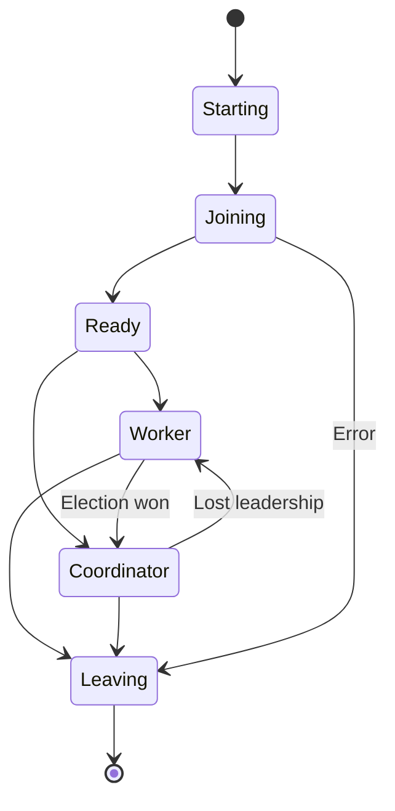
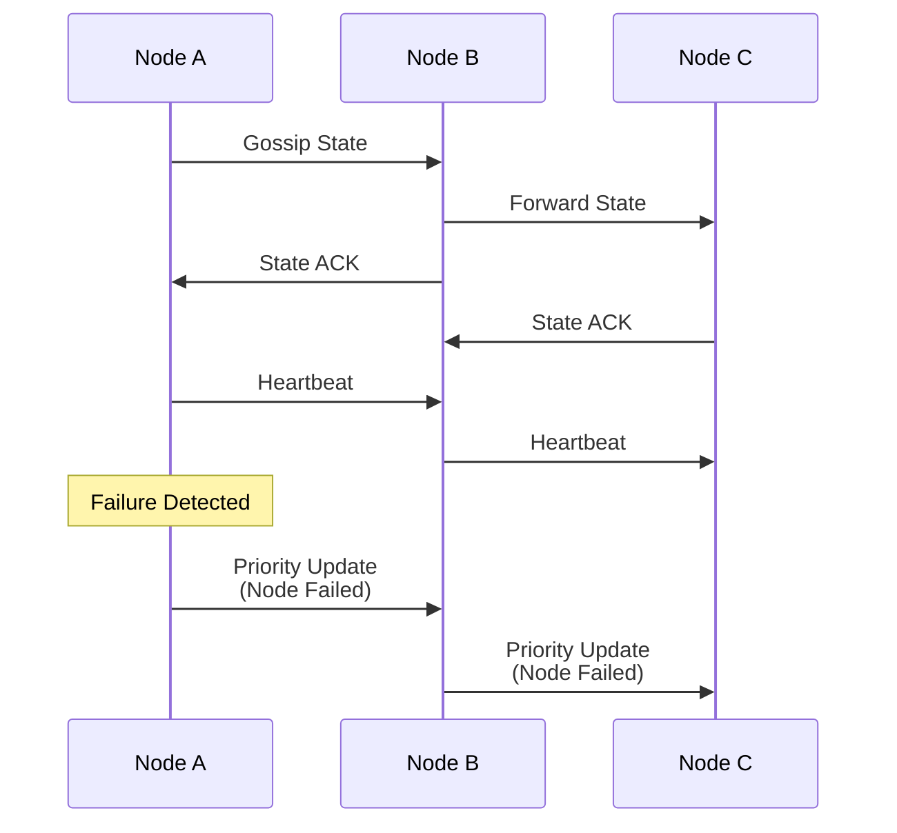
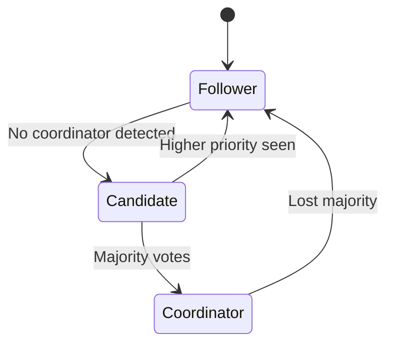

# Distributed Load Testing Overview

## 1. Introduction

The distributed load testing system extends the framework to coordinate multiple nodes, enabling tests that exceed single-machine capacity while maintaining accurate measurement and coordinated control. This document provides an overview of the distributed architecture and its key components.

## 2. System Architecture

### 2.1 High-Level Architecture

```
┌─────────────────────────────────────────────────────────────────────────┐
│                        Distributed Load Test Cluster                     │
├─────────────────────────────────────────────────────────────────────────┤
│                                                                         │
│  ┌─────────────┐    Gossip Protocol    ┌─────────────┐                │
│  │   Node A    │◄──────────────────────►│   Node B    │                │
│  │(Coordinator)│                        │  (Worker)    │                │
│  └──────┬──────┘◄───────────┐          └──────┬───────┘                │
│         │                    │                 │                        │
│         ▼                    ▼                 ▼                        │
│  ┌─────────────┐     ┌──────────────┐  ┌─────────────┐               │
│  │    CRDT     │     │   Node C     │  │    CRDT     │               │
│  │   State     │     │  (Worker)     │  │   State     │               │
│  └─────────────┘     └──────┬───────┘  └─────────────┘               │
│                             │                                          │
│                             ▼                                          │
│                      ┌─────────────┐                                  │
│                      │    CRDT     │                                  │
│                      │   State     │                                  │
│                      └─────────────┘                                  │
│                                                                       │
│  State Synchronization:                Load Distribution:            │
│  • Node Registry                       • Target RPS allocation       │
│  • Load Assignments                    • URL pattern assignment      │
│  • Test Parameters                     • Rebalancing on failure      │
│  • Controller State                                                   │
│  • Epoch Timeline                                                     │
└─────────────────────────────────────────────────────────────────────────┘
```

### 2.2 Component Overview

The distributed system consists of several key components:

1. **Dual-Role Nodes**: Each node can act as either coordinator or worker
2. **CRDT State Management**: Conflict-free replicated data types for consistency
3. **Gossip Protocol**: Epidemic-style state propagation
4. **Leader Election**: Automatic coordinator selection
5. **Load Distribution**: Dynamic allocation based on capacity
6. **Failure Detection**: Automatic detection and recovery
7. **Epoch Management**: Coordinated global state changes

## 3. Node Roles and Transitions

### 3.1 Role State Machine



### 3.2 Role Responsibilities

**Coordinator Node:**
- Manages global test parameters
- Distributes load across workers
- Creates epochs for state changes
- Monitors worker health
- Triggers rebalancing on failures

**Worker Node:**
- Generates assigned load
- Reports metrics to cluster
- Participates in state synchronization
- Executes load assignments
- Monitors own health

## 4. State Management with CRDTs

### 4.1 CRDT Types Used

The system uses the `crdts` library for proven CRDT implementations:

```
┌─────────────────────────────────────────────────────────────┐
│                      CRDT State Types                       │
├─────────────────────────────────────────────────────────────┤
│                                                             │
│  Orswot (Node Registry)          LWWReg (Load Assignments) │
│  ┌─────────────────┐             ┌─────────────────┐      │
│  │ • Add nodes     │             │ • Node → RPS    │      │
│  │ • Remove nodes  │             │ • Last-write-wins│      │
│  │ • No tombstones │             │ • Actor-based    │      │
│  └─────────────────┘             └─────────────────┘      │
│                                                             │
│  Map<LWWReg> (Parameters)        Custom Log (Epochs)       │
│  ┌─────────────────┐             ┌─────────────────┐      │
│  │ • Key → Value   │             │ • Causal order  │      │
│  │ • Per-key LWW   │             │ • Event history │      │
│  │ • Actor-based   │             │ • Built on Map  │      │
│  └─────────────────┘             └─────────────────┘      │
└─────────────────────────────────────────────────────────────┘
```

Using the `crdts` library provides:
- **Proven correctness**: Battle-tested implementations
- **Simple merging**: Just call `.merge()`
- **Type safety**: Actor-based operations
- **Performance**: Optimized algorithms

### 4.2 Consistency Model

- **Eventual Consistency**: All nodes converge to same state
- **Causal Consistency**: Operations respect happens-before relationships
- **Conflict Resolution**: Deterministic merge functions
- **Partition Tolerance**: Continues operating during network splits

## 5. Communication Protocol

### 5.1 Message Flow



### 5.2 Protocol Layers

1. **Transport Layer**: UDP with optional encryption
2. **Gossip Layer**: State propagation and heartbeats
3. **Priority Layer**: Critical updates (failures, elections)
4. **Application Layer**: Load testing specific messages

## 6. Leader Election Process

### 6.1 Election State Machine



### 6.2 Election Criteria

Priority calculation based on:
- Available resources (CPU, memory, network)
- Node stability (uptime)
- Network centrality (latency to other nodes)
- Current load

## 7. Load Distribution Strategy

### 7.1 Distribution Algorithm

```
┌─────────────────────────────────────────────────────────┐
│                Load Distribution Flow                    │
├─────────────────────────────────────────────────────────┤
│                                                         │
│  1. Calculate Total Capacity                            │
│     C_total = Σ(node.capacity × node.health_factor)    │
│                                                         │
│  2. Base Load Assignment                                │
│     node.base_load = (node.capacity/C_total) × Target  │
│                                                         │
│  3. Apply Health Adjustments                            │
│     node.load = node.base_load × health_factor         │
│                                                         │
│  4. Enforce Limits                                      │
│     node.load = min(node.load, node.max_capacity)      │
│                                                         │
│  5. Redistribute Remainder                              │
│     If Σ(node.load) < Target:                         │
│       Distribute remainder to capable nodes             │
│                                                         │
└─────────────────────────────────────────────────────────┘
```

### 7.2 Rebalancing Triggers

- Node failure or departure
- Node capacity change
- Error rate threshold exceeded
- Saturation detected
- Manual intervention

## 8. Failure Detection

### 8.1 Detection Mechanism

```
           Heartbeat Interval
    Node A ──┬──┬──┬──┬──┬──┬──► Time
             │  │  │  │  │  │
    Node B   ✓  ✓  ✓  ✗  ✗  ✗
             │  │  │  │  │  │
             │  │  │  └──┴──┴── Failure Suspected
             │  │  │            (3 missed heartbeats)
             │  │  │
             └──┴──┴── Healthy Communication
```

### 8.2 Phi Accrual Failure Detector

- Adaptive timeout based on network conditions
- Probability-based suspicion level
- Reduces false positives
- Configurable sensitivity

## 9. Epoch Management

### 9.1 Epoch Timeline

```
Epoch 1          Epoch 2              Epoch 3            Epoch 4
│                │                    │                  │
├─ Node Joined ──┼─ Load Rebalanced ──┼─ Node Failed ────┼─ Rate Changed
│                │                    │                  │
│ Nodes: A,B     │ Nodes: A,B,C       │ Nodes: A,B       │ Nodes: A,B
│ Load: 1000 RPS │ Load: 1000 RPS     │ Load: 1000 RPS   │ Load: 1500 RPS
│                │ A:333,B:333,C:334  │ A:500,B:500      │ A:750,B:750
```

### 9.2 Epoch Events

- Node lifecycle (join/leave/fail)
- Load distribution changes
- Test parameter updates
- Rate adjustments
- Phase transitions

## 10. Integration Points

### 10.1 Rate Controller Integration

```rust
// Distributed rate controller adapter
let base_controller = create_pid_controller();
let distributed_controller = DistributedRateControllerAdapter::new(
    base_controller,
    coordinator,
    update_interval,
);

// Controller automatically:
// - Receives load assignments
// - Reports metrics to cluster
// - Adjusts to global changes
```

### 10.2 Metrics Aggregation

```
┌─────────────┐     ┌─────────────┐     ┌─────────────┐
│   Node A    │     │   Node B    │     │   Node C    │
│ RPS: 333    │     │ RPS: 333    │     │ RPS: 334    │
│ P99: 45ms   │     │ P99: 52ms   │     │ P99: 48ms   │
│ Errors: 0.1%│     │ Errors: 0.2%│     │ Errors: 0.1%│
└──────┬──────┘     └──────┬──────┘     └──────┬──────┘
       │                   │                   │
       └───────────────────┴───────────────────┘
                           │
                    ┌──────▼──────┐
                    │ Coordinator │
                    │             │
                    │ Total RPS: 1000            │
                    │ Global P99: 52ms (max)     │
                    │ Error Rate: 0.13% (avg)    │
                    └─────────────┘
```

## 11. Configuration Example

```rust
// Distributed configuration
let config = DistributedConfig {
    // Gossip settings
    gossip: GossipConfig {
        interval: Duration::from_millis(100),
        fanout: 3,
        differential: true,
    },
    
    // Election settings
    election: ElectionConfig {
        timeout: Duration::from_secs(5),
        priority_weights: PriorityWeights {
            resources: 0.5,
            stability: 0.3,
            centrality: 0.2,
        },
    },
    
    // Failure detection
    failure_detection: FailureDetectionConfig {
        phi_threshold: 8.0,
        detection_interval: Duration::from_millis(500),
    },
    
    // Load distribution
    distribution_strategy: LoadDistributionStrategy::WeightedOptimal,
};
```

## 12. Benefits and Trade-offs

### 12.1 Benefits

- **Scalability**: Test beyond single-machine limits
- **Fault Tolerance**: Automatic failover and recovery
- **Consistency**: Eventually consistent state across nodes
- **Flexibility**: Dynamic load redistribution
- **Observability**: Epoch-based history tracking

### 12.2 Trade-offs

- **Complexity**: More moving parts than single-node
- **Network Overhead**: Gossip and state synchronization
- **Convergence Time**: Not instantly consistent
- **Debugging**: Distributed systems are harder to debug

## 13. Next Steps

For detailed information on specific components:

- [CRDT Implementation with crdts Library](section-3-2-crdt-library-integration.md)
- [Custom CRDT Implementation](section-3-2-crdt-implementation.md) (reference)
- [Gossip Protocol](section-3-3-gossip-protocol.md)
- [Leader Election](section-3-4-leader-election.md)
- [Load Distribution](section-3-5-load-distribution.md)
- [Failure Detection](section-3-6-failure-detection.md)

### Implementation Approach

We recommend using the `crdts` library for CRDT implementation rather than building custom CRDTs. This provides:

1. **Faster Development**: Focus on domain logic instead of CRDT algorithms
2. **Proven Correctness**: Battle-tested implementations
3. **Better Performance**: Optimized merge operations
4. **Simpler Code**: Just call `.merge()` instead of complex logic

See the [CRDT Library Integration](section-3-2-crdt-library-integration.md) document for implementation details.