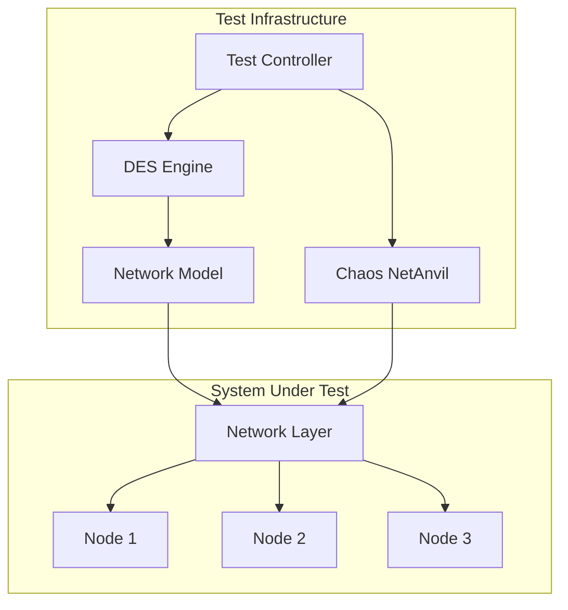
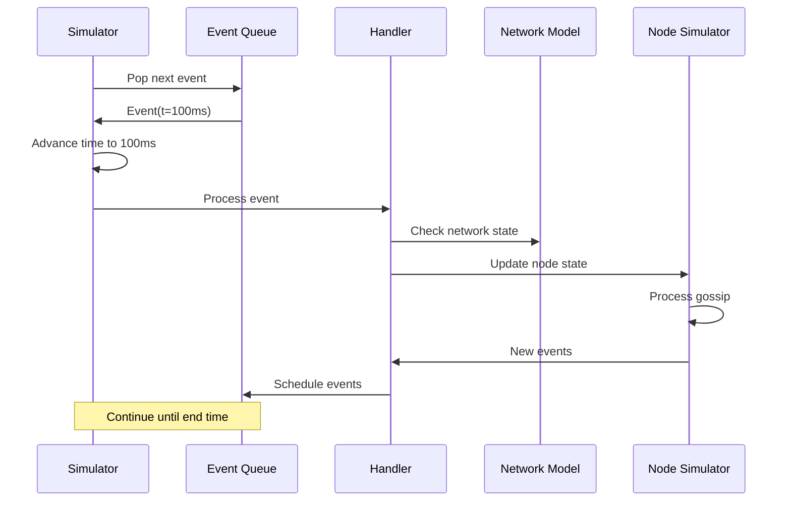
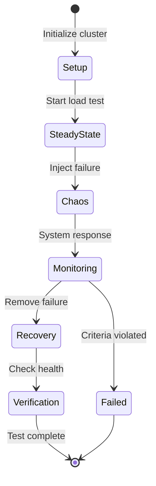
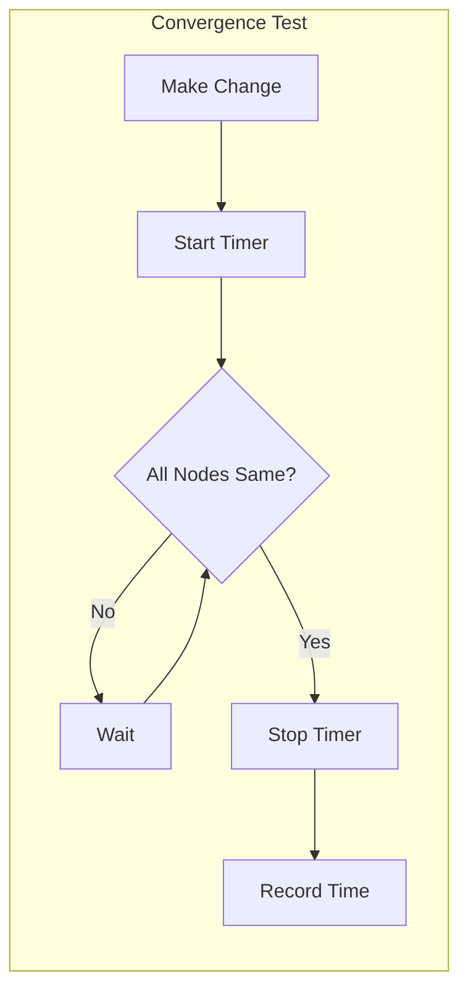
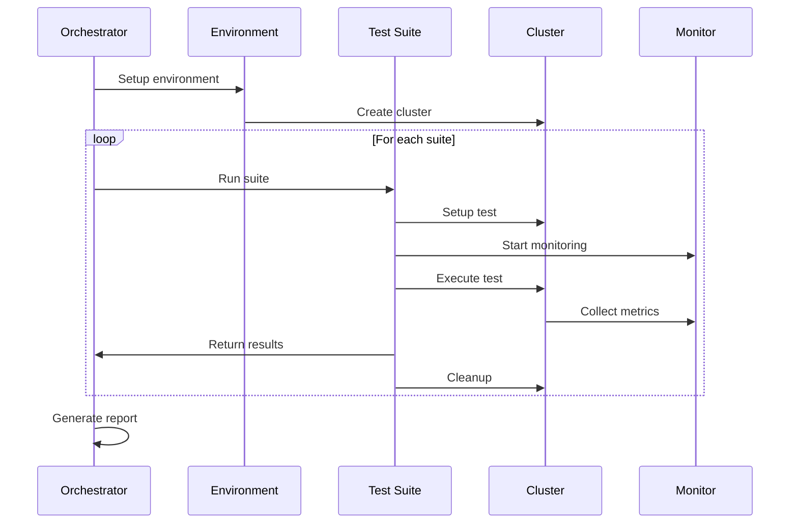

# Distributed System Testing Strategy

## 1. Introduction

Testing a distributed load testing system presents unique challenges. This document outlines comprehensive testing strategies including discrete event simulation, chaos engineering, and integration testing approaches to ensure system reliability.

## 2. Testing Architecture

### 2.1 Testing Layers

```
┌─────────────────────────────────────────────────────────────────────┐
│                        Testing Strategy Layers                       │
├─────────────────────────────────────────────────────────────────────┤
│                                                                     │
│  Unit Tests               Integration Tests      System Tests       │
│  ┌─────────────┐         ┌─────────────┐       ┌─────────────┐   │
│  │ CRDT Logic  │         │ Component   │       │ Full Cluster│   │
│  │ Algorithms  │         │ Integration │       │ Scenarios   │   │
│  │ Utilities   │         │ Protocols   │       │ Performance │   │
│  └─────────────┘         └─────────────┘       └─────────────┘   │
│                                                                     │
│  Simulation Tests         Chaos Tests           Property Tests      │
│  ┌─────────────┐         ┌─────────────┐       ┌─────────────┐   │
│  │ DES Models  │         │ Failure     │       │ Invariants  │   │
│  │ Network Sim │         │ Injection   │       │ Properties  │   │
│  │ Scenarios   │         │ Partition   │       │ Convergence │   │
│  └─────────────┘         └─────────────┘       └─────────────┘   │
│                                                                     │
└─────────────────────────────────────────────────────────────────────┘
```

### 2.2 Test Environment Architecture



## 3. Discrete Event Simulation (DES)

### 3.1 DES Framework

```rust
/// Core discrete event simulation engine
pub struct DiscreteEventSimulator {
    /// Current simulation time
    current_time: Duration,
    
    /// Event queue (min-heap by time)
    event_queue: BinaryHeap<Reverse<Event>>,
    
    /// Network model
    network: NetworkModel,
    
    /// Node simulators
    nodes: HashMap<String, NodeSimulator>,
    
    /// Global state
    state: SimulationState,
    
    /// Event handlers
    handlers: HashMap<EventType, Box<dyn EventHandler>>,
}

/// Simulation event
#[derive(Debug, Clone, Eq, PartialEq)]
pub struct Event {
    /// When this event occurs
    pub time: Duration,
    /// Event type
    pub event_type: EventType,
    /// Event data
    pub data: EventData,
}

impl Ord for Event {
    fn cmp(&self, other: &Self) -> Ordering {
        self.time.cmp(&other.time)
    }
}

#[derive(Debug, Clone, PartialEq, Eq, Hash)]
pub enum EventType {
    // Network events
    MessageSent,
    MessageReceived,
    MessageDropped,
    
    // Node events
    NodeStarted,
    NodeFailed,
    HeartbeatTimeout,
    
    // Protocol events
    ElectionStarted,
    GossipRound,
    EpochCreated,
    
    // Load events
    RequestGenerated,
    RequestCompleted,
    LoadChanged,
}

impl DiscreteEventSimulator {
    /// Run simulation
    pub async fn run(&mut self, until: Duration) -> SimulationResult {
        while let Some(Reverse(event)) = self.event_queue.pop() {
            if event.time > until {
                break;
            }
            
            self.current_time = event.time;
            self.process_event(event).await;
        }
        
        self.collect_results()
    }
    
    /// Process a single event
    async fn process_event(&mut self, event: Event) {
        // Update global state
        self.state.record_event(&event);
        
        // Find handler
        if let Some(handler) = self.handlers.get(&event.event_type) {
            let new_events = handler.handle(
                &event,
                &mut self.network,
                &mut self.nodes,
                &self.state,
            ).await;
            
            // Schedule new events
            for new_event in new_events {
                self.event_queue.push(Reverse(new_event));
            }
        }
    }
}
```

### 3.2 Network Model

```rust
/// Network behavior model for simulation
pub struct NetworkModel {
    /// Latency between nodes
    latency_matrix: HashMap<(String, String), LatencyModel>,
    
    /// Packet loss probability
    loss_model: LossModel,
    
    /// Bandwidth constraints
    bandwidth: BandwidthModel,
    
    /// Current partitions
    partitions: Vec<NetworkPartition>,
}

/// Latency model with jitter
#[derive(Debug, Clone)]
pub struct LatencyModel {
    /// Base latency
    pub base_ms: f64,
    /// Jitter (standard deviation)
    pub jitter_ms: f64,
    /// Distribution type
    pub distribution: LatencyDistribution,
}

#[derive(Debug, Clone)]
pub enum LatencyDistribution {
    /// Normal distribution
    Normal,
    /// Gamma distribution (more realistic)
    Gamma { shape: f64, scale: f64 },
    /// Empirical distribution from traces
    Empirical { samples: Vec<f64> },
}

impl NetworkModel {
    /// Calculate message delivery time
    pub fn calculate_delivery_time(
        &self,
        from: &str,
        to: &str,
        message_size: usize,
        current_time: Duration,
    ) -> Option<Duration> {
        // Check for partition
        if self.is_partitioned(from, to, current_time) {
            return None; // Message dropped
        }
        
        // Get latency model
        let latency_model = self.latency_matrix
            .get(&(from.to_string(), to.to_string()))?;
        
        // Sample latency
        let network_latency = latency_model.sample();
        
        // Add bandwidth delay
        let bandwidth_delay = self.bandwidth.calculate_delay(from, to, message_size);
        
        // Check packet loss
        if self.loss_model.should_drop(from, to) {
            return None;
        }
        
        Some(current_time + network_latency + bandwidth_delay)
    }
}
```

### 3.3 Node Simulation

```rust
/// Simulated node behavior
pub struct NodeSimulator {
    /// Node ID
    id: String,
    
    /// Current role
    role: NodeRole,
    
    /// CRDT state
    state: DistributedState,
    
    /// Pending messages
    inbox: VecDeque<Message>,
    
    /// Gossip targets
    peers: Vec<String>,
    
    /// Failure model
    failure_model: Option<FailureModel>,
}

impl NodeSimulator {
    /// Process time advancement
    pub fn advance_time(&mut self, new_time: Duration) -> Vec<Event> {
        let mut events = vec![];
        
        // Check for scheduled failures
        if let Some(ref failure) = self.failure_model {
            if failure.should_fail(new_time) {
                events.push(Event {
                    time: new_time,
                    event_type: EventType::NodeFailed,
                    data: EventData::NodeFailure {
                        node_id: self.id.clone(),
                        reason: failure.get_reason(),
                    },
                });
                return events;
            }
        }
        
        // Process any due gossip rounds
        if self.should_gossip(new_time) {
            events.extend(self.create_gossip_events(new_time));
        }
        
        // Process message inbox
        while let Some(msg) = self.inbox.pop_front() {
            events.extend(self.process_message(msg, new_time));
        }
        
        events
    }
}
```

### 3.4 Simulation Scenarios

```rust
/// Pre-defined test scenarios
pub enum SimulationScenario {
    /// Basic cluster formation
    ClusterFormation {
        nodes: usize,
        join_interval: Duration,
    },
    
    /// Leader election under various conditions
    LeaderElection {
        nodes: usize,
        failure_pattern: FailurePattern,
    },
    
    /// Network partition and healing
    NetworkPartition {
        partition_time: Duration,
        heal_time: Duration,
        partition_type: PartitionType,
    },
    
    /// Load distribution with failures
    LoadDistribution {
        initial_load: u64,
        node_failures: Vec<(Duration, String)>,
        load_changes: Vec<(Duration, u64)>,
    },
    
    /// Cascading failure scenario
    CascadingFailure {
        trigger_load: u64,
        failure_threshold: f64,
    },
}

impl SimulationScenario {
    /// Create initial events for scenario
    pub fn create_initial_events(&self) -> Vec<Event> {
        match self {
            SimulationScenario::ClusterFormation { nodes, join_interval } => {
                (0..*nodes).map(|i| Event {
                    time: *join_interval * i as u32,
                    event_type: EventType::NodeStarted,
                    data: EventData::NodeStart {
                        node_id: format!("node-{}", i),
                        capabilities: NodeCapabilities::default(),
                    },
                }).collect()
            }
            // Other scenarios...
        }
    }
}
```

### 3.5 Simulation Execution



## 4. Property-Based Testing

### 4.1 System Invariants

```rust
/// Core system properties that must always hold
pub struct SystemInvariants;

impl SystemInvariants {
    /// At most one coordinator with highest token
    pub fn single_coordinator_invariant(nodes: &[NodeState]) -> bool {
        let coordinators: Vec<_> = nodes.iter()
            .filter(|n| n.role == NodeRole::Coordinator)
            .collect();
        
        match coordinators.len() {
            0 => true, // No coordinator is valid
            1 => true, // Exactly one is good
            _ => {
                // Multiple coordinators - check tokens
                let max_token = coordinators.iter()
                    .map(|c| c.fencing_token)
                    .max()
                    .unwrap();
                
                // Only one should have max token
                coordinators.iter()
                    .filter(|c| c.fencing_token == max_token)
                    .count() == 1
            }
        }
    }
    
    /// Total load equals sum of node loads
    pub fn load_conservation_invariant(
        target_load: u64,
        assignments: &HashMap<String, u64>,
    ) -> bool {
        let total: u64 = assignments.values().sum();
        // Allow small deviation for rounding
        (total as i64 - target_load as i64).abs() <= assignments.len() as i64
    }
    
    /// CRDTs eventually converge
    pub fn eventual_consistency_invariant(
        states: &[DistributedState],
        max_time: Duration,
    ) -> bool {
        // After max_time with no new events, all states should be identical
        let first = &states[0];
        states.iter().all(|s| s.equals_eventually(first, max_time))
    }
}

/// Property-based test harness
#[quickcheck]
fn prop_coordinator_safety(
    events: Vec<TestEvent>,
    network: TestNetwork,
) -> bool {
    let mut sim = DiscreteEventSimulator::new();
    sim.apply_events(events);
    sim.set_network(network);
    
    let result = sim.run(Duration::from_secs(300));
    
    SystemInvariants::single_coordinator_invariant(&result.final_states)
}
```

### 4.2 CRDT Properties

```rust
/// CRDT-specific properties
pub struct CRDTProperties;

impl CRDTProperties {
    /// Merge is commutative
    pub fn merge_commutative<T: CRDT>(a: &T, b: &T) -> bool {
        let mut ab = a.clone();
        ab.merge(b);
        
        let mut ba = b.clone();
        ba.merge(a);
        
        ab == ba
    }
    
    /// Merge is associative
    pub fn merge_associative<T: CRDT>(a: &T, b: &T, c: &T) -> bool {
        let mut ab_c = a.clone();
        ab_c.merge(b);
        ab_c.merge(c);
        
        let mut a_bc = a.clone();
        let mut bc = b.clone();
        bc.merge(c);
        a_bc.merge(&bc);
        
        ab_c == a_bc
    }
    
    /// Merge is idempotent
    pub fn merge_idempotent<T: CRDT>(a: &T) -> bool {
        let mut aa = a.clone();
        aa.merge(a);
        
        aa == *a
    }
}

#[test]
fn test_distributed_state_properties() {
    quickcheck(CRDTProperties::merge_commutative::<DistributedState> as fn(&DistributedState, &DistributedState) -> bool);
    quickcheck(CRDTProperties::merge_associative::<DistributedState> as fn(&DistributedState, &DistributedState, &DistributedState) -> bool);
    quickcheck(CRDTProperties::merge_idempotent::<DistributedState> as fn(&DistributedState) -> bool);
}
```

## 5. Chaos Engineering

### 5.1 Chaos Test Framework

```rust
/// Chaos testing framework
pub struct ChaosFramework {
    /// Target cluster
    cluster: TestCluster,
    
    /// Chaos operations
    operations: Vec<Box<dyn ChaosOperation>>,
    
    /// Monitoring
    monitor: SystemMonitor,
    
    /// Success criteria
    criteria: SuccessCriteria,
}

/// Types of chaos operations
pub trait ChaosOperation: Send + Sync {
    /// Execute the chaos operation
    async fn execute(&self, cluster: &TestCluster) -> Result<()>;
    
    /// Cleanup after operation
    async fn cleanup(&self, cluster: &TestCluster) -> Result<()>;
    
    /// Get operation name
    fn name(&self) -> &str;
}

/// Network partition chaos
pub struct NetworkPartitionChaos {
    /// Partition configuration
    config: PartitionConfig,
}

impl ChaosOperation for NetworkPartitionChaos {
    async fn execute(&self, cluster: &TestCluster) -> Result<()> {
        // Create network partition
        cluster.network_controller()
            .create_partition(&self.config)
            .await
    }
    
    async fn cleanup(&self, cluster: &TestCluster) -> Result<()> {
        // Heal partition
        cluster.network_controller()
            .heal_all_partitions()
            .await
    }
    
    fn name(&self) -> &str {
        "network_partition"
    }
}
```

### 5.2 Chaos Scenarios

```rust
/// Pre-defined chaos scenarios
pub enum ChaosScenario {
    /// Random node failures
    RandomFailures {
        failure_rate: f64,
        mttr: Duration, // Mean time to repair
    },
    
    /// Coordinated failures
    CoordinatorHunting {
        kill_interval: Duration,
    },
    
    /// Network degradation
    NetworkDegradation {
        latency_multiplier: f64,
        loss_rate: f64,
    },
    
    /// Resource exhaustion
    ResourceExhaustion {
        target_nodes: Vec<String>,
        resource_type: ResourceType,
    },
    
    /// Clock skew
    ClockSkew {
        max_skew: Duration,
        drift_rate: f64,
    },
}

impl ChaosFramework {
    /// Run chaos test
    pub async fn run_chaos_test(&mut self) -> Result<ChaosTestResult> {
        // Start monitoring
        self.monitor.start().await?;
        
        // Verify steady state
        self.verify_steady_state().await?;
        
        // Execute chaos operations
        for operation in &self.operations {
            info!("Executing chaos operation: {}", operation.name());
            operation.execute(&self.cluster).await?;
            
            // Let system react
            tokio::time::sleep(Duration::from_secs(10)).await;
            
            // Check if system is still meeting criteria
            if !self.check_criteria().await? {
                return Ok(ChaosTestResult::Failed {
                    operation: operation.name().to_string(),
                    reason: "Criteria not met during chaos".to_string(),
                });
            }
        }
        
        // Cleanup
        for operation in &self.operations {
            operation.cleanup(&self.cluster).await?;
        }
        
        // Verify recovery
        tokio::time::sleep(Duration::from_secs(30)).await;
        self.verify_steady_state().await?;
        
        Ok(ChaosTestResult::Passed)
    }
}
```

### 5.3 Chaos Test Execution



## 6. Integration Testing

### 6.1 Multi-Node Test Harness

```rust
/// Test cluster for integration testing
pub struct TestCluster {
    /// Nodes in the cluster
    nodes: Vec<TestNode>,
    
    /// Network controller
    network: NetworkController,
    
    /// Time controller (for testing)
    time: TimeController,
    
    /// Log aggregator
    logs: LogAggregator,
}

impl TestCluster {
    /// Create a new test cluster
    pub async fn new(size: usize) -> Result<Self> {
        let mut nodes = Vec::new();
        
        for i in 0..size {
            let node = TestNode::new(
                format!("node-{}", i),
                TestNodeConfig {
                    gossip_port: 7000 + i as u16,
                    api_port: 8000 + i as u16,
                    data_dir: format!("/tmp/test-node-{}", i),
                },
            ).await?;
            
            nodes.push(node);
        }
        
        Ok(Self {
            nodes,
            network: NetworkController::new(),
            time: TimeController::new(),
            logs: LogAggregator::new(),
        })
    }
    
    /// Wait for cluster to converge
    pub async fn wait_for_convergence(&self, timeout: Duration) -> Result<()> {
        let start = Instant::now();
        
        loop {
            if self.is_converged().await? {
                return Ok(());
            }
            
            if start.elapsed() > timeout {
                return Err("Convergence timeout".into());
            }
            
            tokio::time::sleep(Duration::from_millis(100)).await;
        }
    }
    
    /// Check if all nodes have same state
    async fn is_converged(&self) -> Result<bool> {
        let states: Vec<_> = futures::future::join_all(
            self.nodes.iter().map(|n| n.get_state())
        ).await;
        
        // All states should be identical
        let first = &states[0];
        Ok(states.iter().all(|s| s == first))
    }
}
```

### 6.2 Integration Test Scenarios

```rust
#[tokio::test]
async fn test_node_join_sequence() {
    let mut cluster = TestCluster::new(3).await.unwrap();
    
    // Start first two nodes
    cluster.start_nodes(&[0, 1]).await.unwrap();
    cluster.wait_for_convergence(Duration::from_secs(10)).await.unwrap();
    
    // Verify two-node cluster formed
    assert_eq!(cluster.get_active_nodes().await.len(), 2);
    
    // Start third node
    cluster.start_node(2).await.unwrap();
    cluster.wait_for_convergence(Duration::from_secs(10)).await.unwrap();
    
    // Verify three-node cluster
    assert_eq!(cluster.get_active_nodes().await.len(), 3);
    
    // Verify load redistributed
    let assignments = cluster.get_load_assignments().await;
    assert_eq!(assignments.len(), 3);
}

#[tokio::test]
async fn test_coordinator_failover() {
    let cluster = TestCluster::new(5).await.unwrap();
    cluster.start_all().await.unwrap();
    cluster.wait_for_convergence(Duration::from_secs(10)).await.unwrap();
    
    // Identify coordinator
    let coordinator = cluster.get_coordinator().await.unwrap();
    
    // Kill coordinator
    cluster.kill_node(&coordinator.id).await.unwrap();
    
    // Wait for new election
    tokio::time::sleep(Duration::from_secs(5)).await;
    
    // Verify new coordinator elected
    let new_coordinator = cluster.get_coordinator().await.unwrap();
    assert_ne!(coordinator.id, new_coordinator.id);
    
    // Verify load redistributed
    let assignments = cluster.get_load_assignments().await;
    assert_eq!(assignments.len(), 4); // 5 - 1 failed
}
```

## 7. Performance Testing

### 7.1 Scalability Tests

```rust
/// Test cluster scalability
pub struct ScalabilityTest {
    /// Maximum nodes to test
    max_nodes: usize,
    
    /// Load per node
    load_per_node: u64,
    
    /// Metrics to collect
    metrics: Vec<ScalabilityMetric>,
}

#[derive(Debug, Clone)]
pub enum ScalabilityMetric {
    /// Time to converge after node join
    ConvergenceTime,
    /// Gossip message overhead
    GossipOverhead,
    /// Election completion time
    ElectionTime,
    /// State size growth
    StateSize,
    /// CPU usage per node
    CpuUsage,
}

impl ScalabilityTest {
    pub async fn run(&self) -> Result<ScalabilityResults> {
        let mut results = ScalabilityResults::new();
        
        for size in (10..=self.max_nodes).step_by(10) {
            info!("Testing with {} nodes", size);
            
            let cluster = TestCluster::new(size).await?;
            cluster.start_all().await?;
            
            // Measure convergence time
            let start = Instant::now();
            cluster.wait_for_convergence(Duration::from_secs(60)).await?;
            let convergence_time = start.elapsed();
            
            results.record(size, ScalabilityMetric::ConvergenceTime, convergence_time);
            
            // Apply load
            cluster.set_total_load(size as u64 * self.load_per_node).await?;
            
            // Let it run
            tokio::time::sleep(Duration::from_secs(60)).await;
            
            // Collect metrics
            let metrics = cluster.collect_metrics().await?;
            results.record_all(size, metrics);
            
            // Cleanup
            cluster.shutdown().await?;
        }
        
        Ok(results)
    }
}
```

### 7.2 Convergence Speed Testing



## 8. Failure Injection Testing

### 8.1 Failure Patterns

```rust
/// Failure injection patterns
pub enum FailurePattern {
    /// Single random failure
    Random {
        probability: f64,
    },
    
    /// Correlated failures
    Correlated {
        correlation: f64,
        group_size: usize,
    },
    
    /// Cascading failures
    Cascading {
        initial_failures: usize,
        propagation_delay: Duration,
        propagation_probability: f64,
    },
    
    /// Periodic failures
    Periodic {
        interval: Duration,
        duration: Duration,
    },
}

/// Failure injector
pub struct FailureInjector {
    pattern: FailurePattern,
    cluster: Arc<TestCluster>,
}

impl FailureInjector {
    /// Start injecting failures
    pub async fn start(&self) -> Result<()> {
        match &self.pattern {
            FailurePattern::Cascading { initial_failures, propagation_delay, propagation_probability } => {
                // Select initial victims
                let victims = self.select_random_nodes(*initial_failures);
                
                // Kill initial nodes
                for node in victims {
                    self.cluster.kill_node(&node).await?;
                }
                
                // Simulate cascading effect
                loop {
                    tokio::time::sleep(*propagation_delay).await;
                    
                    let active = self.cluster.get_active_nodes().await;
                    if active.is_empty() {
                        break;
                    }
                    
                    // Randomly propagate failure
                    for node in active {
                        if rand::random::<f64>() < *propagation_probability {
                            self.cluster.kill_node(&node.id).await?;
                        }
                    }
                }
            }
            // Other patterns...
        }
        
        Ok(())
    }
}
```

## 9. Test Execution Framework

### 9.1 Test Orchestration

```rust
/// Main test orchestrator
pub struct TestOrchestrator {
    /// Test suites to run
    suites: Vec<Box<dyn TestSuite>>,
    
    /// Test environment
    environment: TestEnvironment,
    
    /// Results collector
    results: TestResults,
}

#[async_trait]
pub trait TestSuite: Send + Sync {
    /// Suite name
    fn name(&self) -> &str;
    
    /// Setup before tests
    async fn setup(&self, env: &TestEnvironment) -> Result<()>;
    
    /// Run test suite
    async fn run(&self, env: &TestEnvironment) -> Result<SuiteResults>;
    
    /// Cleanup after tests
    async fn cleanup(&self, env: &TestEnvironment) -> Result<()>;
}

impl TestOrchestrator {
    /// Run all test suites
    pub async fn run_all(&mut self) -> Result<TestReport> {
        for suite in &self.suites {
            info!("Running test suite: {}", suite.name());
            
            // Setup
            suite.setup(&self.environment).await?;
            
            // Run with timeout
            let result = tokio::time::timeout(
                Duration::from_secs(3600),
                suite.run(&self.environment)
            ).await;
            
            match result {
                Ok(Ok(suite_results)) => {
                    self.results.add_suite_results(suite.name(), suite_results);
                }
                Ok(Err(e)) => {
                    error!("Suite {} failed: {}", suite.name(), e);
                    self.results.add_suite_failure(suite.name(), e);
                }
                Err(_) => {
                    error!("Suite {} timed out", suite.name());
                    self.results.add_suite_timeout(suite.name());
                }
            }
            
            // Always cleanup
            let _ = suite.cleanup(&self.environment).await;
        }
        
        Ok(self.results.generate_report())
    }
}
```

### 9.2 Test Execution Pipeline



## 10. Continuous Testing

### 10.1 CI/CD Integration

```yaml
# .github/workflows/distributed-tests.yml
name: Distributed System Tests

on:
  push:
    branches: [ main ]
  pull_request:
  schedule:
    - cron: '0 0 * * *'  # Daily

jobs:
  simulation-tests:
    runs-on: ubuntu-latest
    steps:
      - uses: actions/checkout@v2
      
      - name: Run DES tests
        run: |
          cargo test --package distributed-tests \
            --test simulation -- --nocapture
      
      - name: Upload simulation results
        uses: actions/upload-artifact@v2
        with:
          name: simulation-results
          path: target/simulation-results/
  
  chaos-tests:
    runs-on: ubuntu-latest
    strategy:
      matrix:
        scenario: [network-partition, node-failures, clock-skew]
    steps:
      - name: Run chaos test
        run: |
          cargo test --package distributed-tests \
            --test chaos_${{ matrix.scenario }}
```

### 10.2 Performance Regression Detection

```rust
/// Performance regression detector
pub struct RegressionDetector {
    /// Historical performance data
    baseline: PerformanceBaseline,
    
    /// Regression thresholds
    thresholds: RegressionThresholds,
}

impl RegressionDetector {
    /// Check for regressions
    pub fn check_results(&self, results: &TestResults) -> Vec<Regression> {
        let mut regressions = Vec::new();
        
        // Check convergence time
        if let Some(convergence) = results.get_metric("convergence_time") {
            let baseline = self.baseline.convergence_time;
            if convergence > baseline * (1.0 + self.thresholds.convergence) {
                regressions.push(Regression {
                    metric: "convergence_time".to_string(),
                    baseline_value: baseline,
                    current_value: convergence,
                    threshold: self.thresholds.convergence,
                });
            }
        }
        
        // Check other metrics...
        
        regressions
    }
}
```

## 11. Summary

This comprehensive testing strategy ensures the distributed load testing system is reliable and performant:

1. **Discrete Event Simulation**: Test complex scenarios without real infrastructure
2. **Property-Based Testing**: Verify system invariants hold under all conditions
3. **Chaos Engineering**: Ensure resilience to failures and network issues
4. **Integration Testing**: Verify components work together correctly
5. **Performance Testing**: Ensure scalability and detect regressions

Key benefits:
- **Early Detection**: Find issues before production
- **Confidence**: Comprehensive coverage of failure modes
- **Automation**: CI/CD integration for continuous validation
- **Insights**: Deep understanding of system behavior

The combination of simulation and real testing provides both speed and accuracy in validating the distributed system.