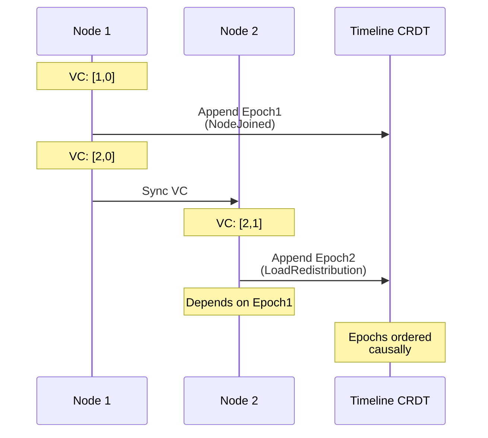
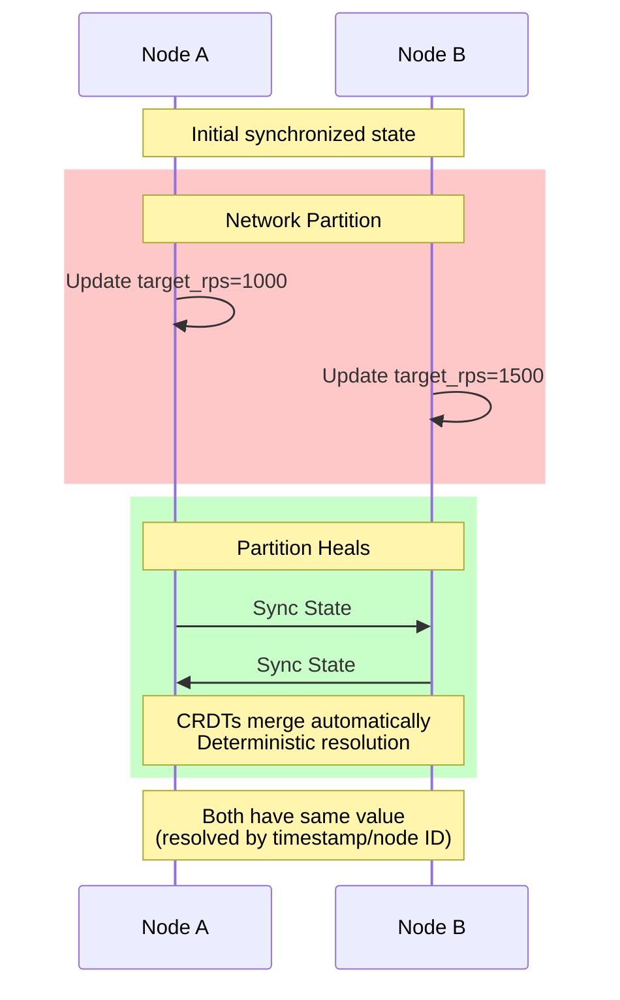

# CRDT Implementation for Distributed State Management

## 1. Introduction

This document provides the detailed implementation of Conflict-free Replicated Data Types (CRDTs) used in the distributed load testing system. CRDTs enable distributed nodes to maintain consistent state without coordination, providing eventual consistency guarantees even in the presence of network partitions.

Key features include:

- **Automatic Conflict Resolution**: CRDTs merge concurrent updates deterministically
- **Partition Tolerance**: Nodes can continue operating during network splits
- **Eventual Consistency**: All nodes converge to the same state when communication resumes
- **Commutative Operations**: Updates can be applied in any order
- **Idempotent Merges**: Repeated merges produce the same result
- **Memory Efficiency**: Garbage collection for tombstones and old entries
- **Delta State CRDTs**: Efficient synchronization with minimal data transfer

## 2. Core CRDT Traits

### 2.1 Base CRDT Trait

```rust
/// Base trait for all CRDTs
pub trait CRDT: Clone + Send + Sync {
    /// The delta type for this CRDT
    type Delta: Clone + Send + Sync + Serialize + DeserializeOwned;
    
    /// Merge another CRDT instance into this one
    fn merge(&mut self, other: &Self);
    
    /// Create a delta containing changes since the given version
    fn delta(&self, since_version: &Version) -> Option<Self::Delta>;
    
    /// Apply a delta to this CRDT
    fn apply_delta(&mut self, delta: &Self::Delta);
    
    /// Get the current version for delta tracking
    fn version(&self) -> Version;
    
    /// Get the size in bytes (for memory management)
    fn size_bytes(&self) -> usize;
    
    /// Garbage collect old entries
    fn gc(&mut self, threshold: Instant);
}

/// Version tracking for delta CRDTs
#[derive(Debug, Clone, PartialEq, Eq, Hash, Serialize, Deserialize)]
pub struct Version {
    /// Logical timestamp
    pub logical_time: u64,
    /// Node that created this version
    pub node_id: String,
}
```

### 2.2 CRDT Registry

```rust
/// Registry for managing all CRDTs in the system
pub struct CRDTRegistry {
    /// Node registry
    pub nodes: Arc<RwLock<NodeRegistryCRDT>>,
    /// Load assignments
    pub assignments: Arc<RwLock<LoadAssignmentsCRDT>>,
    /// Epoch timeline
    pub epochs: Arc<RwLock<EpochTimelineCRDT>>,
    /// Test parameters
    pub parameters: Arc<RwLock<ParametersCRDT>>,
    /// Controller state
    pub controller: Arc<RwLock<ControllerStateCRDT>>,
    /// Version tracking
    versions: Arc<RwLock<HashMap<String, Version>>>,
}

impl CRDTRegistry {
    /// Create delta state containing all changes since versions
    pub fn create_delta_state(&self, since_versions: &HashMap<String, Version>) -> DeltaState {
        DeltaState {
            nodes_delta: self.nodes.read().unwrap()
                .delta(since_versions.get("nodes").unwrap_or(&Version::default())),
            assignments_delta: self.assignments.read().unwrap()
                .delta(since_versions.get("assignments").unwrap_or(&Version::default())),
            epochs_delta: self.epochs.read().unwrap()
                .delta(since_versions.get("epochs").unwrap_or(&Version::default())),
            parameters_delta: self.parameters.read().unwrap()
                .delta(since_versions.get("parameters").unwrap_or(&Version::default())),
            controller_delta: self.controller.read().unwrap()
                .delta(since_versions.get("controller").unwrap_or(&Version::default())),
        }
    }
    
    /// Apply delta state
    pub fn apply_delta_state(&self, delta: &DeltaState) {
        if let Some(ref d) = delta.nodes_delta {
            self.nodes.write().unwrap().apply_delta(d);
        }
        if let Some(ref d) = delta.assignments_delta {
            self.assignments.write().unwrap().apply_delta(d);
        }
        if let Some(ref d) = delta.epochs_delta {
            self.epochs.write().unwrap().apply_delta(d);
        }
        if let Some(ref d) = delta.parameters_delta {
            self.parameters.write().unwrap().apply_delta(d);
        }
        if let Some(ref d) = delta.controller_delta {
            self.controller.write().unwrap().apply_delta(d);
        }
    }
}
```

## 3. OR-Set CRDT Implementation

### 3.1 OR-Set for Node Registry

```rust
/// OR-Set CRDT for node registry
#[derive(Debug, Clone)]
pub struct NodeRegistryCRDT {
    /// Set entries: node_id -> list of tagged entries
    entries: HashMap<String, Vec<NodeEntry>>,
    /// Version for delta tracking
    version: Version,
    /// Tombstones for removed entries
    tombstones: HashSet<(String, Uuid)>,
}

/// Node entry with unique tag
#[derive(Debug, Clone, Serialize, Deserialize)]
struct NodeEntry {
    /// Node ID
    node_id: String,
    /// Node state
    state: NodeState,
    /// Node capabilities
    capabilities: NodeCapabilities,
    /// Timestamp
    timestamp: u64,
    /// Unique tag for this entry
    tag: Uuid,
    /// Vector clock
    vector_clock: VectorClock,
}

/// Delta for OR-Set
#[derive(Debug, Clone, Serialize, Deserialize)]
pub struct ORSetDelta {
    /// Added entries
    added: Vec<NodeEntry>,
    /// Removed tags
    removed: HashSet<(String, Uuid)>,
}

impl NodeRegistryCRDT {
    /// Create new node registry
    pub fn new(node_id: String) -> Self {
        Self {
            entries: HashMap::new(),
            version: Version {
                logical_time: 0,
                node_id,
            },
            tombstones: HashSet::new(),
        }
    }
    
    /// Add or update a node
    pub fn update_node(
        &mut self,
        node_id: String,
        state: NodeState,
        capabilities: NodeCapabilities,
        vector_clock: VectorClock,
    ) {
        let entry = NodeEntry {
            node_id: node_id.clone(),
            state,
            capabilities,
            timestamp: SystemTime::now()
                .duration_since(UNIX_EPOCH)
                .unwrap()
                .as_millis() as u64,
            tag: Uuid::new_v4(),
            vector_clock,
        };
        
        self.entries.entry(node_id)
            .or_insert_with(Vec::new)
            .push(entry);
        
        self.version.logical_time += 1;
    }
    
    /// Remove a node
    pub fn remove_node(&mut self, node_id: &str) {
        if let Some(entries) = self.entries.get(node_id) {
            // Add all tags to tombstones
            for entry in entries {
                self.tombstones.insert((node_id.to_string(), entry.tag));
            }
        }
        
        self.version.logical_time += 1;
    }
    
    /// Get current state of a node
    pub fn get_node(&self, node_id: &str) -> Option<(NodeState, NodeCapabilities)> {
        self.entries.get(node_id)
            .and_then(|entries| {
                // Filter out tombstoned entries
                let active_entries: Vec<_> = entries.iter()
                    .filter(|e| !self.tombstones.contains(&(node_id.to_string(), e.tag)))
                    .collect();
                
                // Return most recent
                active_entries.iter()
                    .max_by_key(|e| e.timestamp)
                    .map(|e| (e.state, e.capabilities.clone()))
            })
    }
    
    /// Get all active nodes
    pub fn get_active_nodes(&self) -> Vec<(String, NodeCapabilities)> {
        self.entries.iter()
            .filter_map(|(node_id, entries)| {
                // Get most recent non-tombstoned entry
                entries.iter()
                    .filter(|e| !self.tombstones.contains(&(node_id.clone(), e.tag)))
                    .max_by_key(|e| e.timestamp)
                    .filter(|e| matches!(e.state, NodeState::Ready | NodeState::Active))
                    .map(|e| (node_id.clone(), e.capabilities.clone()))
            })
            .collect()
    }
}

impl CRDT for NodeRegistryCRDT {
    type Delta = ORSetDelta;
    
    fn merge(&mut self, other: &Self) {
        // Merge entries
        for (node_id, entries) in &other.entries {
            let local_entries = self.entries.entry(node_id.clone())
                .or_insert_with(Vec::new);
            
            for entry in entries {
                // Add if not already present
                if !local_entries.iter().any(|e| e.tag == entry.tag) {
                    local_entries.push(entry.clone());
                }
            }
        }
        
        // Merge tombstones
        self.tombstones.extend(&other.tombstones);
        
        // Update version
        if other.version.logical_time > self.version.logical_time {
            self.version = other.version.clone();
        }
    }
    
    fn delta(&self, since_version: &Version) -> Option<Self::Delta> {
        if since_version.logical_time >= self.version.logical_time {
            return None;
        }
        
        // Collect entries added since version
        let added: Vec<NodeEntry> = self.entries.values()
            .flat_map(|entries| entries.iter())
            .filter(|e| e.timestamp > since_version.logical_time)
            .cloned()
            .collect();
        
        // Collect tombstones added since version
        let removed: HashSet<(String, Uuid)> = self.tombstones.iter()
            .filter(|(node_id, _)| {
                // Check if this tombstone is newer than since_version
                self.entries.get(node_id)
                    .and_then(|entries| entries.iter()
                        .find(|e| self.tombstones.contains(&(node_id.clone(), e.tag)))
                        .map(|e| e.timestamp > since_version.logical_time))
                    .unwrap_or(false)
            })
            .cloned()
            .collect();
        
        if added.is_empty() && removed.is_empty() {
            None
        } else {
            Some(ORSetDelta { added, removed })
        }
    }
    
    fn apply_delta(&mut self, delta: &Self::Delta) {
        // Apply additions
        for entry in &delta.added {
            let entries = self.entries.entry(entry.node_id.clone())
                .or_insert_with(Vec::new);
            
            if !entries.iter().any(|e| e.tag == entry.tag) {
                entries.push(entry.clone());
            }
        }
        
        // Apply removals
        self.tombstones.extend(&delta.removed);
        
        self.version.logical_time += 1;
    }
    
    fn version(&self) -> Version {
        self.version.clone()
    }
    
    fn size_bytes(&self) -> usize {
        std::mem::size_of_val(&self.entries) +
        self.entries.iter()
            .map(|(k, v)| k.len() + v.len() * std::mem::size_of::<NodeEntry>())
            .sum::<usize>() +
        std::mem::size_of_val(&self.tombstones) +
        self.tombstones.len() * std::mem::size_of::<(String, Uuid)>()
    }
    
    fn gc(&mut self, threshold: Instant) {
        let threshold_ts = threshold.duration_since(UNIX_EPOCH).unwrap().as_millis() as u64;
        
        // Remove old tombstones
        self.tombstones.retain(|(node_id, tag)| {
            self.entries.get(node_id)
                .and_then(|entries| entries.iter().find(|e| e.tag == *tag))
                .map(|e| e.timestamp > threshold_ts)
                .unwrap_or(false)
        });
        
        // Remove old entries that are tombstoned
        for entries in self.entries.values_mut() {
            entries.retain(|e| {
                e.timestamp > threshold_ts || 
                !self.tombstones.contains(&(e.node_id.clone(), e.tag))
            });
        }
        
        // Remove empty entries
        self.entries.retain(|_, v| !v.is_empty());
    }
}
```

## 4. LWW-Map CRDT Implementation

### 4.1 LWW-Map for Load Assignments

```rust
/// Last-Write-Wins Map for load assignments
#[derive(Debug, Clone)]
pub struct LoadAssignmentsCRDT {
    /// Map of node_id to assignment
    assignments: HashMap<String, TimestampedAssignment>,
    /// Version for delta tracking
    version: Version,
}

/// Assignment with timestamp and causality
#[derive(Debug, Clone, Serialize, Deserialize)]
struct TimestampedAssignment {
    /// Load value
    load: f64,
    /// Logical timestamp
    timestamp: u64,
    /// Physical timestamp for tie-breaking
    physical_time: SystemTime,
    /// Fencing token from coordinator
    fencing_token: u64,
    /// Vector clock for causality
    vector_clock: VectorClock,
}

/// Delta for LWW-Map
#[derive(Debug, Clone, Serialize, Deserialize)]
pub struct LWWMapDelta {
    /// Updated assignments
    updates: HashMap<String, TimestampedAssignment>,
}

impl LoadAssignmentsCRDT {
    /// Update assignment for a node
    pub fn update_assignment(
        &mut self,
        node_id: String,
        load: f64,
        fencing_token: u64,
        vector_clock: VectorClock,
    ) {
        let assignment = TimestampedAssignment {
            load,
            timestamp: self.version.logical_time + 1,
            physical_time: SystemTime::now(),
            fencing_token,
            vector_clock,
        };
        
        // Only update if newer
        let should_update = match self.assignments.get(&node_id) {
            Some(existing) => {
                // Fencing token takes precedence
                if fencing_token > existing.fencing_token {
                    true
                } else if fencing_token == existing.fencing_token {
                    // Use vector clock for causality
                    if assignment.vector_clock.happens_before(&existing.vector_clock) {
                        false
                    } else if existing.vector_clock.happens_before(&assignment.vector_clock) {
                        true
                    } else {
                        // Concurrent - use timestamp
                        if assignment.timestamp > existing.timestamp {
                            true
                        } else if assignment.timestamp == existing.timestamp {
                            // Use physical time as final tie-breaker
                            assignment.physical_time > existing.physical_time
                        } else {
                            false
                        }
                    }
                } else {
                    false
                }
            }
            None => true,
        };
        
        if should_update {
            self.assignments.insert(node_id, assignment);
            self.version.logical_time += 1;
        }
    }
    
    /// Get current assignments
    pub fn get_assignments(&self) -> HashMap<String, f64> {
        self.assignments.iter()
            .map(|(id, a)| (id.clone(), a.load))
            .collect()
    }
    
    /// Get assignment for specific node
    pub fn get_assignment(&self, node_id: &str) -> Option<f64> {
        self.assignments.get(node_id).map(|a| a.load)
    }
}

impl CRDT for LoadAssignmentsCRDT {
    type Delta = LWWMapDelta;
    
    fn merge(&mut self, other: &Self) {
        for (node_id, other_assignment) in &other.assignments {
            let should_update = match self.assignments.get(node_id) {
                Some(our_assignment) => {
                    // Compare using same logic as update
                    if other_assignment.fencing_token > our_assignment.fencing_token {
                        true
                    } else if other_assignment.fencing_token == our_assignment.fencing_token {
                        if other_assignment.timestamp > our_assignment.timestamp {
                            true
                        } else if other_assignment.timestamp == our_assignment.timestamp {
                            other_assignment.physical_time > our_assignment.physical_time
                        } else {
                            false
                        }
                    } else {
                        false
                    }
                }
                None => true,
            };
            
            if should_update {
                self.assignments.insert(node_id.clone(), other_assignment.clone());
            }
        }
        
        // Update version
        if other.version.logical_time > self.version.logical_time {
            self.version = other.version.clone();
        }
    }
    
    fn delta(&self, since_version: &Version) -> Option<Self::Delta> {
        let updates: HashMap<String, TimestampedAssignment> = self.assignments.iter()
            .filter(|(_, a)| a.timestamp > since_version.logical_time)
            .map(|(k, v)| (k.clone(), v.clone()))
            .collect();
        
        if updates.is_empty() {
            None
        } else {
            Some(LWWMapDelta { updates })
        }
    }
    
    fn apply_delta(&mut self, delta: &Self::Delta) {
        for (node_id, assignment) in &delta.updates {
            // Use same update logic
            let should_update = match self.assignments.get(node_id) {
                Some(existing) => {
                    assignment.fencing_token > existing.fencing_token ||
                    (assignment.fencing_token == existing.fencing_token &&
                     (assignment.timestamp > existing.timestamp ||
                      (assignment.timestamp == existing.timestamp &&
                       assignment.physical_time > existing.physical_time)))
                }
                None => true,
            };
            
            if should_update {
                self.assignments.insert(node_id.clone(), assignment.clone());
            }
        }
        
        self.version.logical_time += 1;
    }
    
    fn version(&self) -> Version {
        self.version.clone()
    }
    
    fn size_bytes(&self) -> usize {
        std::mem::size_of_val(&self.assignments) +
        self.assignments.iter()
            .map(|(k, _)| k.len() + std::mem::size_of::<TimestampedAssignment>())
            .sum::<usize>()
    }
    
    fn gc(&mut self, threshold: Instant) {
        // LWW-Map doesn't need GC for correctness, but we can remove
        // entries for nodes that have been gone for a long time
        let threshold_time = SystemTime::now() - threshold.elapsed();
        
        self.assignments.retain(|_, assignment| {
            assignment.physical_time > threshold_time
        });
    }
}
```

## 5. Append-Only Log CRDT Implementation

### 5.1 Epoch Timeline CRDT

```rust
/// Append-only log for epoch timeline
#[derive(Debug, Clone)]
pub struct EpochTimelineCRDT {
    /// Ordered list of epochs
    epochs: Vec<EpochEntry>,
    /// Index by ID for fast lookup
    by_id: HashMap<Uuid, usize>,
    /// Version for delta tracking
    version: Version,
}

/// Epoch entry in timeline
#[derive(Debug, Clone, Serialize, Deserialize)]
struct EpochEntry {
    /// Epoch information
    epoch: Epoch,
    /// Observed set (nodes that have seen this)
    observed_by: HashSet<String>,
}

/// Delta for append-only log
#[derive(Debug, Clone, Serialize, Deserialize)]
pub struct AppendLogDelta {
    /// New epochs
    new_epochs: Vec<Epoch>,
    /// Observation updates
    observations: Vec<(Uuid, String)>,
}

impl EpochTimelineCRDT {
    /// Append new epoch
    pub fn append(&mut self, epoch: Epoch, observer: String) {
        // Check if already exists
        if self.by_id.contains_key(&epoch.id) {
            // Just add observer
            if let Some(idx) = self.by_id.get(&epoch.id) {
                if let Some(entry) = self.epochs.get_mut(*idx) {
                    entry.observed_by.insert(observer);
                }
            }
        } else {
            // Add new epoch
            let mut observed_by = HashSet::new();
            observed_by.insert(observer);
            
            let entry = EpochEntry {
                epoch: epoch.clone(),
                observed_by,
            };
            
            // Find insertion point to maintain causal order
            let insert_pos = self.find_insertion_point(&epoch);
            self.epochs.insert(insert_pos, entry);
            
            // Update index
            self.rebuild_index();
        }
        
        self.version.logical_time += 1;
    }
    
    /// Find insertion point maintaining causal order
    fn find_insertion_point(&self, epoch: &Epoch) -> usize {
        // Binary search for insertion point
        self.epochs.binary_search_by(|entry| {
            // First compare by vector clock causality
            if epoch.vector_clock.happens_before(&entry.epoch.vector_clock) {
                std::cmp::Ordering::Less
            } else if entry.epoch.vector_clock.happens_before(&epoch.vector_clock) {
                std::cmp::Ordering::Greater
            } else {
                // Concurrent - order by timestamp, then ID
                match epoch.timestamp.cmp(&entry.epoch.timestamp) {
                    std::cmp::Ordering::Equal => epoch.id.cmp(&entry.epoch.id),
                    other => other,
                }
            }
        }).unwrap_or_else(|pos| pos)
    }
    
    /// Rebuild ID index
    fn rebuild_index(&mut self) {
        self.by_id.clear();
        for (idx, entry) in self.epochs.iter().enumerate() {
            self.by_id.insert(entry.epoch.id, idx);
        }
    }
    
    /// Get epochs in causal order
    pub fn get_epochs(&self) -> Vec<Epoch> {
        self.epochs.iter()
            .map(|e| e.epoch.clone())
            .collect()
    }
    
    /// Get epochs since a specific epoch
    pub fn get_epochs_since(&self, epoch_id: &Uuid) -> Vec<Epoch> {
        if let Some(&start_idx) = self.by_id.get(epoch_id) {
            self.epochs[start_idx + 1..]
                .iter()
                .map(|e| e.epoch.clone())
                .collect()
        } else {
            self.get_epochs()
        }
    }
}

impl CRDT for EpochTimelineCRDT {
    type Delta = AppendLogDelta;
    
    fn merge(&mut self, other: &Self) {
        // Merge epochs
        for other_entry in &other.epochs {
            if let Some(&idx) = self.by_id.get(&other_entry.epoch.id) {
                // Merge observers
                if let Some(entry) = self.epochs.get_mut(idx) {
                    entry.observed_by.extend(&other_entry.observed_by);
                }
            } else {
                // Add new epoch
                let insert_pos = self.find_insertion_point(&other_entry.epoch);
                self.epochs.insert(insert_pos, other_entry.clone());
            }
        }
        
        // Rebuild index
        self.rebuild_index();
        
        // Update version
        if other.version.logical_time > self.version.logical_time {
            self.version = other.version.clone();
        }
    }
    
    fn delta(&self, since_version: &Version) -> Option<Self::Delta> {
        // Find epochs added since version
        let new_epochs: Vec<Epoch> = self.epochs.iter()
            .filter(|e| e.epoch.timestamp.elapsed().as_millis() as u64 > since_version.logical_time)
            .map(|e| e.epoch.clone())
            .collect();
        
        // Find observation updates
        let observations: Vec<(Uuid, String)> = self.epochs.iter()
            .flat_map(|e| {
                e.observed_by.iter()
                    .map(|observer| (e.epoch.id, observer.clone()))
            })
            .collect();
        
        if new_epochs.is_empty() && observations.is_empty() {
            None
        } else {
            Some(AppendLogDelta { new_epochs, observations })
        }
    }
    
    fn apply_delta(&mut self, delta: &Self::Delta) {
        // Apply new epochs
        for epoch in &delta.new_epochs {
            if !self.by_id.contains_key(&epoch.id) {
                let entry = EpochEntry {
                    epoch: epoch.clone(),
                    observed_by: HashSet::new(),
                };
                
                let insert_pos = self.find_insertion_point(epoch);
                self.epochs.insert(insert_pos, entry);
            }
        }
        
        // Apply observations
        for (epoch_id, observer) in &delta.observations {
            if let Some(&idx) = self.by_id.get(epoch_id) {
                if let Some(entry) = self.epochs.get_mut(idx) {
                    entry.observed_by.insert(observer.clone());
                }
            }
        }
        
        // Rebuild index
        self.rebuild_index();
        self.version.logical_time += 1;
    }
    
    fn version(&self) -> Version {
        self.version.clone()
    }
    
    fn size_bytes(&self) -> usize {
        std::mem::size_of_val(&self.epochs) +
        self.epochs.len() * std::mem::size_of::<EpochEntry>() +
        std::mem::size_of_val(&self.by_id) +
        self.by_id.len() * std::mem::size_of::<(Uuid, usize)>()
    }
    
    fn gc(&mut self, threshold: Instant) {
        // Keep recent epochs and those that establish important causality
        let threshold_time = SystemTime::now() - threshold.elapsed();
        
        // Don't GC epochs that are referenced by other epochs' vector clocks
        let referenced_epochs: HashSet<Uuid> = self.epochs.iter()
            .filter(|e| e.epoch.timestamp > threshold_time)
            .map(|e| e.epoch.id)
            .collect();
        
        self.epochs.retain(|e| {
            e.epoch.timestamp > threshold_time || referenced_epochs.contains(&e.epoch.id)
        });
        
        self.rebuild_index();
    }
}
```

## 6. Versioned Map CRDT Implementation

### 6.1 Parameters and Controller State CRDT

```rust
/// Versioned map for parameters with causal consistency
#[derive(Debug, Clone)]
pub struct ParametersCRDT {
    /// Parameters with version info
    parameters: HashMap<String, VersionedValue>,
    /// Version for delta tracking
    version: Version,
}

/// Value with version information
#[derive(Debug, Clone, Serialize, Deserialize)]
struct VersionedValue {
    /// The value
    value: f64,
    /// Vector clock when set
    vector_clock: VectorClock,
    /// Logical timestamp
    timestamp: u64,
    /// Node that set this value
    set_by: String,
}

/// Delta for versioned map
#[derive(Debug, Clone, Serialize, Deserialize)]
pub struct VersionedMapDelta {
    /// Updated parameters
    updates: HashMap<String, VersionedValue>,
}

impl ParametersCRDT {
    /// Update a parameter
    pub fn update(&mut self, key: String, value: f64, vector_clock: VectorClock, node_id: String) {
        let versioned = VersionedValue {
            value,
            vector_clock: vector_clock.clone(),
            timestamp: self.version.logical_time + 1,
            set_by: node_id,
        };
        
        // Check if we should update
        let should_update = match self.parameters.get(&key) {
            Some(existing) => {
                // Use vector clock for causality
                if versioned.vector_clock.happens_before(&existing.vector_clock) {
                    false
                } else if existing.vector_clock.happens_before(&versioned.vector_clock) {
                    true
                } else {
                    // Concurrent - use timestamp then node ID
                    if versioned.timestamp > existing.timestamp {
                        true
                    } else if versioned.timestamp == existing.timestamp {
                        versioned.set_by > existing.set_by
                    } else {
                        false
                    }
                }
            }
            None => true,
        };
        
        if should_update {
            self.parameters.insert(key, versioned);
            self.version.logical_time += 1;
        }
    }
    
    /// Get parameter value
    pub fn get(&self, key: &str) -> Option<f64> {
        self.parameters.get(key).map(|v| v.value)
    }
    
    /// Get parameter with metadata
    pub fn get_versioned(&self, key: &str) -> Option<(f64, VectorClock)> {
        self.parameters.get(key)
            .map(|v| (v.value, v.vector_clock.clone()))
    }
    
    /// Get all parameters
    pub fn get_all(&self) -> HashMap<String, f64> {
        self.parameters.iter()
            .map(|(k, v)| (k.clone(), v.value))
            .collect()
    }
}

impl CRDT for ParametersCRDT {
    type Delta = VersionedMapDelta;
    
    fn merge(&mut self, other: &Self) {
        for (key, other_value) in &other.parameters {
            let should_update = match self.parameters.get(key) {
                Some(our_value) => {
                    if other_value.vector_clock.happens_before(&our_value.vector_clock) {
                        false
                    } else if our_value.vector_clock.happens_before(&other_value.vector_clock) {
                        true
                    } else {
                        // Concurrent
                        if other_value.timestamp > our_value.timestamp {
                            true
                        } else if other_value.timestamp == our_value.timestamp {
                            other_value.set_by > our_value.set_by
                        } else {
                            false
                        }
                    }
                }
                None => true,
            };
            
            if should_update {
                self.parameters.insert(key.clone(), other_value.clone());
            }
        }
        
        if other.version.logical_time > self.version.logical_time {
            self.version = other.version.clone();
        }
    }
    
    fn delta(&self, since_version: &Version) -> Option<Self::Delta> {
        let updates: HashMap<String, VersionedValue> = self.parameters.iter()
            .filter(|(_, v)| v.timestamp > since_version.logical_time)
            .map(|(k, v)| (k.clone(), v.clone()))
            .collect();
        
        if updates.is_empty() {
            None
        } else {
            Some(VersionedMapDelta { updates })
        }
    }
    
    fn apply_delta(&mut self, delta: &Self::Delta) {
        for (key, value) in &delta.updates {
            // Use same logic as merge
            let should_update = match self.parameters.get(key) {
                Some(existing) => {
                    if value.vector_clock.happens_before(&existing.vector_clock) {
                        false
                    } else if existing.vector_clock.happens_before(&value.vector_clock) {
                        true
                    } else {
                        value.timestamp > existing.timestamp ||
                        (value.timestamp == existing.timestamp && value.set_by > existing.set_by)
                    }
                }
                None => true,
            };
            
            if should_update {
                self.parameters.insert(key.clone(), value.clone());
            }
        }
        
        self.version.logical_time += 1;
    }
    
    fn version(&self) -> Version {
        self.version.clone()
    }
    
    fn size_bytes(&self) -> usize {
        std::mem::size_of_val(&self.parameters) +
        self.parameters.iter()
            .map(|(k, _)| k.len() + std::mem::size_of::<VersionedValue>())
            .sum::<usize>()
    }
    
    fn gc(&mut self, _threshold: Instant) {
        // Versioned map doesn't need GC for correctness
        // Could implement value history trimming if needed
    }
}
```

## 7. CRDT Optimization Strategies

### 7.1 Compression and Batching

```rust
/// CRDT message compression
pub struct CRDTCompressor {
    /// Compression algorithm
    algorithm: CompressionAlgorithm,
}

#[derive(Debug, Clone)]
pub enum CompressionAlgorithm {
    /// LZ4 for speed
    LZ4,
    /// Zstd for better compression
    Zstd { level: i32 },
    /// No compression
    None,
}

impl CRDTCompressor {
    /// Compress CRDT state or delta
    pub fn compress<T: Serialize>(&self, data: &T) -> Result<Vec<u8>> {
        let serialized = bincode::serialize(data)?;
        
        match self.algorithm {
            CompressionAlgorithm::LZ4 => {
                let compressed = lz4::block::compress(&serialized, None, false)?;
                Ok(compressed)
            }
            CompressionAlgorithm::Zstd { level } => {
                let compressed = zstd::encode_all(&serialized[..], level)?;
                Ok(compressed)
            }
            CompressionAlgorithm::None => Ok(serialized),
        }
    }
    
    /// Decompress CRDT state or delta
    pub fn decompress<T: DeserializeOwned>(&self, data: &[u8]) -> Result<T> {
        let decompressed = match self.algorithm {
            CompressionAlgorithm::LZ4 => {
                lz4::block::decompress(data, None)?
            }
            CompressionAlgorithm::Zstd { .. } => {
                zstd::decode_all(data)?
            }
            CompressionAlgorithm::None => data.to_vec(),
        };
        
        Ok(bincode::deserialize(&decompressed)?)
    }
}
```

### 7.2 Merkle Tree for Efficient Sync

```rust
/// Merkle tree for efficient CRDT synchronization
pub struct CRDTMerkleTree {
    /// Root hash
    root: Hash,
    /// Tree levels
    levels: Vec<HashMap<String, Hash>>,
}

impl CRDTMerkleTree {
    /// Build tree from CRDT state
    pub fn build<C: CRDT>(crdt: &C) -> Self {
        // Serialize and chunk CRDT state
        let serialized = bincode::serialize(crdt).unwrap();
        let chunks = Self::chunk_data(&serialized, 4096);
        
        // Build tree bottom-up
        let mut levels = vec![];
        let mut current_level: HashMap<String, Hash> = chunks.into_iter()
            .enumerate()
            .map(|(i, chunk)| {
                let hash = Self::hash_data(&chunk);
                (format!("leaf_{}", i), hash)
            })
            .collect();
        
        levels.push(current_level.clone());
        
        // Build upper levels
        while current_level.len() > 1 {
            let mut next_level = HashMap::new();
            let mut pairs: Vec<_> = current_level.iter().collect();
            pairs.sort_by_key(|(k, _)| k.as_str());
            
            for chunk in pairs.chunks(2) {
                let combined = match chunk {
                    [(_k1, h1), (_k2, h2)] => Self::hash_combine(h1, h2),
                    [(_k1, h1)] => **h1,
                    _ => unreachable!(),
                };
                
                next_level.insert(
                    format!("node_{}", next_level.len()),
                    combined,
                );
            }
            
            levels.push(next_level.clone());
            current_level = next_level;
        }
        
        let root = current_level.values().next().copied()
            .unwrap_or_else(|| Hash::default());
        
        Self { root, levels }
    }
    
    /// Compare with another tree to find differences
    pub fn diff(&self, other: &CRDTMerkleTree) -> Vec<usize> {
        if self.root == other.root {
            return vec![];
        }
        
        // Find differing leaf nodes
        let mut diff_indices = vec![];
        
        // Traverse tree to find differences
        self.find_differences(other, 0, &mut diff_indices);
        
        diff_indices
    }
    
    fn hash_data(data: &[u8]) -> Hash {
        use sha2::{Sha256, Digest};
        let mut hasher = Sha256::new();
        hasher.update(data);
        Hash(hasher.finalize().into())
    }
    
    fn hash_combine(h1: &Hash, h2: &Hash) -> Hash {
        use sha2::{Sha256, Digest};
        let mut hasher = Sha256::new();
        hasher.update(&h1.0);
        hasher.update(&h2.0);
        Hash(hasher.finalize().into())
    }
}

#[derive(Debug, Clone, Copy, PartialEq, Eq, Default)]
struct Hash([u8; 32]);
```

## 8. Usage Examples

### 8.1 Basic CRDT Operations

```rust
// Example: Using node registry CRDT
fn example_node_registry() {
    let mut registry = NodeRegistryCRDT::new("node-1".to_string());
    
    // Add a node
    registry.update_node(
        "node-2".to_string(),
        NodeState::Ready,
        NodeCapabilities {
            max_rps: 1000,
            available_capacity: 0.8,
            cpu_cores: 8,
            memory_mb: 16384,
            bandwidth_mbps: 1000,
            region: Some("us-east-1".to_string()),
            target_latency_ms: Some(50.0),
        },
        VectorClock::new("node-1".to_string()),
    );
    
    // Get active nodes
    let active_nodes = registry.get_active_nodes();
    println!("Active nodes: {:?}", active_nodes);
    
    // Create another registry
    let mut registry2 = NodeRegistryCRDT::new("node-2".to_string());
    
    // Merge registries
    registry.merge(&registry2);
}
```

### 8.2 Delta State Synchronization

```rust
// Example: Efficient delta synchronization
async fn example_delta_sync() -> Result<()> {
    let mut node1_state = CRDTRegistry::new("node-1");
    let mut node2_state = CRDTRegistry::new("node-2");
    
    // Track versions
    let mut node2_versions = HashMap::new();
    
    // Node 1 makes changes
    node1_state.nodes.write().unwrap().update_node(
        "node-3".to_string(),
        NodeState::Active,
        NodeCapabilities::default(),
        VectorClock::new("node-1".to_string()),
    );
    
    // Create delta for node 2
    let delta = node1_state.create_delta_state(&node2_versions);
    
    // Apply delta to node 2
    node2_state.apply_delta_state(&delta);
    
    // Update version tracking
    node2_versions.insert("nodes".to_string(), 
        node1_state.nodes.read().unwrap().version());
    
    Ok(())
}
```

### 8.3 Causal Ordering with Vector Clocks



### 8.4 Handling Network Partitions



```rust
// Example: CRDT behavior during partition
async fn example_partition_handling() -> Result<()> {
    // Two nodes start synchronized
    let mut node_a = CRDTRegistry::new("node-a");
    let mut node_b = CRDTRegistry::new("node-b");
    
    // Network partition occurs
    // Both nodes continue operating independently
    
    // Node A updates
    node_a.parameters.write().unwrap().update(
        "target_rps".to_string(),
        1000.0,
        VectorClock::new("node-a".to_string()),
        "node-a".to_string(),
    );
    
    // Node B updates the same parameter
    node_b.parameters.write().unwrap().update(
        "target_rps".to_string(),
        1500.0,
        VectorClock::new("node-b".to_string()),
        "node-b".to_string(),
    );
    
    // Partition heals - merge states
    let node_a_params = node_a.parameters.read().unwrap().clone();
    node_b.parameters.write().unwrap().merge(&node_a_params);
    
    let node_b_params = node_b.parameters.read().unwrap().clone();
    node_a.parameters.write().unwrap().merge(&node_b_params);
    
    // Both nodes now have consistent state
    // The parameter value will be deterministically chosen
    let value_a = node_a.parameters.read().unwrap().get("target_rps");
    let value_b = node_b.parameters.read().unwrap().get("target_rps");
    assert_eq!(value_a, value_b);
    
    Ok(())
}
```

## 9. Performance Optimizations

### 9.1 Batched Updates

```rust
/// Batch multiple CRDT operations
pub struct CRDTBatch {
    operations: Vec<CRDTOperation>,
}

#[derive(Debug, Clone)]
enum CRDTOperation {
    NodeUpdate {
        node_id: String,
        state: NodeState,
        capabilities: NodeCapabilities,
    },
    AssignmentUpdate {
        node_id: String,
        load: f64,
        fencing_token: u64,
    },
    ParameterUpdate {
        key: String,
        value: f64,
    },
}

impl CRDTBatch {
    /// Apply batch to registry
    pub fn apply_to(&self, registry: &CRDTRegistry, vector_clock: VectorClock, node_id: String) {
        for op in &self.operations {
            match op {
                CRDTOperation::NodeUpdate { node_id, state, capabilities } => {
                    registry.nodes.write().unwrap().update_node(
                        node_id.clone(),
                        *state,
                        capabilities.clone(),
                        vector_clock.clone(),
                    );
                }
                CRDTOperation::AssignmentUpdate { node_id, load, fencing_token } => {
                    registry.assignments.write().unwrap().update_assignment(
                        node_id.clone(),
                        *load,
                        *fencing_token,
                        vector_clock.clone(),
                    );
                }
                CRDTOperation::ParameterUpdate { key, value } => {
                    registry.parameters.write().unwrap().update(
                        key.clone(),
                        *value,
                        vector_clock.clone(),
                        node_id.clone(),
                    );
                }
            }
        }
    }
}
```

### 9.2 Read-Heavy Optimization

```rust
/// Cached CRDT reader for read-heavy workloads
pub struct CachedCRDTReader<T: CRDT> {
    /// Underlying CRDT
    crdt: Arc<RwLock<T>>,
    /// Cached values
    cache: Arc<RwLock<HashMap<String, CachedValue>>>,
    /// Cache TTL
    ttl: Duration,
}

#[derive(Clone)]
struct CachedValue {
    value: Vec<u8>,
    expires_at: Instant,
}

impl<T: CRDT + Serialize> CachedCRDTReader<T> {
    /// Get with caching
    pub fn get<F, R>(&self, key: &str, getter: F) -> R 
    where
        F: FnOnce(&T) -> R,
        R: Serialize + DeserializeOwned,
    {
        // Check cache
        if let Some(cached) = self.cache.read().unwrap().get(key) {
            if cached.expires_at > Instant::now() {
                return bincode::deserialize(&cached.value).unwrap();
            }
        }
        
        // Read from CRDT
        let crdt = self.crdt.read().unwrap();
        let result = getter(&*crdt);
        
        // Update cache
        let serialized = bincode::serialize(&result).unwrap();
        self.cache.write().unwrap().insert(
            key.to_string(),
            CachedValue {
                value: serialized,
                expires_at: Instant::now() + self.ttl,
            },
        );
        
        result
    }
    
    /// Invalidate cache on updates
    pub fn invalidate(&self) {
        self.cache.write().unwrap().clear();
    }
}
```

## 10. Conclusion

This CRDT implementation provides a robust foundation for distributed state management in the load testing system. Key benefits include:

1. **Automatic Conflict Resolution**: Concurrent updates are merged deterministically
2. **Partition Tolerance**: System continues operating during network splits
3. **Causal Consistency**: Vector clocks maintain causal ordering of events
4. **Efficient Synchronization**: Delta states minimize network traffic
5. **Memory Management**: Garbage collection prevents unbounded growth
6. **Performance Optimization**: Caching and batching for production workloads
7. **Type Safety**: Strong typing prevents common distributed system errors

The implementation seamlessly integrates with the distributed coordination system, providing the state management layer that enables reliable multi-node load testing.