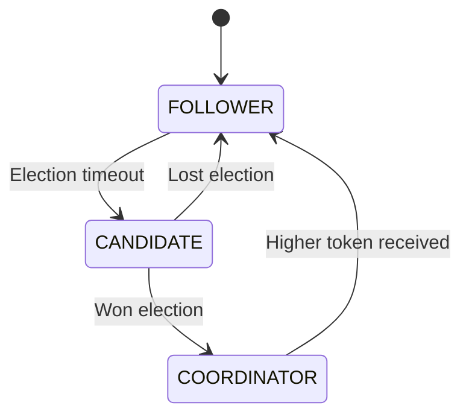
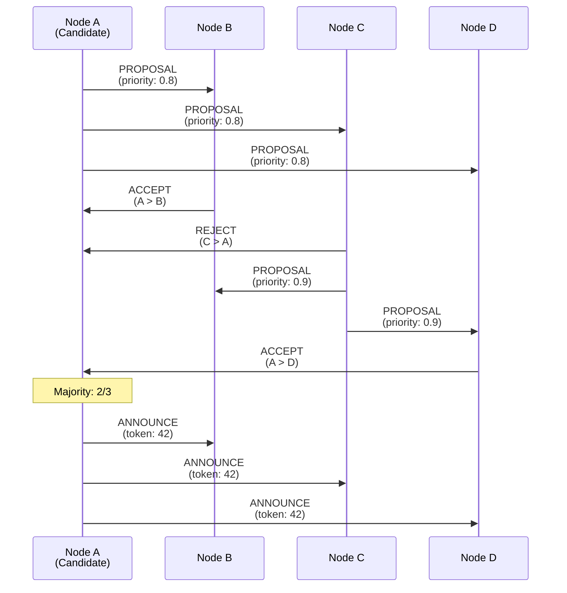
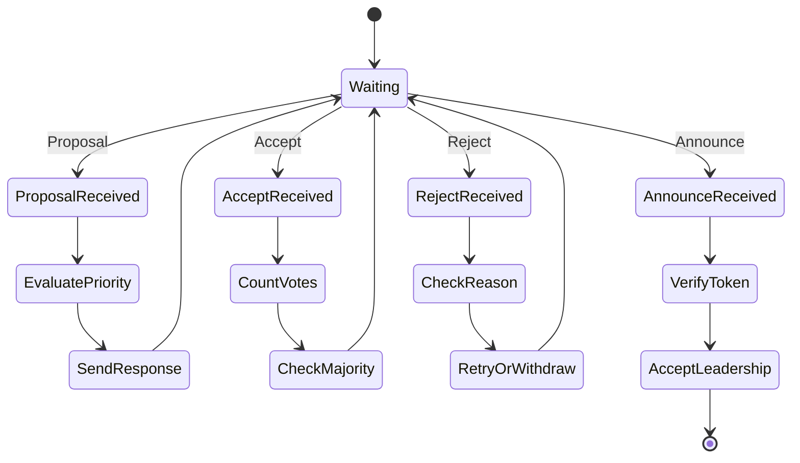
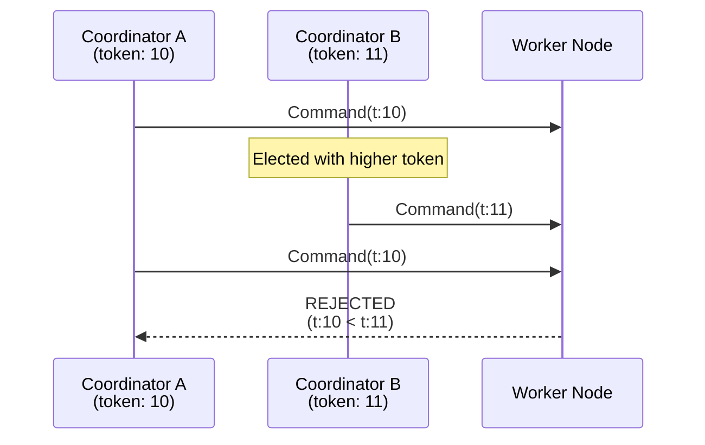
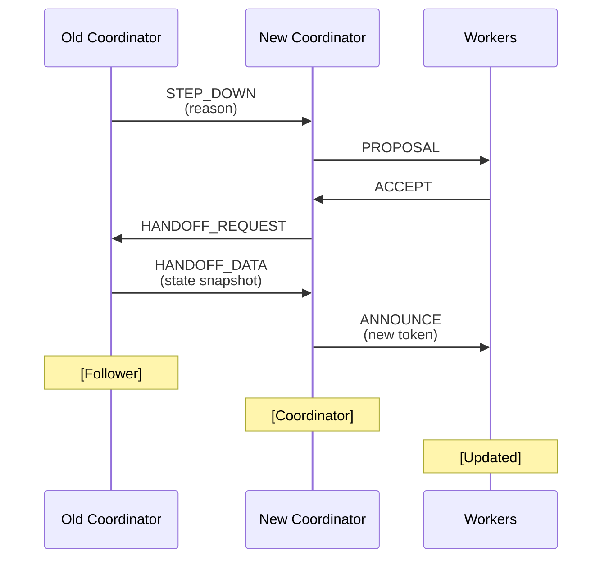

# Leader Election Protocol

## 1. Introduction

The leader election protocol ensures that exactly one node acts as coordinator at any time, managing global test state and load distribution. This design uses a priority-based election with fencing tokens to prevent split-brain scenarios.

Key features include:

- **Automatic Election**: Triggered when no coordinator exists or current coordinator fails
- **Priority-Based Selection**: Nodes with better resources and stability preferred
- **Fencing Tokens**: Monotonically increasing tokens prevent stale commands
- **Split-Brain Prevention**: Majority consensus required for leadership
- **Graceful Transitions**: Coordinated handoff when coordinator changes
- **Network Partition Handling**: Higher token wins when partitions heal

## 2. Election State Machine

### 2.1 Node States

```
┌─────────────────────────────────────────────────────────────┐
│                    Election States                          │
├─────────────────────────────────────────────────────────────┤
│                                                             │
│  FOLLOWER                                                   │
│  • Accepts commands from coordinator                        │
│  • Monitors coordinator health                              │
│  • Can trigger election on timeout                          │
│                                                             │
│  CANDIDATE                                                  │
│  • Actively seeking votes                                   │
│  • Calculates own priority                                  │
│  • Waits for majority response                             │
│                                                             │
│  COORDINATOR                                                │
│  • Issues commands with fencing token                       │
│  • Manages global state                                     │
│  • Sends periodic heartbeats                                │
│                                                             │
└─────────────────────────────────────────────────────────────┘
```

### 2.2 State Transitions



## 3. Election Process

### 3.1 Election Flow



### 3.2 Priority Calculation

```
                    Priority Score Calculation
    ┌────────────────────────────────────────────────────┐
    │                                                    │
    │  Priority = w₁·Resources + w₂·Stability + w₃·Network│
    │                                                    │
    │  Resources = (CPU_available/CPU_total) ×           │
    │              (Memory_available/Memory_total) ×     │
    │              (1 - current_load/max_load)          │
    │                                                    │
    │  Stability = min(1.0, uptime_hours/24)            │
    │                                                    │
    │  Network = 1/(1 + avg_latency_ms/100)             │
    │                                                    │
    │  Default weights: w₁=0.5, w₂=0.3, w₃=0.2          │
    │                                                    │
    └────────────────────────────────────────────────────┘
```

## 4. Message Protocol

### 4.1 Election Messages

```rust
/// Election message types
#[derive(Debug, Clone, Serialize, Deserialize)]
pub enum ElectionMessage {
    /// Propose self as coordinator
    Proposal {
        candidate_id: String,
        priority: f64,
        proposed_token: u64,
        current_epoch: Option<Epoch>,
    },
    
    /// Accept a candidate
    Accept {
        voter_id: String,
        candidate_id: String,
        accepted_token: u64,
    },
    
    /// Reject a candidate
    Reject {
        voter_id: String,
        candidate_id: String,
        reason: RejectReason,
        higher_candidate: Option<String>,
    },
    
    /// Announce victory
    Announce {
        coordinator_id: String,
        fencing_token: u64,
        voters: Vec<String>,
    },
    
    /// Step down as coordinator
    StepDown {
        coordinator_id: String,
        reason: StepDownReason,
        suggested_successor: Option<String>,
    },
}

#[derive(Debug, Clone, Serialize, Deserialize)]
pub enum RejectReason {
    LowerPriority,
    AlreadyVoted,
    HasCoordinator,
    InvalidState,
}
```

### 4.2 Message Handling State Machine



## 5. Fencing Token Management

### 5.1 Token Generation and Validation



### 5.2 Token Rules

1. **Monotonic Increase**: New coordinator token > all previous tokens
2. **Command Validation**: Accept only if command_token ≥ last_seen_token
3. **Token Propagation**: Include in all coordinator commands
4. **Persistence**: Store last seen token durably

## 6. Split-Brain Prevention

### 6.1 Network Partition Scenario

```
          Before Partition              During Partition
   
    ┌─────┬─────┬─────┬─────┐      ┌─────┬─────┐   ┌─────┬─────┐
    │  A  │  B  │  C  │  D  │      │  A  │  B  │   │  C  │  D  │
    │     │     │     │     │      │     │     │   │     │     │
    │  C  │  F  │  F  │  F  │      │  C  │  F  │   │  ?  │  ?  │
    └─────┴─────┴─────┴─────┘      └─────┴─────┘   └─────┴─────┘
    
    C = Coordinator (token: 10)     Partition 1      Partition 2
    F = Follower                    A: Maintains      C,D: Trigger
                                    coordination      election
                                    (no majority)     
                                                     D: Elected
                                                     (token: 11)
```

### 6.2 Partition Healing

```
           After Partition Heals
    
         ┌─────┬─────┬─────┬─────┐
         │  A  │  B  │  C  │  D  │
         │ t:10│     │     │ t:11│
         └─────┴─────┴─────┴─────┘
                  │
                  ▼
         Token comparison:
         D (token: 11) > A (token: 10)
                  │
                  ▼
         ┌─────┬─────┬─────┬─────┐
         │  F  │  F  │  F  │  C  │
         │     │     │     │ t:11│
         └─────┴─────┴─────┴─────┘
         
         D remains coordinator
```

## 7. Implementation Details

### 7.1 Election Manager

```rust
pub struct ElectionManager {
    /// Node ID
    node_id: String,
    
    /// Current state
    state: Arc<AtomicCell<ElectionState>>,
    
    /// Current coordinator info
    coordinator: Arc<RwLock<Option<CoordinatorInfo>>>,
    
    /// Election round number
    round: Arc<AtomicU64>,
    
    /// Votes received in current round
    votes: Arc<RwLock<HashMap<String, Vote>>>,
    
    /// Fencing token generator
    token_generator: Arc<AtomicU64>,
    
    /// Known nodes
    known_nodes: Arc<RwLock<HashSet<String>>>,
    
    /// Priority calculator
    priority_calc: Arc<PriorityCalculator>,
    
    /// Message sender
    message_sender: Arc<dyn MessageSender>,
    
    /// Configuration
    config: ElectionConfig,
}

#[derive(Debug, Clone)]
pub struct ElectionConfig {
    /// Election timeout
    pub election_timeout: Duration,
    
    /// Minimum nodes for valid election
    pub min_nodes: usize,
    
    /// Priority weights
    pub priority_weights: PriorityWeights,
    
    /// Heartbeat interval when coordinator
    pub heartbeat_interval: Duration,
    
    /// Step down if no majority after duration
    pub step_down_timeout: Duration,
}
```

### 7.2 Priority Calculator

```rust
pub struct PriorityCalculator {
    /// Resource monitor
    resource_monitor: Arc<ResourceMonitor>,
    
    /// Network monitor
    network_monitor: Arc<NetworkMonitor>,
    
    /// Uptime tracker
    uptime: Arc<UptimeTracker>,
    
    /// Configuration
    config: PriorityConfig,
}

impl PriorityCalculator {
    pub async fn calculate(&self) -> f64 {
        let resources = self.calculate_resource_score().await;
        let stability = self.calculate_stability_score();
        let network = self.calculate_network_score().await;
        
        let weights = &self.config.weights;
        
        weights.resources * resources +
        weights.stability * stability +
        weights.network * network
    }
    
    async fn calculate_resource_score(&self) -> f64 {
        let metrics = self.resource_monitor.current_metrics().await;
        
        let cpu_score = metrics.cpu_available / metrics.cpu_total;
        let memory_score = metrics.memory_available / metrics.memory_total;
        let load_score = 1.0 - (metrics.current_load / metrics.max_load);
        
        // Geometric mean for balanced scoring
        (cpu_score * memory_score * load_score).powf(1.0 / 3.0)
    }
}
```

## 8. Coordinator Responsibilities

### 8.1 State Management Flow

```
┌─────────────────────────────────────────────────────┐
│              Coordinator Responsibilities            │
├─────────────────────────────────────────────────────┤
│                                                     │
│  On Election:                                       │
│  1. Generate new fencing token                      │
│  2. Create coordinator epoch                        │
│  3. Broadcast announcement                          │
│                                                     │
│  During Operation:                                  │
│  ┌─────────────┐     ┌──────────────┐             │
│  │   Monitor    │────►│  Distribute  │             │
│  │   Workers    │     │    Load      │             │
│  └──────┬──────┘     └──────┬───────┘             │
│         │                    │                      │
│         ▼                    ▼                      │
│  ┌─────────────┐     ┌──────────────┐             │
│  │   Handle     │     │   Create     │             │
│  │  Failures    │     │   Epochs     │             │
│  └─────────────┘     └──────────────┘             │
│                                                     │
│  On Step Down:                                      │
│  1. Announce step down                              │
│  2. Stop issuing commands                           │
│  3. Transition to follower                          │
│                                                     │
└─────────────────────────────────────────────────────┘
```

### 8.2 Heartbeat Protocol

```rust
/// Coordinator heartbeat
#[derive(Debug, Clone, Serialize, Deserialize)]
pub struct CoordinatorHeartbeat {
    /// Coordinator ID
    pub coordinator_id: String,
    
    /// Current fencing token
    pub fencing_token: u64,
    
    /// Heartbeat sequence number
    pub sequence: u64,
    
    /// Current epoch
    pub current_epoch: Epoch,
    
    /// Cluster health summary
    pub cluster_health: ClusterHealth,
    
    /// Timestamp
    pub timestamp: Instant,
}

/// Cluster health information
#[derive(Debug, Clone, Serialize, Deserialize)]
pub struct ClusterHealth {
    /// Number of active nodes
    pub active_nodes: usize,
    
    /// Total RPS being generated
    pub total_rps: u64,
    
    /// Global error rate
    pub error_rate: f64,
    
    /// Nodes suspected of failure
    pub suspected_nodes: Vec<String>,
}
```

## 9. Graceful Transitions

### 9.1 Coordinator Handoff



### 9.2 Handoff Data

```rust
#[derive(Debug, Clone, Serialize, Deserialize)]
pub struct HandoffData {
    /// Current epoch state
    pub current_epoch: Epoch,
    
    /// Active load assignments
    pub load_assignments: HashMap<String, LoadAssignment>,
    
    /// Pending operations
    pub pending_operations: Vec<PendingOperation>,
    
    /// Recent failure suspicions
    pub failure_suspicions: HashMap<String, FailureSuspicion>,
    
    /// Test parameters
    pub test_parameters: HashMap<String, f64>,
    
    /// Timestamp of handoff
    pub handoff_time: Instant,
}
```

## 10. Error Handling

### 10.1 Common Failure Scenarios

1. **Election Timeout**: No majority achieved
   - Retry with exponential backoff
   - Eventually accept minority if configured

2. **Coordinator Isolation**: Can't reach majority
   - Step down automatically
   - Prevent issuing commands

3. **Rapid Coordinator Changes**: Election thrashing
   - Implement election cooldown
   - Increase stability weight

4. **Byzantine Behavior**: Node sending invalid messages
   - Validate all messages
   - Blacklist misbehaving nodes

## 11. Monitoring and Observability

### 11.1 Election Metrics

```rust
pub struct ElectionMetrics {
    /// Elections triggered
    pub elections_triggered: Counter,
    
    /// Elections won
    pub elections_won: Counter,
    
    /// Elections lost
    pub elections_lost: Counter,
    
    /// Time to elect (ms)
    pub election_duration: Histogram,
    
    /// Current coordinator changes
    pub coordinator_changes: Counter,
    
    /// Time as coordinator
    pub coordinator_tenure: Histogram,
    
    /// Rejected commands (wrong token)
    pub rejected_commands: Counter,
    
    /// Current fencing token
    pub current_token: Gauge,
}
```

### 11.2 Election Events

```rust
#[derive(Debug, Clone)]
pub enum ElectionEvent {
    ElectionStarted {
        round: u64,
        trigger: ElectionTrigger,
    },
    
    VoteReceived {
        from: String,
        vote_type: VoteType,
    },
    
    ElectionCompleted {
        round: u64,
        result: ElectionResult,
        duration: Duration,
    },
    
    CoordinatorChanged {
        old: Option<String>,
        new: String,
        token: u64,
    },
    
    StepDownOccurred {
        coordinator: String,
        reason: StepDownReason,
    },
}
```

## 12. Configuration Best Practices

### 12.1 Recommended Settings

```rust
ElectionConfig {
    // Allow enough time for network delays
    election_timeout: Duration::from_secs(5),
    
    // Require majority for strong consistency
    min_nodes: (total_nodes / 2) + 1,
    
    // Balance resource availability and stability
    priority_weights: PriorityWeights {
        resources: 0.5,  // Most important
        stability: 0.3,  // Prevent flapping
        network: 0.2,    // Network locality
    },
    
    // Frequent enough to detect failures
    heartbeat_interval: Duration::from_secs(1),
    
    // Prevent isolated coordinators
    step_down_timeout: Duration::from_secs(10),
}
```

### 12.2 Tuning Guidelines

- **Small Clusters** (< 5 nodes): Shorter timeouts, higher stability weight
- **Large Clusters** (> 20 nodes): Longer timeouts, consider hierarchical election
- **Cross-Region**: Increase timeouts, add region awareness
- **High Churn**: Increase stability weight, add hysteresis

## 13. Summary

The leader election protocol provides strong consistency guarantees for distributed coordination:

- **Safety**: At most one coordinator via fencing tokens
- **Liveness**: Eventually elects if majority available  
- **Efficiency**: Priority-based selection optimizes coordinator choice
- **Resilience**: Handles partitions and failures gracefully

This forms the foundation for coordinated distributed load testing operations.