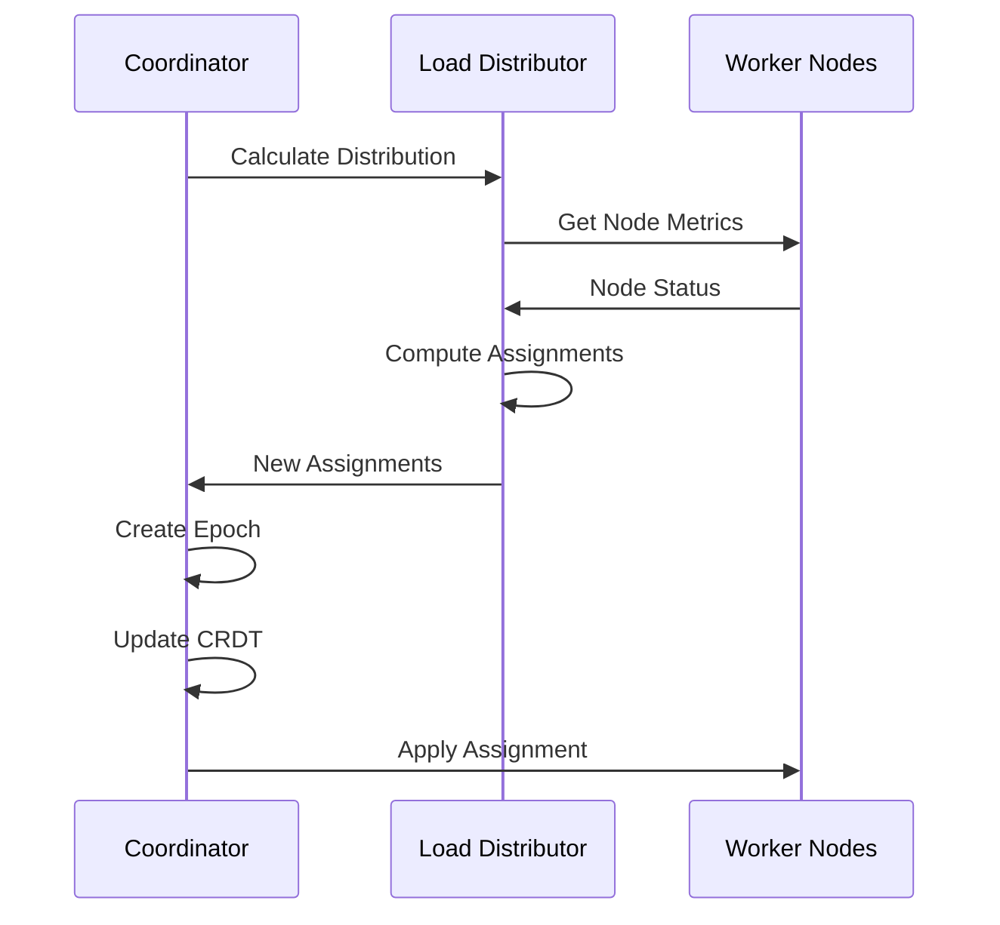

# Load Distribution System

## 1. Introduction

The load distribution system allocates target RPS across worker nodes based on their capacity, health, and network characteristics. This component ensures optimal resource utilization while maintaining system stability.

Key features include:

- **Dynamic Load Balancing**: Continuous adjustment based on node health
- **Capacity-Aware Distribution**: Respects node resource limits
- **Health-Based Weighting**: Reduces load on struggling nodes
- **Geographic Optimization**: Considers network latency for distribution
- **Saturation Prevention**: Monitors and prevents client-side bottlenecks
- **Smooth Transitions**: Gradual load shifts to avoid disruption

## 2. Distribution Architecture

### 2.1 System Overview

```
┌─────────────────────────────────────────────────────────────┐
│                   Load Distribution Flow                     │
├─────────────────────────────────────────────────────────────┤
│                                                             │
│  Target: 10,000 RPS                                        │
│                                                             │
│  ┌──────────────┐         ┌────────────────┐              │
│  │   Monitor     │────────►│   Calculate    │              │
│  │ Node Health   │         │ Distribution   │              │
│  └──────────────┘         └───────┬────────┘              │
│         ▲                          │                        │
│         │                          ▼                        │
│  ┌──────────────┐         ┌────────────────┐              │
│  │   Collect     │         │     Apply      │              │
│  │   Metrics     │         │  Assignments   │              │
│  └──────────────┘         └───────┬────────┘              │
│         ▲                          │                        │
│         │                          ▼                        │
│  ┌──────┴───────┬──────────┬──────────────┐               │
│  │   Node A     │  Node B  │    Node C     │               │
│  │ Cap: 5000    │ Cap: 4000│  Cap: 3000    │               │
│  │ Load: 4000   │ Load:3500│  Load: 2500   │               │
│  └──────────────┴──────────┴──────────────┘               │
│                                                             │
└─────────────────────────────────────────────────────────────┘
```

### 2.2 Component Interactions



## 3. Distribution Strategies

### 3.1 Strategy Types

```
┌─────────────────────────────────────────────────────────────┐
│                   Distribution Strategies                    │
├─────────────────────────────────────────────────────────────┤
│                                                             │
│  1. Even Distribution                                       │
│     └─ Equal load to all nodes                             │
│     └─ Simple baseline approach                            │
│                                                             │
│  2. Weighted Capacity                                       │
│     └─ Proportional to node resources                      │
│     └─ Considers CPU, memory, network                      │
│                                                             │
│  3. Weighted Optimal                                        │
│     └─ Capacity + health metrics                           │
│     └─ Adaptive to current conditions                      │
│                                                             │
│  4. Geographic Aware                                        │
│     └─ Minimizes cross-region traffic                      │
│     └─ Optimizes for latency                               │
│                                                             │
│  5. Saturation Aware                                        │
│     └─ Prevents client-side bottlenecks                    │
│     └─ Uses Transaction Profiler data                      │
│                                                             │
└─────────────────────────────────────────────────────────────┘
```

### 3.2 Strategy Selection Matrix

```
                 Low Load          Medium Load        High Load
              (< 30% capacity)  (30-70% capacity)  (> 70% capacity)
   
Homogeneous  │     Even        │   Weighted      │   Weighted     │
Nodes        │  Distribution   │   Capacity      │   Optimal      │
             │                 │                 │                │
Heterogeneous│   Weighted      │   Weighted      │  Saturation    │
Nodes        │   Capacity      │   Optimal       │    Aware       │
             │                 │                 │                │
Multi-Region │   Geographic    │   Geographic    │   Geographic   │
             │     Aware       │   + Weighted    │  + Saturation  │
```

## 4. Weighted Distribution Algorithm

### 4.1 Capacity Calculation

```
Node Effective Capacity = Base Capacity × Health Factor × Availability

Where:
- Base Capacity = min(CPU_capacity, Memory_capacity, Network_capacity)
- Health Factor = (1 - error_rate) × (1 - saturation_level)
- Availability = Resources_available / Resources_total
```

### 4.2 Distribution Formula

```
                     Node_Effective_Capacity
Node_Load = ─────────────────────────────────── × Target_Load
             Σ(All_Nodes_Effective_Capacity)


With constraints:
- Node_Load ≤ Node_Max_Capacity
- Node_Load ≥ Node_Min_Load (if specified)
- Σ(Node_Load) = Target_Load (after redistribution)
```

### 4.3 Visual Example

```
Target: 10,000 RPS

Node A: Capacity=5000, Health=0.95, Available=0.8
        Effective = 5000 × 0.95 × 0.8 = 3,800

Node B: Capacity=4000, Health=0.90, Available=0.9  
        Effective = 4000 × 0.90 × 0.9 = 3,240

Node C: Capacity=3000, Health=0.85, Available=0.7
        Effective = 3000 × 0.85 × 0.7 = 1,785

Total Effective = 3,800 + 3,240 + 1,785 = 8,825

Assignments:
Node A: (3,800/8,825) × 10,000 = 4,306 RPS
Node B: (3,240/8,825) × 10,000 = 3,672 RPS  
Node C: (1,785/8,825) × 10,000 = 2,022 RPS
```

## 5. Health-Based Adjustments

### 5.1 Health Metrics

```
┌─────────────────────────────────────────────────────────────┐
│                     Health Score Components                  │
├─────────────────────────────────────────────────────────────┤
│                                                             │
│  Error Rate Impact           Saturation Impact             │
│  ┌──────────────┐           ┌──────────────┐              │
│  │ 0% → 1.00    │           │ 0% → 1.00    │              │
│  │ 1% → 0.90    │           │ 50% → 0.50   │              │
│  │ 5% → 0.50    │           │ 80% → 0.20   │              │
│  │ 10%→ 0.00    │           │ 100%→ 0.00   │              │
│  └──────────────┘           └──────────────┘              │
│                                                             │
│  Response Time Impact        Combined Score                 │
│  ┌──────────────┐           ┌──────────────┐              │
│  │ <P50 → 1.00  │           │ Health =      │              │
│  │ <P90 → 0.75  │           │ 0.5 × Error + │              │
│  │ <P99 → 0.50  │           │ 0.3 × Sat +   │              │
│  │ >P99 → 0.25  │           │ 0.2 × RT      │              │
│  └──────────────┘           └──────────────┘              │
│                                                             │
└─────────────────────────────────────────────────────────────┘
```

### 5.2 Dynamic Health Adjustment

```
Time →
      Node Health Over Time
1.0 ┤
    │     Healthy Operation
0.8 ┤════════════════╗
    │                ╚══════╗    Load
0.6 ┤                       ╚═══Reduced
    │                           ╚════╗
0.4 ┤         Error Spike            ╚═══Recovery
    │                                    ╚════════
0.2 ┤
    │
0.0 └────────────────────────────────────────────
    0    5    10   15   20   25   30   35   40  min
```

## 6. Geographic Distribution

### 6.1 Region-Aware Assignment

```
┌─────────────────────────────────────────────────────────────┐
│                  Geographic Load Distribution                │
├─────────────────────────────────────────────────────────────┤
│                                                             │
│  Target Servers: US-East                                    │
│                                                             │
│  ┌─────────────┐         ┌─────────────┐                  │
│  │  US-East-1  │         │  US-East-2  │                  │
│  │ Latency: 5ms│         │ Latency: 8ms│                  │
│  │ Priority: 1 │         │ Priority: 1 │                  │
│  └─────────────┘         └─────────────┘                  │
│        60%                      30%                         │
│                                                             │
│  ┌─────────────┐         ┌─────────────┐                  │
│  │  US-West-1  │         │   EU-West   │                  │
│  │Latency: 45ms│         │Latency:120ms│                  │
│  │ Priority: 2 │         │ Priority: 3 │                  │
│  └─────────────┘         └─────────────┘                  │
│        8%                       2%                          │
│                                                             │
│  Distribution weights by latency:                           │
│  Weight = 1 / (1 + latency_ms/10)                         │
│                                                             │
└─────────────────────────────────────────────────────────────┘
```

### 6.2 Cross-Region Optimization

```rust
pub struct GeographicStrategy {
    /// Target region for load
    target_region: String,
    
    /// Penalty for cross-region assignment
    cross_region_penalty: f64,
    
    /// Maximum acceptable latency
    max_latency_ms: f64,
}

impl GeographicStrategy {
    fn calculate_weights(&self, nodes: &[NodeInfo]) -> HashMap<String, f64> {
        nodes.iter().map(|node| {
            let base_weight = node.capacity as f64;
            
            let region_factor = if node.region == self.target_region {
                1.0
            } else {
                1.0 - self.cross_region_penalty
            };
            
            let latency_factor = if let Some(latency) = node.latency_ms {
                (self.max_latency_ms - latency) / self.max_latency_ms
            } else {
                0.5 // Unknown latency
            };
            
            let weight = base_weight * region_factor * latency_factor.max(0.0);
            
            (node.id.clone(), weight)
        }).collect()
    }
}
```

## 7. Saturation-Aware Distribution

### 7.1 Saturation Detection

```
┌─────────────────────────────────────────────────────────────┐
│              Client-Side Saturation Indicators               │
├─────────────────────────────────────────────────────────────┤
│                                                             │
│  CPU Saturation              Memory Pressure               │
│  ┌──────────────┐           ┌──────────────┐              │
│  │ User: 85%    │           │ Heap: 90%    │              │
│  │ System: 10%  │           │ GC Time: 15% │              │
│  │ ────────     │           │ ────────     │              │
│  │ Total: 95% ⚠ │           │ Critical ⚠   │              │
│  └──────────────┘           └──────────────┘              │
│                                                             │
│  Network Saturation          Thread Pool                   │
│  ┌──────────────┐           ┌──────────────┐              │
│  │ Send: 950Mbps│           │ Active: 200  │              │
│  │ Recv: 100Mbps│           │ Queue: 1000  │              │
│  │ ────────     │           │ ────────     │              │
│  │ Near limit ⚠ │           │ Saturated ⚠  │              │
│  └──────────────┘           └──────────────┘              │
│                                                             │
│  Action: Reduce load to prevent client-side bottleneck     │
│                                                             │
└─────────────────────────────────────────────────────────────┘
```

### 7.2 Saturation Response

```
Load vs Saturation Response Curve

Load │     ╱─────── Ideal (no saturation)
(RPS)│    ╱
     │   ╱ ╱╲
     │  ╱ ╱  ╲_____ Actual (with saturation)
     │ ╱ ╱         ╲
     │╱_╱___________╲___
     └────────────────────► Saturation %
     0   20  40  60  80 100

Adjustment = Load × (1 - saturation_level²)
```

## 8. Load Redistribution

### 8.1 Redistribution Triggers

```
┌─────────────────────────────────────────────────────────────┐
│                  Redistribution Triggers                     │
├─────────────────────────────────────────────────────────────┤
│                                                             │
│  1. Node Failure          │  2. Capacity Change            │
│     Before: A=3K,B=3K,C=3K│     Before: A=3K,B=3K,C=3K    │
│     After:  A=4.5K,B=4.5K │     After:  A=2K,B=3K,C=4K    │
│             (C failed)     │     (A degraded, C upgraded)   │
│                           │                                │
│  3. Health Degradation    │  4. Target Change              │
│     Before: A=3K,B=3K,C=3K│     Before: Total=9K          │
│     After:  A=4K,B=4K,C=1K│     After:  Total=12K         │
│     (C errors increased)  │     (Scaled up)               │
│                                                             │
└─────────────────────────────────────────────────────────────┘
```

### 8.2 Smooth Redistribution

```rust
pub struct SmoothRedistributor {
    /// Maximum change per iteration
    max_change_percent: f64,
    
    /// Iteration interval
    iteration_interval: Duration,
    
    /// Convergence threshold
    convergence_threshold: f64,
}

impl SmoothRedistributor {
    async fn redistribute(
        &self,
        current: &HashMap<String, f64>,
        target: &HashMap<String, f64>,
    ) -> Vec<HashMap<String, f64>> {
        let mut steps = Vec::new();
        let mut current = current.clone();
        
        loop {
            let mut next = HashMap::new();
            let mut max_change = 0.0;
            
            for (node, &target_load) in target {
                let current_load = current.get(node).copied().unwrap_or(0.0);
                let change = target_load - current_load;
                
                // Limit change rate
                let limited_change = change.signum() * 
                    (change.abs().min(current_load * self.max_change_percent));
                
                let new_load = current_load + limited_change;
                next.insert(node.clone(), new_load);
                
                max_change = max_change.max(limited_change.abs());
            }
            
            steps.push(next.clone());
            current = next;
            
            // Check convergence
            if max_change < self.convergence_threshold {
                break;
            }
        }
        
        steps
    }
}
```

### 8.3 Redistribution Timeline

```
Time: T+0s   T+2s    T+4s    T+6s    T+8s    T+10s
      │      │       │       │       │       │
Node A: 3000 → 3200 → 3400 → 3600 → 3800 → 4000
Node B: 3000 → 3150 → 3300 → 3450 → 3600 → 3750
Node C: 3000 → 2650 → 2300 → 1950 → 1600 → 1250
      │      │       │       │       │       │
      Start  Gradual load shift over time   Complete
```

## 9. Implementation

### 9.1 Load Distributor Component

```rust
pub struct LoadDistributor {
    /// Distribution strategy
    strategy: Box<dyn DistributionStrategy>,
    
    /// Node registry (CRDT)
    node_registry: Arc<RwLock<NodeRegistryCRDT>>,
    
    /// Load assignments (CRDT)
    assignments: Arc<RwLock<LoadAssignmentsCRDT>>,
    
    /// Metrics collector
    metrics_collector: Arc<MetricsCollector>,
    
    /// Smooth redistributor
    redistributor: Arc<SmoothRedistributor>,
    
    /// Configuration
    config: DistributorConfig,
}

#[derive(Debug, Clone)]
pub struct DistributorConfig {
    /// Rebalance interval
    pub rebalance_interval: Duration,
    
    /// Minimum load change to trigger update
    pub min_change_threshold: f64,
    
    /// Maximum nodes to update per cycle
    pub max_updates_per_cycle: usize,
    
    /// Load buffer (prevent overload)
    pub load_buffer_percent: f64,
}
```

### 9.2 Distribution Strategy Trait

```rust
#[async_trait]
pub trait DistributionStrategy: Send + Sync {
    /// Calculate load distribution
    async fn calculate_distribution(
        &self,
        nodes: Vec<NodeInfo>,
        target_load: f64,
        current_metrics: &MetricsSnapshot,
    ) -> Result<HashMap<String, f64>>;
    
    /// Validate distribution
    fn validate_distribution(
        &self,
        distribution: &HashMap<String, f64>,
        nodes: &[NodeInfo],
        target_load: f64,
    ) -> Result<()>;
    
    /// Get strategy name
    fn name(&self) -> &str;
}
```

## 10. Monitoring and Metrics

### 10.1 Distribution Metrics

```rust
pub struct DistributionMetrics {
    /// Current load distribution
    pub node_loads: GaugeVec<String>,
    
    /// Load assignment changes
    pub assignment_changes: Counter,
    
    /// Rebalance operations
    pub rebalances: Counter,
    
    /// Distribution skew
    pub distribution_skew: Gauge,
    
    /// Nodes at capacity
    pub nodes_at_capacity: Gauge,
    
    /// Failed assignments
    pub failed_assignments: Counter,
    
    /// Redistribution duration
    pub redistribution_duration: Histogram,
}
```

### 10.2 Distribution Quality Metrics

```
Distribution Skew = σ(node_loads) / μ(node_loads)

Where:
- σ = standard deviation
- μ = mean
- Lower is better (more even distribution)

Efficiency = Σ(actual_load) / Σ(max_capacity)
- Measures how well we use available capacity

Balance Score = 1 - max(|load_i - ideal_i|) / ideal_i
- Measures deviation from ideal distribution
```

## 11. Failure Scenarios

### 11.1 Cascading Failure Prevention

```
            Cascading Failure Scenario
    
Initial:    A(90%) B(85%) C(80%) D(75%)
            ↓ C fails
Naive:      A(120%) B(113%) D(100%)  ← A,B overloaded!
            ↓ A fails
Cascade:    B(180%) D(150%)          ← Total failure!

            With Protection:
            
Initial:    A(90%) B(85%) C(80%) D(75%)
            ↓ C fails  
Protected:  A(95%) B(90%) D(85%) +E,F  ← Add capacity
            ↓ Gradual shift
Stable:     A(85%) B(85%) D(85%) E(80%) F(80%)
```

### 11.2 Protection Mechanisms

1. **Capacity Limits**: Never exceed node maximum
2. **Load Buffers**: Keep headroom for spikes
3. **Gradual Shifts**: Prevent sudden overload
4. **Circuit Breakers**: Stop if nodes failing
5. **Auto-scaling**: Add nodes when needed

## 12. Best Practices

### 12.1 Configuration Guidelines

```rust
DistributorConfig {
    // Frequent enough to respond quickly
    rebalance_interval: Duration::from_secs(5),
    
    // Avoid tiny adjustments
    min_change_threshold: 0.02, // 2%
    
    // Prevent thundering herd
    max_updates_per_cycle: nodes.len() / 3,
    
    // Safety margin
    load_buffer_percent: 0.1, // 10%
}
```

### 12.2 Strategy Selection

- **Homogeneous Cluster**: Use weighted capacity
- **Variable Health**: Use weighted optimal
- **Multi-Region**: Always geographic aware
- **High Load**: Enable saturation awareness
- **Unstable Network**: Increase redistribution smoothing

## 13. Summary

The load distribution system provides intelligent allocation of work across nodes:

- **Adaptive**: Responds to changing conditions
- **Fair**: Proportional to node capabilities
- **Stable**: Smooth transitions prevent disruption
- **Efficient**: Maximizes resource utilization
- **Resilient**: Handles failures gracefully

This ensures optimal performance while maintaining system stability during distributed load tests.