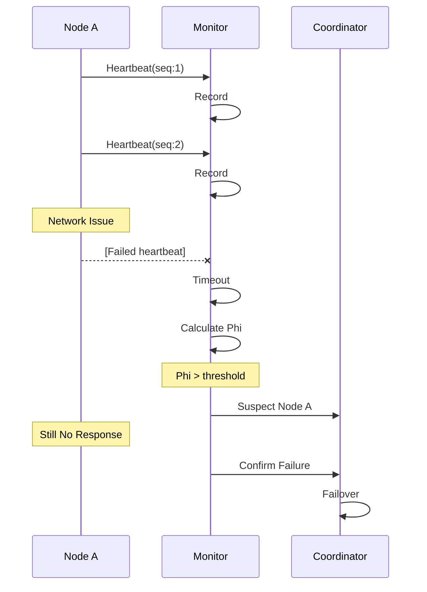
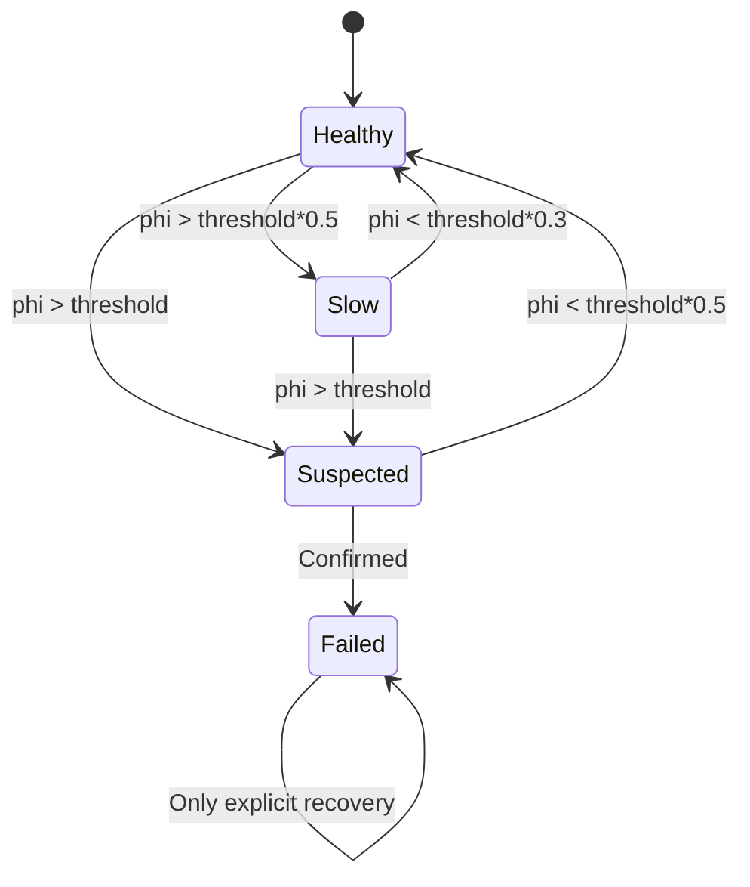
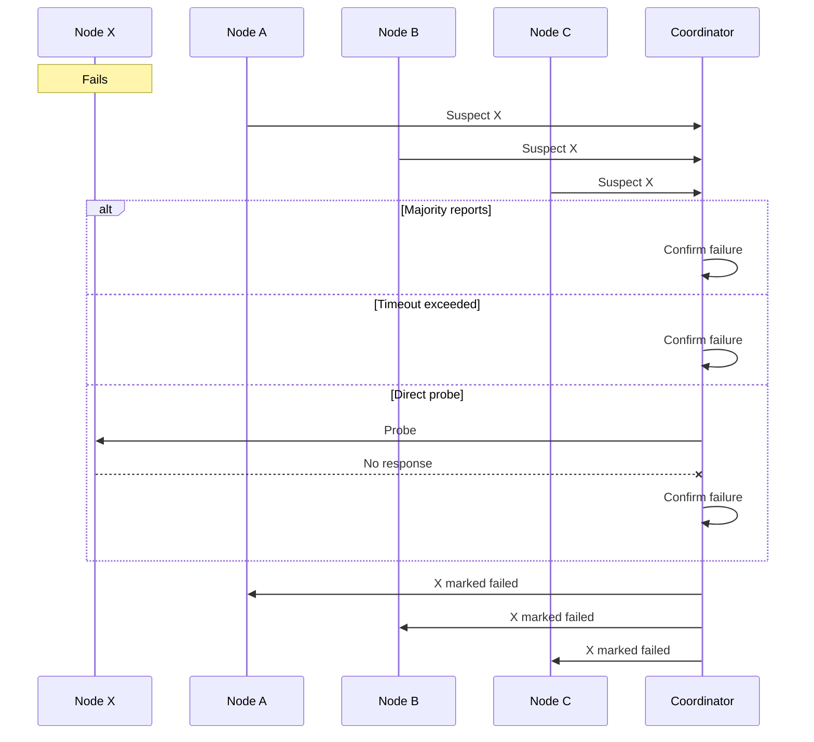
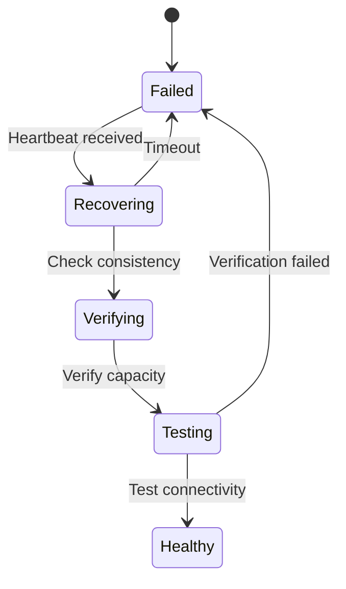

# Failure Detection System

## 1. Introduction

The failure detection system identifies and responds to node failures in the distributed load testing cluster. It uses adaptive algorithms to minimize false positives while ensuring rapid detection of actual failures.

Key features include:

- **Phi Accrual Detection**: Probabilistic failure detection with tunable sensitivity
- **Adaptive Timeouts**: Adjusts to network conditions automatically
- **Multi-Source Confirmation**: Reduces false positives through corroboration
- **Graceful Degradation**: Distinguishes between slow nodes and failed nodes
- **Fast Recovery**: Rapid detection enables quick failover
- **Network Partition Handling**: Correct behavior during splits

## 2. Detection Architecture

### 2.1 System Overview

```
┌─────────────────────────────────────────────────────────────┐
│                  Failure Detection System                    │
├─────────────────────────────────────────────────────────────┤
│                                                             │
│  ┌─────────────┐      ┌─────────────┐     ┌─────────────┐ │
│  │  Heartbeat   │      │   Failure    │     │   Failure   │ │
│  │  Monitor     │─────►│   Detector   │────►│   Handler   │ │
│  └─────────────┘      └─────────────┘     └─────────────┘ │
│         │                     │                     │       │
│         ▼                     ▼                     ▼       │
│  ┌─────────────┐      ┌─────────────┐     ┌─────────────┐ │
│  │  Heartbeat   │      │     Phi      │     │    Load     │ │
│  │   History    │      │  Calculator  │     │Redistributor│ │
│  └─────────────┘      └─────────────┘     └─────────────┘ │
│                                                             │
│  Node States:                                               │
│  ● Healthy    ● Slow    ● Suspected    ● Failed           │
│                                                             │
└─────────────────────────────────────────────────────────────┘
```

### 2.2 Detection Flow



## 3. Phi Accrual Failure Detector

### 3.1 Algorithm Overview

```
┌─────────────────────────────────────────────────────────────┐
│                  Phi Accrual Algorithm                       │
├─────────────────────────────────────────────────────────────┤
│                                                             │
│  1. Collect heartbeat arrival times                        │
│     T = [t₁, t₂, t₃, ..., tₙ]                            │
│                                                             │
│  2. Calculate inter-arrival times                          │
│     Δ = [t₂-t₁, t₃-t₂, ..., tₙ-tₙ₋₁]                   │
│                                                             │
│  3. Compute mean and variance                              │
│     μ = mean(Δ)                                           │
│     σ² = variance(Δ)                                      │
│                                                             │
│  4. Calculate phi value                                     │
│     Tₙₒw = current_time - last_heartbeat                  │
│     Φ = -log₁₀(P(Tₙₒw))                                  │
│                                                             │
│     Where P(t) = 1 - F(t) and F is the CDF of             │
│     normal distribution N(μ, σ²)                          │
│                                                             │
│  5. Interpretation                                          │
│     Φ < 1: Very likely alive                              │
│     Φ ~ 3: Possible failure                               │
│     Φ ~ 8: Likely failure                                  │
│     Φ > 16: Almost certain failure                        │
│                                                             │
└─────────────────────────────────────────────────────────────┘
```

### 3.2 Phi Value Interpretation

```
Phi Value Scale:
     
0    1    3    5    8    10   12   16   20
├────┼────┼────┼────┼────┼────┼────┼────┤
│                    │         │         │
│     Normal         │ Suspect │  Failed │
│                    │         │         │
└── Healthy ─────────┴─ Watch ─┴─ Action ┘

Probability of mistake:
Φ = 1  → 10%
Φ = 3  → 0.1%  
Φ = 8  → 10⁻⁸
Φ = 16 → 10⁻¹⁶
```

### 3.3 Adaptive Behavior

```
Network Conditions vs Phi Threshold:

Stable Network          Variable Network       Unstable Network
(low jitter)           (moderate jitter)      (high jitter)
     
Heartbeat Intervals:   Heartbeat Intervals:   Heartbeat Intervals:
│ │ │ │ │ │ │ │      │  │ │  │  │ │  │     │   │ │    │   │
└─┴─┴─┴─┴─┴─┴─┘      └──┴─┴──┴──┴─┴──┘    └───┴─┴────┴───┘
Regular               Some variation          High variation

Use Φ = 3-5           Use Φ = 8-10          Use Φ = 12-16
(aggressive)          (balanced)             (conservative)
```

## 4. Implementation

### 4.1 Failure Detector Component

```rust
pub struct FailureDetector {
    /// Node ID
    node_id: String,
    
    /// Monitored nodes
    monitors: Arc<RwLock<HashMap<String, NodeMonitor>>>,
    
    /// Phi threshold for suspicion
    phi_threshold: f64,
    
    /// Confirmation requirements
    confirmation_config: ConfirmationConfig,
    
    /// Failure handlers
    handlers: Vec<Box<dyn FailureHandler>>,
    
    /// Metrics
    metrics: Arc<FailureDetectorMetrics>,
}

#[derive(Debug, Clone)]
pub struct NodeMonitor {
    /// Heartbeat history (ring buffer)
    heartbeat_history: VecDeque<Instant>,
    
    /// Last heartbeat time
    last_heartbeat: Instant,
    
    /// Current phi value
    phi_value: f64,
    
    /// Node state
    state: MonitoredNodeState,
    
    /// Suspicion start time
    suspected_at: Option<Instant>,
    
    /// Reporter nodes (for confirmation)
    reporters: HashSet<String>,
    
    /// Statistics
    stats: HeartbeatStats,
}

#[derive(Debug, Clone)]
pub struct HeartbeatStats {
    /// Mean inter-arrival time
    mean_interval: Duration,
    
    /// Standard deviation
    std_deviation: Duration,
    
    /// Minimum observed interval
    min_interval: Duration,
    
    /// Maximum observed interval  
    max_interval: Duration,
    
    /// Total heartbeats received
    total_heartbeats: u64,
}

#[derive(Debug, Clone, Copy, PartialEq)]
pub enum MonitoredNodeState {
    /// Node is healthy
    Healthy,
    
    /// Node is slow but responding
    Slow,
    
    /// Node is suspected of failure
    Suspected,
    
    /// Node is confirmed failed
    Failed,
}
```

### 4.2 Phi Calculation

```rust
impl FailureDetector {
    /// Calculate phi value for a node
    fn calculate_phi(&self, monitor: &NodeMonitor) -> f64 {
        let history = &monitor.heartbeat_history;
        
        if history.len() < 2 {
            return 0.0; // Not enough data
        }
        
        // Calculate inter-arrival times
        let intervals: Vec<Duration> = history
            .iter()
            .zip(history.iter().skip(1))
            .map(|(t1, t2)| *t2 - *t1)
            .collect();
        
        // Calculate mean and variance
        let mean = self.calculate_mean(&intervals);
        let variance = self.calculate_variance(&intervals, mean);
        let std_dev = variance.sqrt();
        
        // Time since last heartbeat
        let elapsed = Instant::now() - monitor.last_heartbeat;
        let elapsed_ms = elapsed.as_secs_f64() * 1000.0;
        
        // Calculate phi using normal distribution
        let mean_ms = mean.as_secs_f64() * 1000.0;
        let std_dev_ms = std_dev * 1000.0;
        
        if std_dev_ms == 0.0 {
            // No variance - use simple threshold
            if elapsed_ms > mean_ms * 3.0 {
                return 10.0;
            } else {
                return 0.0;
            }
        }
        
        // Phi = -log10(1 - F(elapsed))
        // Where F is CDF of normal distribution
        let z_score = (elapsed_ms - mean_ms) / std_dev_ms;
        let probability = self.normal_cdf(z_score);
        
        if probability >= 0.9999999999 {
            return 10.0; // Cap at 10 to avoid infinity
        }
        
        -((1.0 - probability).log10())
    }
    
    /// Normal CDF approximation
    fn normal_cdf(&self, z: f64) -> f64 {
        // Using approximation for standard normal CDF
        let a1 = 0.254829592;
        let a2 = -0.284496736;
        let a3 = 1.421413741;
        let a4 = -1.453152027;
        let a5 = 1.061405429;
        let p = 0.3275911;
        
        let sign = if z < 0.0 { -1.0 } else { 1.0 };
        let z = z.abs();
        
        let t = 1.0 / (1.0 + p * z);
        let t2 = t * t;
        let t3 = t2 * t;
        let t4 = t3 * t;
        let t5 = t4 * t;
        
        let cdf = 1.0 - (a1*t + a2*t2 + a3*t3 + a4*t4 + a5*t5) * (-z*z/2.0).exp() / (2.0 * PI).sqrt();
        
        0.5 * (1.0 + sign * cdf)
    }
}
```

### 4.3 State Transitions



```rust
impl FailureDetector {
    /// Update node state based on phi value
    async fn update_node_state(&self, node_id: &str, monitor: &mut NodeMonitor) {
        let old_state = monitor.state;
        let phi = monitor.phi_value;
        
        monitor.state = match old_state {
            MonitoredNodeState::Healthy => {
                if phi > self.phi_threshold {
                    monitor.suspected_at = Some(Instant::now());
                    MonitoredNodeState::Suspected
                } else if phi > self.phi_threshold * 0.5 {
                    MonitoredNodeState::Slow
                } else {
                    MonitoredNodeState::Healthy
                }
            }
            
            MonitoredNodeState::Slow => {
                if phi > self.phi_threshold {
                    monitor.suspected_at = Some(Instant::now());
                    MonitoredNodeState::Suspected
                } else if phi < self.phi_threshold * 0.3 {
                    MonitoredNodeState::Healthy
                } else {
                    MonitoredNodeState::Slow
                }
            }
            
            MonitoredNodeState::Suspected => {
                if phi < self.phi_threshold * 0.5 {
                    // Recovery
                    monitor.suspected_at = None;
                    MonitoredNodeState::Healthy
                } else if self.should_confirm_failure(monitor).await {
                    MonitoredNodeState::Failed
                } else {
                    MonitoredNodeState::Suspected
                }
            }
            
            MonitoredNodeState::Failed => {
                // Can only recover through explicit action
                MonitoredNodeState::Failed
            }
        };
        
        // Notify if state changed
        if monitor.state != old_state {
            self.notify_state_change(node_id, old_state, monitor.state).await;
        }
    }
}
```

## 5. Multi-Source Confirmation

### 5.1 Confirmation Protocol



### 5.2 Confirmation Configuration

```rust
#[derive(Debug, Clone)]
pub struct ConfirmationConfig {
    /// Minimum reporters for immediate confirmation
    pub min_reporters: usize,
    
    /// Percentage of nodes for confirmation
    pub reporter_percentage: f64,
    
    /// Maximum time to wait for confirmation
    pub confirmation_timeout: Duration,
    
    /// Direct probe timeout
    pub probe_timeout: Duration,
    
    /// Require coordinator confirmation
    pub require_coordinator: bool,
}

impl FailureDetector {
    /// Check if failure should be confirmed
    async fn should_confirm_failure(&self, monitor: &NodeMonitor) -> bool {
        // Check reporter count
        let total_nodes = self.get_total_nodes();
        let required_reporters = (total_nodes as f64 * 
            self.confirmation_config.reporter_percentage).ceil() as usize;
        
        if monitor.reporters.len() >= required_reporters.max(
            self.confirmation_config.min_reporters
        ) {
            return true;
        }
        
        // Check timeout
        if let Some(suspected_at) = monitor.suspected_at {
            if suspected_at.elapsed() > self.confirmation_config.confirmation_timeout {
                return true;
            }
        }
        
        // Try direct probe if coordinator
        if self.is_coordinator() {
            return !self.probe_node(&monitor.node_id).await;
        }
        
        false
    }
}
```

## 6. Failure Handling

### 6.1 Handler Chain

```
   Failure Detected
         │
         ▼
┌─────────────────┐
│ Log Handler     │──► Log failure event
└────────┬────────┘
         │
         ▼
┌─────────────────┐
│ Metric Handler  │──► Update metrics
└────────┬────────┘
         │
         ▼
┌─────────────────┐
│ CRDT Handler    │──► Update node state in CRDT
└────────┬────────┘
         │
         ▼
┌─────────────────┐
│ Epoch Handler   │──► Create failure epoch
└────────┬────────┘
         │
         ▼
┌─────────────────┐
│ Load Handler    │──► Trigger load redistribution
└─────────────────┘
```

### 6.2 Handler Implementation

```rust
/// Failure handler trait
#[async_trait]
pub trait FailureHandler: Send + Sync {
    /// Handle node failure
    async fn handle_failure(&self, event: &FailureEvent) -> Result<()>;
    
    /// Handler priority (lower = higher priority)
    fn priority(&self) -> u32;
}

#[derive(Debug, Clone)]
pub struct FailureEvent {
    /// Failed node ID
    pub node_id: String,
    
    /// Detection time
    pub detected_at: Instant,
    
    /// Detection method
    pub detection_method: DetectionMethod,
    
    /// Node's last known state
    pub last_state: NodeInfo,
    
    /// Reporters
    pub reporters: Vec<String>,
    
    /// Phi value at detection
    pub phi_value: f64,
}

#[derive(Debug, Clone)]
pub enum DetectionMethod {
    /// Phi accrual threshold
    PhiThreshold,
    
    /// Multiple node reports
    MultipleReports,
    
    /// Direct probe failure
    ProbeFailure,
    
    /// Explicit notification
    ExplicitNotification,
}

/// Load redistribution handler
pub struct LoadRedistributionHandler {
    coordinator: Arc<dyn DistributedCoordinator>,
    load_distributor: Arc<LoadDistributor>,
}

#[async_trait]
impl FailureHandler for LoadRedistributionHandler {
    async fn handle_failure(&self, event: &FailureEvent) -> Result<()> {
        // Only coordinator handles load redistribution
        if !self.coordinator.is_coordinator().await {
            return Ok(());
        }
        
        info!("Redistributing load due to failure of {}", event.node_id);
        
        // Remove failed node from active set
        self.coordinator.mark_node_failed(&event.node_id).await?;
        
        // Trigger immediate redistribution
        self.load_distributor.redistribute_load().await?;
        
        // Create epoch for the failure
        self.coordinator.create_epoch(EpochEvent::NodeFailed {
            node_id: event.node_id.clone(),
        }).await?;
        
        Ok(())
    }
    
    fn priority(&self) -> u32 {
        100 // Run after state updates
    }
}
```

## 7. Network Partition Handling

### 7.1 Partition Scenarios

```
Scenario 1: Asymmetric Partition
    
A can reach: B, C       B can reach: A, C      C can reach: B
A cannot reach: D       B cannot reach: D      C cannot reach: A, D

Result: D is suspected by A, B, C
        A is suspected by C
        Majority still agrees on D's failure

Scenario 2: Complete Partition

Partition 1: {A, B}     Partition 2: {C, D}

Result: Each partition detects the other as failed
        Coordinator election determines active partition
        Higher fencing token wins when partition heals
```

### 7.2 Partition Detection

```rust
impl FailureDetector {
    /// Detect potential network partition
    async fn detect_partition(&self) -> Option<PartitionInfo> {
        let monitors = self.monitors.read().await;
        
        // Count suspected/failed nodes
        let suspected_count = monitors.values()
            .filter(|m| matches!(m.state, 
                MonitoredNodeState::Suspected | 
                MonitoredNodeState::Failed))
            .count();
        
        let total_nodes = monitors.len();
        let failure_ratio = suspected_count as f64 / total_nodes as f64;
        
        // High failure ratio suggests partition
        if failure_ratio > 0.4 {
            // Analyze failure pattern
            let pattern = self.analyze_failure_pattern(&monitors).await;
            
            match pattern {
                FailurePattern::RandomFailures => None,
                FailurePattern::NetworkPartition(info) => Some(info),
                FailurePattern::DatacenterFailure(dc) => {
                    Some(PartitionInfo::DatacenterSplit(dc))
                }
            }
        } else {
            None
        }
    }
}
```

## 8. Recovery and Rejoin

### 8.1 Recovery Detection



```rust
// Recovery process implementation shown below...

### 8.2 Rejoin Protocol

```rust
pub struct RecoveryManager {
    /// Failure detector reference
    failure_detector: Arc<FailureDetector>,
    
    /// Recovery verification
    verifier: Arc<NodeVerifier>,
    
    /// Recovery configuration
    config: RecoveryConfig,
}

#[derive(Debug, Clone)]
pub struct RecoveryConfig {
    /// Minimum healthy heartbeats before recovery
    pub min_healthy_heartbeats: u32,
    
    /// Verification timeout
    pub verification_timeout: Duration,
    
    /// Required capacity percentage
    pub min_capacity_percent: f64,
}

impl RecoveryManager {
    /// Handle node recovery
    async fn handle_recovery(&self, node_id: &str) -> Result<()> {
        info!("Node {} attempting recovery", node_id);
        
        // Verify node health
        let verification = self.verifier.verify_node(node_id).await?;
        
        if !verification.is_healthy {
            warn!("Node {} failed verification: {:?}", 
                  node_id, verification.issues);
            return Err("Verification failed".into());
        }
        
        // Mark as recovering
        self.failure_detector.mark_recovering(node_id).await?;
        
        // Monitor for stability
        self.monitor_recovery_stability(node_id).await?;
        
        // Mark as healthy
        self.failure_detector.mark_healthy(node_id).await?;
        
        info!("Node {} successfully recovered", node_id);
        Ok(())
    }
}
```

## 9. Monitoring and Metrics

### 9.1 Failure Detection Metrics

```rust
pub struct FailureDetectorMetrics {
    /// Heartbeats received
    pub heartbeats_received: CounterVec<String>,
    
    /// Heartbeats missed
    pub heartbeats_missed: CounterVec<String>,
    
    /// Current phi values
    pub phi_values: GaugeVec<String>,
    
    /// Node state transitions
    pub state_transitions: CounterVec<StateTransition>,
    
    /// Failures detected
    pub failures_detected: Counter,
    
    /// False positives (recovered quickly)
    pub false_positives: Counter,
    
    /// Detection latency
    pub detection_latency: Histogram,
    
    /// Partition detections
    pub partitions_detected: Counter,
}

#[derive(Debug, Clone)]
pub struct StateTransition {
    pub from: MonitoredNodeState,
    pub to: MonitoredNodeState,
    pub node_id: String,
}
```

### 9.2 Health Dashboard

```
┌─────────────────────────────────────────────────────────────┐
│                  Failure Detection Health                    │
├─────────────────────────────────────────────────────────────┤
│                                                             │
│  Node States            Detection Stats                     │
│  ┌─────────────┐       ┌─────────────────────────┐        │
│  │ Healthy: 8  │       │ Avg Detection Time: 2.3s│        │
│  │ Slow: 1     │       │ False Positive Rate: 0.1%│        │
│  │ Suspected: 1│       │ Last Failure: 5 min ago  │        │
│  │ Failed: 0   │       │ Total Failures: 3         │        │
│  └─────────────┘       └─────────────────────────┘        │
│                                                             │
│  Phi Values (per node)                                      │
│  Node-A: ████░░░░░░ 2.1    Node-E: ████████░░░░ 7.8      │
│  Node-B: ███░░░░░░░ 1.5    Node-F: ██░░░░░░░░░░ 0.9      │
│  Node-C: ████░░░░░░ 2.0    Node-G: ███░░░░░░░░░ 1.7      │
│  Node-D: █████████░ 8.9    Node-H: ████░░░░░░░░ 2.2      │
│                                                             │
└─────────────────────────────────────────────────────────────┘
```

## 10. Configuration Guidelines

### 10.1 Phi Threshold Selection

```
Network Type         Recommended Phi    Detection Time
─────────────────────────────────────────────────────
Local (LAN)         3-5                1-2 seconds
Cloud (same region) 5-8                2-5 seconds  
Cloud (multi-zone)  8-10               5-10 seconds
WAN                 10-12              10-20 seconds
Internet            12-16              20-40 seconds
```

### 10.2 Best Practices

1. **Start Conservative**: Begin with higher phi thresholds
2. **Monitor False Positives**: Adjust based on actual behavior
3. **Consider Network**: Account for network characteristics
4. **Test Partition Scenarios**: Verify behavior during splits
5. **Set Confirmation Requirements**: Balance speed vs accuracy

## 11. Advanced Features

### 11.1 Predictive Failure Detection

```rust
/// Predict potential failures before they occur
pub struct PredictiveDetector {
    /// Historical patterns
    patterns: Arc<RwLock<FailurePatterns>>,
    
    /// ML model (optional)
    model: Option<Arc<dyn FailurePredictionModel>>,
}

impl PredictiveDetector {
    async fn predict_failure_risk(&self, node_id: &str) -> FailureRisk {
        // Analyze patterns
        let patterns = self.analyze_node_patterns(node_id).await;
        
        // Check for warning signs
        let risk_factors = vec![
            self.check_increasing_latency(&patterns),
            self.check_error_rate_trend(&patterns),
            self.check_resource_exhaustion(&patterns),
            self.check_time_of_day_pattern(&patterns),
        ];
        
        // Calculate risk score
        let risk_score = risk_factors.iter()
            .map(|f| f.weight * f.score)
            .sum::<f64>();
        
        FailureRisk {
            score: risk_score,
            factors: risk_factors,
            recommendation: self.get_recommendation(risk_score),
        }
    }
}
```

### 11.2 Adaptive Phi Threshold

```rust
/// Automatically adjust phi threshold based on conditions
pub struct AdaptiveThreshold {
    /// Base threshold
    base_threshold: f64,
    
    /// Network stability score
    network_stability: Arc<RwLock<f64>>,
    
    /// False positive tracker
    false_positive_rate: Arc<RwLock<f64>>,
}

impl AdaptiveThreshold {
    fn calculate_threshold(&self) -> f64 {
        let stability = *self.network_stability.read().unwrap();
        let fp_rate = *self.false_positive_rate.read().unwrap();
        
        // Adjust based on conditions
        let mut threshold = self.base_threshold;
        
        // Less stable network = higher threshold
        threshold *= 1.0 + (1.0 - stability);
        
        // High false positives = increase threshold
        if fp_rate > 0.05 {
            threshold *= 1.0 + fp_rate;
        }
        
        threshold.min(16.0).max(3.0)
    }
}
```

## 12. Summary

The failure detection system provides reliable identification of node failures:

- **Adaptive**: Adjusts to network conditions automatically
- **Accurate**: Minimizes false positives through phi accrual
- **Fast**: Rapid detection enables quick recovery
- **Robust**: Handles partitions and asymmetric failures
- **Scalable**: Efficient monitoring of large clusters

This ensures high availability and resilience in distributed load testing scenarios.