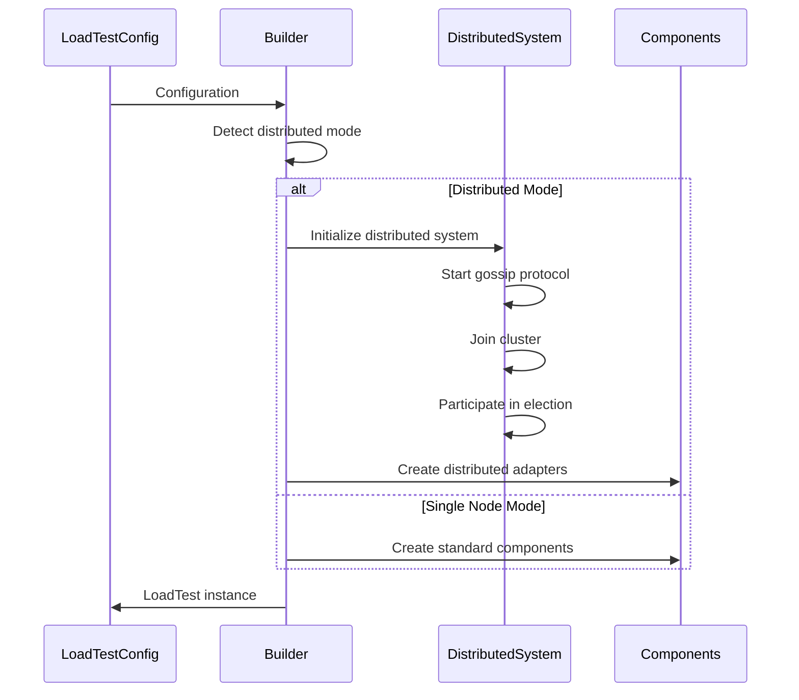
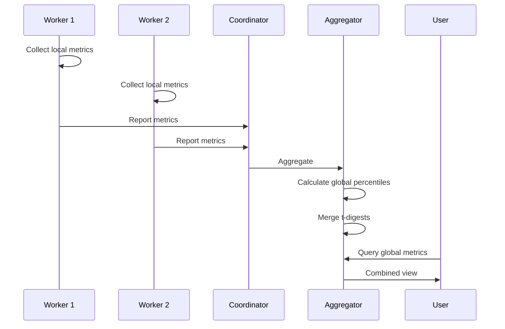
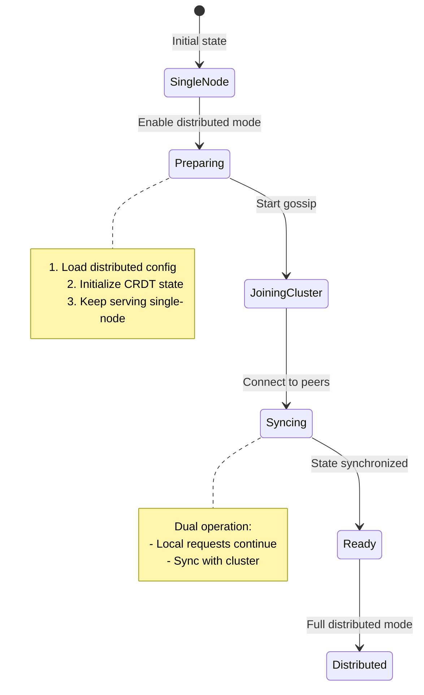
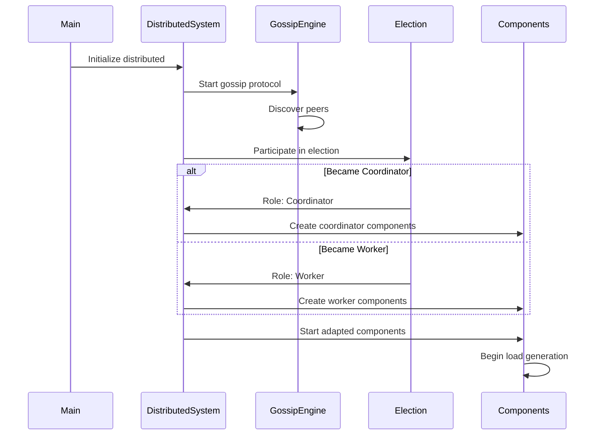

# Distributed System Integration Guide

## 1. Introduction

This guide explains how to integrate the distributed coordination system with the existing load testing framework components. It covers adapting single-node components for distributed operation, migration strategies, and maintaining backward compatibility.

## 2. Architecture Integration

### 2.1 Component Adaptation Overview

```
┌─────────────────────────────────────────────────────────────────────┐
│                     Distributed Load Test System                     │
├─────────────────────────────────────────────────────────────────────┤
│                                                                     │
│  Single-Node Components          Distributed Adapters               │
│  ┌─────────────────┐            ┌─────────────────────┐           │
│  │ RateController  │───────────►│ DistributedRateCtrl │           │
│  └─────────────────┘            └─────────────────────┘           │
│                                          │                          │
│  ┌─────────────────┐            ┌───────▼─────────────┐           │
│  │ClientSessionMgr │───────────►│DistributedCoordinator│           │
│  └─────────────────┘            └─────────────────────┘           │
│                                          │                          │
│  ┌─────────────────┐            ┌───────▼─────────────┐           │
│  │ MetricsCollector│───────────►│  GlobalAggregator   │           │
│  └─────────────────┘            └─────────────────────┘           │
│                                                                     │
│  New Distributed Components:                                        │
│  • GossipEngine    • LeaderElection    • FailureDetector          │
│  • LoadDistributor • EpochManager      • CRDTState                │
│                                                                     │
└─────────────────────────────────────────────────────────────────────┘
```

### 2.2 Integration Points



## 3. Rate Controller Integration

### 3.1 Distributed Rate Controller Adapter

```rust
/// Adapter that makes any RateController distributed-aware
pub struct DistributedRateController<C: RateController> {
    /// Local rate controller
    local_controller: Arc<C>,
    
    /// Distributed coordinator
    coordinator: Arc<dyn DistributedCoordinator>,
    
    /// Current load assignment
    assignment: Arc<RwLock<Option<LoadAssignment>>>,
    
    /// Node ID
    node_id: String,
}

impl<C: RateController> DistributedRateController<C> {
    pub fn new(
        local_controller: C,
        coordinator: Arc<dyn DistributedCoordinator>,
        node_id: String,
    ) -> Self {
        Self {
            local_controller: Arc::new(local_controller),
            coordinator,
            assignment: Arc::new(RwLock::new(None)),
            node_id,
        }
    }
    
    /// Start monitoring for assignment changes
    pub async fn start(&self) -> Result<()> {
        let monitor = self.clone();
        tokio::spawn(async move {
            monitor.monitor_assignments().await
        });
        Ok(())
    }
    
    async fn monitor_assignments(&self) {
        let mut interval = tokio::time::interval(Duration::from_secs(1));
        
        loop {
            interval.tick().await;
            
            // Get current assignment from distributed state
            if let Ok(state) = self.coordinator.get_state().await {
                if let Some(new_assignment) = state.get_load_assignment(&self.node_id) {
                    self.apply_assignment(new_assignment).await;
                }
            }
        }
    }
}

impl<C: RateController> RateController for DistributedRateController<C> {
    fn get_current_rps(&self) -> u64 {
        // Use distributed assignment if available
        if let Some(assignment) = self.assignment.read().unwrap().as_ref() {
            assignment.target_rps
        } else {
            self.local_controller.get_current_rps()
        }
    }
    
    fn update(&self, metrics: &RequestMetrics) {
        // Update local controller
        self.local_controller.update(metrics);
        
        // Report to distributed system
        if let Ok(rt) = tokio::runtime::Handle::try_current() {
            let coordinator = self.coordinator.clone();
            let node_metrics = NodeMetrics::from_request_metrics(metrics);
            
            rt.spawn(async move {
                let _ = coordinator.report_metrics(node_metrics).await;
            });
        }
    }
}
```

### 3.2 Integration with Existing Controllers

```rust
// Example: Making a PID controller distributed
let pid_controller = create_pid_controller();
let distributed_controller = DistributedRateController::new(
    pid_controller,
    coordinator.clone(),
    node_id.clone(),
);

distributed_controller.start().await?;

// The distributed controller now:
// 1. Receives load assignments from coordinator
// 2. Reports metrics back to cluster
// 3. Falls back to local control if needed
```

## 4. Client Session Manager Integration

### 4.1 Distributed Session Coordination

```rust
/// Distributed client session manager adapter
pub struct DistributedClientSessionManager<M: ClientSessionManager> {
    /// Local session manager
    local_manager: Arc<M>,
    
    /// Distributed state
    state: Arc<RwLock<DistributedState>>,
    
    /// Session distribution parameters
    session_params: Arc<RwLock<SessionDistribution>>,
}

#[derive(Debug, Clone)]
pub struct SessionDistribution {
    /// Types of sessions this node should create
    pub session_types: Vec<String>,
    
    /// Target distribution percentages
    pub type_percentages: HashMap<String, f64>,
    
    /// URL patterns assigned to this node
    pub url_patterns: Vec<String>,
}

impl<M: ClientSessionManager> DistributedClientSessionManager<M> {
    /// Apply distributed session parameters
    pub async fn apply_distribution(&self, params: SessionDistribution) {
        // Update local manager configuration
        self.local_manager.set_session_types(&params.session_types);
        self.local_manager.set_url_patterns(&params.url_patterns);
        
        *self.session_params.write().await = params;
    }
    
    /// Coordinate session creation across nodes
    pub async fn coordinate_sessions(&self) -> Result<()> {
        let state = self.state.read().await;
        let total_nodes = state.get_active_nodes().len();
        
        // Ensure session types are distributed across nodes
        let params = self.session_params.read().await;
        
        for (session_type, percentage) in &params.type_percentages {
            // Calculate how many sessions of this type for this node
            let total_sessions = self.local_manager.get_session_count();
            let type_sessions = (total_sessions as f64 * percentage) as usize;
            
            self.local_manager.ensure_session_count(session_type, type_sessions).await?;
        }
        
        Ok(())
    }
}
```

### 4.2 Session Type Distribution

```mermaid
sequenceDiagram
    participant C as Coordinator
    participant N1 as Node 1
    participant N2 as Node 2
    participant N3 as Node 3
    
    Note over C: Assign session types
    C->>N1: Desktop Browser Sessions (40%)
    C->>N2: Mobile Sessions (40%)
    C->>N3: API Client Sessions (20%)
    
    N1->>N1: Create desktop sessions
    N2->>N2: Create mobile sessions
    N3->>N3: Create API sessions
    
    Note over N1,N2,N3: Balanced session distribution
```

## 5. Metrics Integration

### 5.1 Distributed Metrics Aggregation

```rust
/// Global metrics aggregator
pub struct DistributedMetricsAggregator {
    /// Local metrics
    local_collector: Arc<MetricsCollector>,
    
    /// Node metrics from distributed state
    state: Arc<RwLock<DistributedState>>,
    
    /// Aggregation interval
    interval: Duration,
}

impl DistributedMetricsAggregator {
    /// Get global metrics view
    pub async fn get_global_metrics(&self) -> GlobalMetrics {
        let state = self.state.read().await;
        let local = self.local_collector.get_current_metrics();
        
        // Collect metrics from all nodes
        let mut node_metrics = vec![local];
        
        for node in state.get_active_nodes() {
            if let Some(metrics) = state.get_node_metrics(&node.id) {
                node_metrics.push(metrics);
            }
        }
        
        // Aggregate
        GlobalMetrics {
            total_rps: node_metrics.iter().map(|m| m.rps).sum(),
            error_rate: self.calculate_weighted_error_rate(&node_metrics),
            latency_p50: self.calculate_global_percentile(&node_metrics, 0.5),
            latency_p99: self.calculate_global_percentile(&node_metrics, 0.99),
            active_nodes: node_metrics.len(),
            total_requests: node_metrics.iter().map(|m| m.total_requests).sum(),
        }
    }
    
    /// Calculate global percentiles using t-digest
    fn calculate_global_percentile(&self, metrics: &[NodeMetrics], percentile: f64) -> f64 {
        // Merge t-digests from all nodes
        let mut global_digest = TDigest::new(100);
        
        for node_metric in metrics {
            if let Some(digest) = &node_metric.latency_digest {
                global_digest.merge(digest);
            }
        }
        
        global_digest.quantile(percentile)
    }
}
```

### 5.2 Metrics Flow



## 6. Migration Strategies

### 6.1 Single-Node to Distributed Migration



### 6.2 Migration Code Example

```rust
/// Migration helper
pub struct DistributedMigration {
    config: MigrationConfig,
}

impl DistributedMigration {
    /// Migrate running single-node test to distributed
    pub async fn migrate_live(
        &self,
        load_test: &LoadTest,
    ) -> Result<DistributedLoadTest> {
        // Step 1: Create distributed components
        let distributed_config = self.create_distributed_config()?;
        let coordinator = GossipBasedCoordinator::new(distributed_config);
        
        // Step 2: Initialize without disrupting current test
        coordinator.initialize_as_migration().await?;
        
        // Step 3: Snapshot current state
        let snapshot = load_test.create_state_snapshot();
        
        // Step 4: Initialize distributed state from snapshot
        let mut state = DistributedState::new(self.config.node_id.clone());
        state.import_snapshot(snapshot);
        
        // Step 5: Start distributed protocols
        coordinator.start_protocols().await?;
        
        // Step 6: Create adapters for existing components
        let rate_controller = DistributedRateController::new(
            load_test.rate_controller.clone(),
            Arc::new(coordinator),
            self.config.node_id.clone(),
        );
        
        // Step 7: Seamless transition
        let distributed_test = DistributedLoadTest::from_components(
            rate_controller,
            load_test.session_manager.clone(),
            coordinator,
        );
        
        Ok(distributed_test)
    }
}
```

## 7. Backward Compatibility

### 7.1 Unified API

```rust
/// Unified load test trait that works for both modes
pub trait LoadTestRunner: Send + Sync {
    /// Start the test
    async fn start(&self) -> Result<()>;
    
    /// Get current metrics
    async fn get_metrics(&self) -> MetricsSnapshot;
    
    /// Stop the test
    async fn stop(&self) -> Result<()>;
    
    /// Is this a distributed test?
    fn is_distributed(&self) -> bool;
}

/// Single-node implementation
impl LoadTestRunner for LoadTest {
    async fn start(&self) -> Result<()> {
        self.run().await
    }
    
    fn is_distributed(&self) -> bool {
        false
    }
}

/// Distributed implementation
impl LoadTestRunner for DistributedLoadTest {
    async fn start(&self) -> Result<()> {
        // Join cluster
        self.coordinator.join_cluster().await?;
        
        // Start distributed test
        self.run_distributed().await
    }
    
    fn is_distributed(&self) -> bool {
        true
    }
}
```

### 7.2 Configuration Compatibility

```rust
#[derive(Debug, Clone)]
pub struct LoadTestConfig {
    // Common fields
    pub urls: Vec<String>,
    pub initial_rps: u64,
    pub duration: Duration,
    
    // Distributed mode (None = single-node)
    pub distributed: Option<DistributedConfig>,
}

impl LoadTestBuilder {
    /// Automatically choose implementation based on config
    pub fn build(self) -> Result<Box<dyn LoadTestRunner>> {
        match self.config.distributed {
            Some(dist_config) => {
                // Build distributed version
                let test = self.build_distributed(dist_config)?;
                Ok(Box::new(test))
            }
            None => {
                // Build single-node version
                let test = self.build_single_node()?;
                Ok(Box::new(test))
            }
        }
    }
}
```

## 8. Component Lifecycle Management

### 8.1 Startup Sequence



### 8.2 Shutdown Sequence

```rust
impl DistributedLoadTest {
    /// Graceful distributed shutdown
    pub async fn shutdown(&self) -> Result<()> {
        // Step 1: Stop accepting new work
        self.set_shutting_down(true);
        
        // Step 2: If coordinator, trigger epoch
        if self.is_coordinator() {
            self.create_epoch(EpochEvent::TestEnding).await?;
        }
        
        // Step 3: Drain in-flight requests
        self.drain_requests(Duration::from_secs(30)).await?;
        
        // Step 4: Final metrics sync
        self.sync_final_metrics().await?;
        
        // Step 5: Leave cluster gracefully
        self.coordinator.leave_cluster().await?;
        
        // Step 6: Stop components in order
        self.stop_components_ordered().await?;
        
        Ok(())
    }
    
    async fn stop_components_ordered(&self) {
        // Stop in reverse dependency order
        self.rate_controller.stop().await;
        self.session_manager.stop().await;
        self.metrics_aggregator.stop().await;
        self.gossip_engine.stop().await;
        self.transport.close().await;
    }
}
```

## 9. Best Practices

### 9.1 Integration Patterns

1. **Adapter Pattern**: Wrap existing components rather than modifying them
2. **Async Boundaries**: Use channels for sync→async communication
3. **Graceful Degradation**: Fall back to local control if distributed fails
4. **Progressive Enhancement**: Add distributed features incrementally

### 9.2 Common Pitfalls

1. **Clock Synchronization**: Ensure NTP is configured on all nodes
2. **Network Latency**: Account for cross-region delays in timeouts
3. **State Size**: Monitor CRDT size growth over long tests
4. **Message Ordering**: Don't assume message order across nodes

## 10. Testing Integration

### 10.1 Integration Test Example

```rust
#[tokio::test]
async fn test_distributed_integration() {
    // Start a 3-node cluster
    let cluster = TestCluster::new(3).await;
    
    // Create load test on each node
    let tests: Vec<_> = cluster.nodes().iter().map(|node| {
        LoadTestBuilder::new()
            .with_urls(vec!["http://test.example.com"])
            .with_initial_rps(300)
            .with_distributed(node.distributed_config())
            .build()
            .unwrap()
    }).collect();
    
    // Start all tests
    for test in &tests {
        test.start().await.unwrap();
    }
    
    // Wait for cluster to stabilize
    tokio::time::sleep(Duration::from_secs(5)).await;
    
    // Verify distributed operation
    let coordinator = cluster.get_coordinator().await;
    assert_eq!(coordinator.get_active_nodes().await.len(), 3);
    
    // Verify load distribution
    let metrics = coordinator.get_global_metrics().await;
    assert_eq!(metrics.total_rps, 900); // 300 * 3
}
```

## 11. Monitoring Integration

### 11.1 Distributed Tracing

```rust
/// Trace context propagation
impl DistributedRequestExecutor {
    async fn execute_request(&self, request: Request) -> Result<Response> {
        // Extract or create trace context
        let trace_id = request.trace_id.unwrap_or_else(|| {
            TraceId::new()
        });
        
        // Add distributed span
        let span = tracing::span!(
            Level::INFO,
            "distributed_request",
            trace_id = %trace_id,
            node_id = %self.node_id,
            coordinator = %self.coordinator_id,
        );
        
        async move {
            // Execute with trace context
            self.inner.execute(request).await
        }.instrument(span).await
    }
}
```

## 12. Summary

This integration guide provides a complete path for adapting the single-node load testing framework for distributed operation:

1. **Component Adapters**: Wrap existing components with distributed awareness
2. **State Synchronization**: Use CRDTs for consistent state across nodes
3. **Metrics Aggregation**: Combine node metrics for global view
4. **Migration Support**: Seamlessly transition from single to distributed
5. **Backward Compatibility**: Unified API works for both modes

The key principle is to enhance rather than replace existing components, maintaining compatibility while adding distributed capabilities.